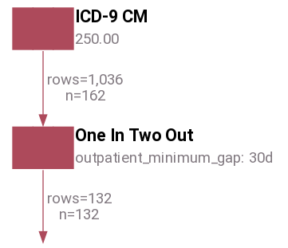
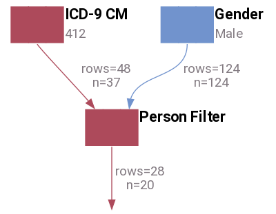
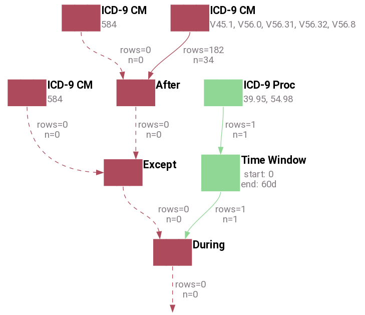

<!-- START doctoc generated TOC please keep comment here to allow auto update -->
<!-- DON'T EDIT THIS SECTION, INSTEAD RE-RUN doctoc TO UPDATE -->


- [ConceptQL Specification](#conceptql-specification)
  - [Motivation for ConceptQL](#motivation-for-conceptql)
  - [ConceptQL Overview](#conceptql-overview)
    - [What ConceptQL Looks Like](#what-conceptql-looks-like)
    - [ConceptQL Diagrams](#conceptql-diagrams)
    - [Think of Results as a Stream](#think-of-results-as-a-stream)
    - [Streams have Types](#streams-have-types)
    - [What *are* Streams Really?](#what-are-streams-really)
  - [Selection Operators](#selection-operators)
  - [All Other Operators i.e. Mutation Operators](#all-other-operators-ie-mutation-operators)
  - [Set Operators](#set-operators)
    - [Union](#union)
    - [Intersect](#intersect)
    - [Complement](#complement)
    - [Except](#except)
    - [Discussion about Set Operators](#discussion-about-set-operators)
      - [Union Operators](#union-operators)
        - [Q. Why should we allow two different types of streams to continue downstream concurrently?](#q-why-should-we-allow-two-different-types-of-streams-to-continue-downstream-concurrently)
        - [Q. Why aren't all streams passed forward unaltered?  Why union like-typed streams?](#q-why-arent-all-streams-passed-forward-unaltered--why-union-like-typed-streams)
  - [Time-oriented Operators](#time-oriented-operators)
    - [Relative Temporal Operators](#relative-temporal-operators)
      - [occurrence](#occurrence)
      - [first](#first)
      - [last](#last)
    - [Date Literals](#date-literals)
      - [date_range](#date_range)
      - [day](#day)
      - [What is <date-format\>?](#what-is-date-format%5C)
    - [Temporal Comparison Operators](#temporal-comparison-operators)
      - [any_overlap](#any_overlap)
      - [Edge behaviors](#edge-behaviors)
    - [Temporal Comparison Improvements](#temporal-comparison-improvements)
      - [New Parameters](#new-parameters)
      - [Considerations](#considerations)
    - [Time Windows](#time-windows)
      - [time_window](#time_window)
      - [Temporal Operators and Person Streams](#temporal-operators-and-person-streams)
  - [Type Conversion](#type-conversion)
    - [Casting to person](#casting-to-person)
    - [Casting to a visit_occurrence](#casting-to-a-visit_occurrence)
    - [Casting Loses All Original Information](#casting-loses-all-original-information)
    - [Cast all the Things!](#cast-all-the-things)
    - [Casting as a way to fetch all rows](#casting-as-a-way-to-fetch-all-rows)
  - [Finding a Single Inpatient or Two Outpatient Records as Confirmation of a Diagnosis](#finding-a-single-inpatient-or-two-outpatient-records-as-confirmation-of-a-diagnosis)
  - [Filtering by People](#filtering-by-people)
  - [Sub-algorithms within a Larger Algorithm](#sub-algorithms-within-a-larger-algorithm)
    - [`label` option](#label-option)
    - [`recall` operator](#recall-operator)
  - [Algorithms within Algorithms](#algorithms-within-algorithms)
  - [Values](#values)
    - [numeric](#numeric)
    - [Counting](#counting)
      - [Numeric Value Comparison](#numeric-value-comparison)
    - [numeric as selection operator](#numeric-as-selection-operator)
      - [sum](#sum)
  - [Appendix A - Selection Operators](#appendix-a---selection-operators)
  - [Appendix B - Algorithm Showcase](#appendix-b---algorithm-showcase)
    - [Acute Kidney Injury - Narrow Definition and diagnositc procedure](#acute-kidney-injury---narrow-definition-and-diagnositc-procedure)
    - [Mortality after Myocardial Infarction #3](#mortality-after-myocardial-infarction-3)
    - [GI Ulcer Hospitalization 2 (5000001002)](#gi-ulcer-hospitalization-2-5000001002)
  - [Appendix C - Under Development](#appendix-c---under-development)
    - [Todo List](#todo-list)
    - [Future Work for Define and Recall](#future-work-for-define-and-recall)
    - [Considerations for Values](#considerations-for-values)
    - [Filter Operator](#filter-operator)
    - [AS option for Except](#as-option-for-except)
    - [How to Handle fact_relationship Table from CDMv5](#how-to-handle-fact_relationship-table-from-cdmv5)
    - [Change First/Last to Earliest/Most Recent and change "Nth" to "Nth Earliest" and "Nth Most Recent"](#change-firstlast-to-earliestmost-recent-and-change-nth-to-nth-earliest-and-nth-most-recent)
    - [Dates when building a cohort](#dates-when-building-a-cohort)
    - [During optimization?](#during-optimization)
    - [Casting Operators](#casting-operators)
    - [Drop support for positional arguments?](#drop-support-for-positional-arguments)
    - [Validations](#validations)
      - [General validations](#general-validations)
      - [Upstream validations - Enforce number of upstream operators](#upstream-validations---enforce-number-of-upstream-operators)
      - [Argument validations - Enforce number of positional arguments](#argument-validations---enforce-number-of-positional-arguments)
      - [Option validations](#option-validations)
      - [`recall`-specific validations](#recall-specific-validations)
      - [`algorithm`-specific validations](#algorithm-specific-validations)
      - [Vocabulary validations and warnings](#vocabulary-validations-and-warnings)
    - [Other data models](#other-data-models)
      - [Mutator - in theory, these need no modification to continue working](#mutator---in-theory-these-need-no-modification-to-continue-working)
      - [Selection - These are the operators that will need the most work and might need to be re-thought](#selection---these-are-the-operators-that-will-need-the-most-work-and-might-need-to-be-re-thought)
    - [Multiple sets of things with ordering](#multiple-sets-of-things-with-ordering)
    - [Nth line chemo](#nth-line-chemo)
    - [concurrent with?](#concurrent-with)

<!-- END doctoc generated TOC please keep comment here to allow auto update -->

# ConceptQL Specification

[ConceptQL](https://github.com/outcomesinsights/conceptql) (pronounced concept-Q-L) is a high-level language that allows researchers to unambiguously define their research algorithms.

## Motivation for ConceptQL

Outcomes Insights intends to build a vast library of research algorithms and apply those algorithms to large databases of claims data.  Early into building the library, we realized we had to overcome two major issues:

1. Methods sections of research papers commonly use natural language to specify the criteria used to build cohorts from a claims database.
    - Algorithms defined in natural language are often imprecise, open to multiple interpretations, and generally difficult to reproduce.
    - Researchers could benefit from a language that removes the ambiguity of natural language while increasing the reproducibility of their research algorithms.
1. Querying against claims databases is often difficult.
    - Hand-coding algorithms to extract cohorts from datasets is time-consuming, error-prone, and opaque.
    - Researchers could benefit from a language that allows algorithms to be defined at a high-level and then gets translated into the appropriate queries against a database.

We developed ConceptQL to address these two issues.

We are writing a tool that can read research algorithms defined in ConceptQL.  The tool can create a diagram for the algorithm which makes it easy to visualize and understand.  The tool can also translate the algorithm into a SQL query which runs against data structured in [OMOP's Common Data Model (CDM)](http://omop.org/CDM).  The purpose of the CDM is to standardize the format and content of observational data, so standardized applications, tools and methods can be applied to them.

For instance, using ConceptQL we can take a statement that looks like this:

```YAML
:icd9: '412'
```

And generate a diagram that looks like this:

```JSON

["icd9","412"]

```


| person_id | criterion_id | criterion_type | start_date | end_date | source_value |
| --------- | ------------ | -------------- | ---------- | -------- | ------------ |
| 17 | 1712 | condition_occurrence | 2008-08-25 | 2008-08-25 | 412 |
| 17 | 1829 | condition_occurrence | 2009-04-30 | 2009-04-30 | 412 |
| 37 | 4359 | condition_occurrence | 2010-02-12 | 2010-02-12 | 412 |
| 53 | 5751 | condition_occurrence | 2008-06-05 | 2008-06-05 | 412 |
| 59 | 6083 | condition_occurrence | 2009-07-19 | 2009-07-22 | 412 |
| 64 | 6902 | condition_occurrence | 2009-07-25 | 2009-07-25 | 412 |
| 71 | 7865 | condition_occurrence | 2008-11-16 | 2008-11-16 | 412 |
| 75 | 8397 | condition_occurrence | 2010-10-06 | 2010-10-06 | 412 |
| 79 | 8618 | condition_occurrence | 2009-01-28 | 2009-01-30 | 412 |
| 86 | 9882 | condition_occurrence | 2009-01-03 | 2009-01-09 | 412 |

And generate SQL that looks like this:

```SQL
SELECT *
FROM cdm_data.condition_occurrence AS co
JOIN vocabulary.source_to_concept_map AS scm ON (c.condition_concept_id = scm.target_concept_id)
WHERE scm.source_code IN ('412')
AND scm.source_vocabulary_id = 2
AND scm.source_code = co.condition_source_value
```

As stated above, one of the goals of ConceptQL is to make it easy to assemble fairly complex queries without having to roll up our sleeves and write raw SQL.  To accommodate this complexity, ConceptQL itself has some complexities of its own.  That said, we believe ConceptQL will help researchers define, hone, and share their research algorithms.

## ConceptQL Overview

### What ConceptQL Looks Like

I find seeing examples to be the quickest way to get a sense of a language.  Here is a trivial example to whet your appetite.  The example is in YAML, but could just as easily be in JSON or any other markup language capable of representing nested sets of heterogeneous arrays and hashes.  In fact, the ConceptQL "language" is a just set of nested hashes and arrays representing search criteria and some set operations and temporal operations to glue those criteria together.

```YAML
# Example 1: A simple example in YAML
# This is just a simple hash with a key of :icd9 and a value of 412
# This example will search the condition_occurrence table for all conditions that match the ICD-9 code 412.
---
:icd9: '412'
```

### ConceptQL Diagrams

Reading ConceptQL in YAML or JSON seems hard to me.  I prefer to explore ConceptQL using directed graphs.  For instance, the diagram for the simple example listed in YAML above is:

```JSON

["icd9","412"]

```


| person_id | criterion_id | criterion_type | start_date | end_date | source_value |
| --------- | ------------ | -------------- | ---------- | -------- | ------------ |
| 17 | 1712 | condition_occurrence | 2008-08-25 | 2008-08-25 | 412 |
| 17 | 1829 | condition_occurrence | 2009-04-30 | 2009-04-30 | 412 |
| 37 | 4359 | condition_occurrence | 2010-02-12 | 2010-02-12 | 412 |
| 53 | 5751 | condition_occurrence | 2008-06-05 | 2008-06-05 | 412 |
| 59 | 6083 | condition_occurrence | 2009-07-19 | 2009-07-22 | 412 |
| 64 | 6902 | condition_occurrence | 2009-07-25 | 2009-07-25 | 412 |
| 71 | 7865 | condition_occurrence | 2008-11-16 | 2008-11-16 | 412 |
| 75 | 8397 | condition_occurrence | 2010-10-06 | 2010-10-06 | 412 |
| 79 | 8618 | condition_occurrence | 2009-01-28 | 2009-01-30 | 412 |
| 86 | 9882 | condition_occurrence | 2009-01-03 | 2009-01-09 | 412 |

Each oval depicts a "operator", or rather, a ConceptQL expression.  An arrow between a pair of operators indicates that the results from the operator on the tail of the arrow pass on to the operator at the head of the arrow.  A simple example should help here:

```JSON

["first",["cpt","99214"]]

```


| person_id | criterion_id | criterion_type | start_date | end_date | source_value |
| --------- | ------------ | -------------- | ---------- | -------- | ------------ |
| 2 | 48 | procedure_occurrence | 2009-07-03 | 2009-07-03 | 99214 |
| 5 | 118 | procedure_occurrence | 2008-12-14 | 2008-12-14 | 99214 |
| 6 | 167 | procedure_occurrence | 2009-09-12 | 2009-09-12 | 99214 |
| 7 | 376 | procedure_occurrence | 2008-08-13 | 2008-08-13 | 99214 |
| 8 | 609 | procedure_occurrence | 2008-02-27 | 2008-02-27 | 99214 |
| 9 | 652 | procedure_occurrence | 2009-09-11 | 2009-09-11 | 99214 |
| 10 | 681 | procedure_occurrence | 2009-05-09 | 2009-05-09 | 99214 |
| 11 | 758 | procedure_occurrence | 2008-06-17 | 2008-06-17 | 99214 |
| 12 | 847 | procedure_occurrence | 2008-02-11 | 2008-02-11 | 99214 |
| 13 | 1102 | procedure_occurrence | 2008-01-24 | 2008-01-24 | 99214 |

The diagram above reads "get all procedures that match the CPT 99214 (Office Visit) and then filter them down to the first occurrence for each person".  The diagram is much more terse than that and to accurately read the diagram, you need a lot of implicit knowledge about how each operator operates.  Fortunately, this document will (hopefully) impart that knowledge to you.

Please note that all of my diagrams end with an arrow pointing at nothing.  You'll see why soon.

### Think of Results as a Stream

I draw my ConceptQL diagrams with leaf operators at the top and the "trunk" operators at the bottom.  I like to think of the results of a ConceptQL statement as a flowing stream of data.  The leaf operators, or operators that gather results out of the database, act like tributaries.  The results flow downwards and either join with other results, or filter out other results until the streams emerge at the bottom of the diagram.  Think of each arrow as a stream of results, flowing down through one operator to the next.

The trailing arrow in the diagrams serves as a reminder that ConceptQL yields a stream of results.

### Streams have Types

You might have noticed that the operators and edges in the diagrams often have a color.  That color represents what "type" of stream the operator or edge represents.  There are many types in ConceptQL, and you'll notice they are __strongly__ correlated with the tables found in [CDM v4.0](http://omop.org/CDM):

- condition_occurrence
    - red
- death
    - brown
- drug_cost
    - TBD
- drug_exposure
    - purple
- observation
    - TBD
- payer_plan_period
    - TBD
- person
    - blue
- procedure_cost
    - gold
- procedure_occurrence
    - green
- visit_occurrence
    - orange

Each stream has a point of origin (essentially, the table from which we pulled the results for a stream).  Based on that origin, each stream will have a particular type.  The stream carries this type information as it moves through each operator.  When certain operators, particularly set and temporal operators, need to perform filtering, they can use this type information to determine how to best filter a stream.  There will be much more discussion about types woven throughout this document.  For now, it is sufficient to know that each stream has a type.

You'll also notice that the trailing arrow(s) at the end of the diagrams indicate which types of streams are ultimately passed on at the end of a ConceptQL statement.

### What *are* Streams Really?

Though I think that a "stream" is a helpful abstraction when thinking in ConceptQL, on a few occasions we need to know what's going on under the hood.

Every table in the CDM structure has a surrogate key column (an ID column).  When we execute a ConceptQL statement, the "streams" that are generated by the statement are just sets of these IDs for rows that matched the ConceptQL criteria.  So each stream is just a set of IDs that point back to some rows in one of the CDM tables.  When a stream has a "type" it is really just that the stream contains IDs associated with its table of origin.

So when we execute this ConceptQL statement, the resulting "stream" is all the person IDs for all male patients in the database:

```JSON

["gender","Male"]

```


| person_id | criterion_id | criterion_type | start_date | end_date | source_value |
| --------- | ------------ | -------------- | ---------- | -------- | ------------ |
| 1 | 1 | person | 1923-05-01 | 1923-05-01 | 00013D2EFD8E45D1 |
| 2 | 2 | person | 1943-01-01 | 1943-01-01 | 00016F745862898F |
| 4 | 4 | person | 1941-06-01 | 1941-06-01 | 00021CA6FF03E670 |
| 5 | 5 | person | 1936-08-01 | 1936-08-01 | 00024B3D2352D2D0 |
| 6 | 6 | person | 1943-10-01 | 1943-10-01 | 0002DAE1C81CC70D |
| 7 | 7 | person | 1922-07-01 | 1922-07-01 | 0002F28CE057345B |
| 8 | 8 | person | 1935-09-01 | 1935-09-01 | 000308435E3E5B76 |
| 12 | 12 | person | 1929-06-01 | 1929-06-01 | 00048EF1F4791C68 |
| 14 | 14 | person | 1934-05-01 | 1934-05-01 | 00052705243EA128 |
| 20 | 20 | person | 1938-04-01 | 1938-04-01 | 000B97BA2314E971 |

When we execute this ConceptQL statement, the resulting "stream" is all condition_occurrence IDs that match ICD-9 799.22:

```JSON

["icd9","799.22"]

```


```No Results found.```

Generally, I find it helpful to just think of those queries generating a "stream of people" or a "stream of conditions" and not worry about the table of origin or the fact that they are just IDs.

When a ConceptQL statement is executed, it yields a final set of streams that are just all the IDs that passed through all the criteria.  What is done with that set of IDs is up to the user who assembled the ConceptQL statement.  If a user gathers all 799.22 Conditions, they will end up with a set of condition_occurrence_ids.  They could take those IDs and do all sorts of things like:

- Gather the first and last date of occurrence per person
- Count the number of occurrences per person
- Count number of persons with the condition
- Count the total number of occurrences for the entire population

This kind of aggregation and analysis is beyond the scope of ConceptQL.  ConceptQL will get you the IDs of the rows you're interested in, its up to other parts of the calling system to determine what you do with them.

## Selection Operators

Selection operators are the parts of a ConceptQL query that search for specific values within the CDM data, e.g. searching the condition_occurrence table for a diagnosis of an old myocardial infarction (ICD-9 412) is a selection.  Selection operators are always leaf operators.

There are _many_ selection operators.  A list of currently implemented operators is available in Appendix A.

## All Other Operators i.e. Mutation Operators

Virtually all other operators add, remove, filter, or otherwise alter streams of results.  They are discussed in this section.

## Set Operators

Because streams represent sets of results, its makes sense to include a operators that operate on sets

### Union

- Takes any number of upstream operators and aggregates their streams
    - Unions together streams with identical types
        - Think of streams with the same type flowing together into a single stream
        - We're really just gathering the union of all IDs for identically-typed streams
    - Streams with the different types flow along together concurrently without interacting
        - It does not make sense to union, say, condition_occurrence_ids with visit_occurrence_ids, so streams with different types won't mingle together, but will continue to flow downstream in parallel

```JSON

["union",["icd9","412"],["icd9","799.22"]]

```


| person_id | criterion_id | criterion_type | start_date | end_date | source_value |
| --------- | ------------ | -------------- | ---------- | -------- | ------------ |
| 17 | 1712 | condition_occurrence | 2008-08-25 | 2008-08-25 | 412 |
| 17 | 1829 | condition_occurrence | 2009-04-30 | 2009-04-30 | 412 |
| 37 | 4359 | condition_occurrence | 2010-02-12 | 2010-02-12 | 412 |
| 53 | 5751 | condition_occurrence | 2008-06-05 | 2008-06-05 | 412 |
| 59 | 6083 | condition_occurrence | 2009-07-19 | 2009-07-22 | 412 |
| 64 | 6902 | condition_occurrence | 2009-07-25 | 2009-07-25 | 412 |
| 71 | 7865 | condition_occurrence | 2008-11-16 | 2008-11-16 | 412 |
| 75 | 8397 | condition_occurrence | 2010-10-06 | 2010-10-06 | 412 |
| 79 | 8618 | condition_occurrence | 2009-01-28 | 2009-01-30 | 412 |
| 86 | 9882 | condition_occurrence | 2009-01-03 | 2009-01-09 | 412 |

```JSON

["union",["union",["icd9","412"],["icd9","799.22"]],["place_of_service_code","21"]]

```


| person_id | criterion_id | criterion_type | start_date | end_date | source_value |
| --------- | ------------ | -------------- | ---------- | -------- | ------------ |
| 17 | 1712 | condition_occurrence | 2008-08-25 | 2008-08-25 | 412 |
| 17 | 1829 | condition_occurrence | 2009-04-30 | 2009-04-30 | 412 |
| 37 | 4359 | condition_occurrence | 2010-02-12 | 2010-02-12 | 412 |
| 53 | 5751 | condition_occurrence | 2008-06-05 | 2008-06-05 | 412 |
| 59 | 6083 | condition_occurrence | 2009-07-19 | 2009-07-22 | 412 |
| 64 | 6902 | condition_occurrence | 2009-07-25 | 2009-07-25 | 412 |
| 71 | 7865 | condition_occurrence | 2008-11-16 | 2008-11-16 | 412 |
| 75 | 8397 | condition_occurrence | 2010-10-06 | 2010-10-06 | 412 |
| 79 | 8618 | condition_occurrence | 2009-01-28 | 2009-01-30 | 412 |
| 86 | 9882 | condition_occurrence | 2009-01-03 | 2009-01-09 | 412 |

```JSON

["union",["icd9","412"],["icd9","799.22"],["place_of_service_code","21"]]

```


| person_id | criterion_id | criterion_type | start_date | end_date | source_value |
| --------- | ------------ | -------------- | ---------- | -------- | ------------ |
| 17 | 1712 | condition_occurrence | 2008-08-25 | 2008-08-25 | 412 |
| 17 | 1829 | condition_occurrence | 2009-04-30 | 2009-04-30 | 412 |
| 37 | 4359 | condition_occurrence | 2010-02-12 | 2010-02-12 | 412 |
| 53 | 5751 | condition_occurrence | 2008-06-05 | 2008-06-05 | 412 |
| 59 | 6083 | condition_occurrence | 2009-07-19 | 2009-07-22 | 412 |
| 64 | 6902 | condition_occurrence | 2009-07-25 | 2009-07-25 | 412 |
| 71 | 7865 | condition_occurrence | 2008-11-16 | 2008-11-16 | 412 |
| 75 | 8397 | condition_occurrence | 2010-10-06 | 2010-10-06 | 412 |
| 79 | 8618 | condition_occurrence | 2009-01-28 | 2009-01-30 | 412 |
| 86 | 9882 | condition_occurrence | 2009-01-03 | 2009-01-09 | 412 |

### Intersect

1. Group incoming streams by type
1. For each group of same-type streams
     a. Intersect all streams, yielding a single stream that contains only those IDs common to those streams
1. A single stream for each incoming type is sent downstream
     a. If only a single stream of a type is upstream, that stream is essentially unaltered as it is passed downstream

```JSON

["intersect",["icd9","412"],["condition_type","primary"]]

```


| person_id | criterion_id | criterion_type | start_date | end_date | source_value |
| --------- | ------------ | -------------- | ---------- | -------- | ------------ |
| 168 | 19736 | condition_occurrence | 2009-01-20 | 2009-01-20 | 412 |
| 183 | 21619 | condition_occurrence | 2010-12-26 | 2010-12-26 | 412 |
| 160 | 18555 | condition_occurrence | 2008-12-24 | 2008-12-25 | 412 |
| 207 | 24721 | condition_occurrence | 2008-02-17 | 2008-02-17 | 412 |
| 37 | 4359 | condition_occurrence | 2010-02-12 | 2010-02-12 | 412 |
| 71 | 7865 | condition_occurrence | 2008-11-16 | 2008-11-16 | 412 |
| 104 | 13016 | condition_occurrence | 2009-02-27 | 2009-02-27 | 412 |
| 255 | 31542 | condition_occurrence | 2010-11-21 | 2010-11-21 | 412 |
| 191 | 22933 | condition_occurrence | 2009-05-07 | 2009-05-07 | 412 |
| 183 | 21627 | condition_occurrence | 2009-01-31 | 2009-01-31 | 412 |

```JSON

["intersect",["icd9","412"],["gender","Male"]]

```


| person_id | criterion_id | criterion_type | start_date | end_date | source_value |
| --------- | ------------ | -------------- | ---------- | -------- | ------------ |
| 17 | 1712 | condition_occurrence | 2008-08-25 | 2008-08-25 | 412 |
| 17 | 1829 | condition_occurrence | 2009-04-30 | 2009-04-30 | 412 |
| 37 | 4359 | condition_occurrence | 2010-02-12 | 2010-02-12 | 412 |
| 53 | 5751 | condition_occurrence | 2008-06-05 | 2008-06-05 | 412 |
| 59 | 6083 | condition_occurrence | 2009-07-19 | 2009-07-22 | 412 |
| 64 | 6902 | condition_occurrence | 2009-07-25 | 2009-07-25 | 412 |
| 71 | 7865 | condition_occurrence | 2008-11-16 | 2008-11-16 | 412 |
| 75 | 8397 | condition_occurrence | 2010-10-06 | 2010-10-06 | 412 |
| 79 | 8618 | condition_occurrence | 2009-01-28 | 2009-01-30 | 412 |
| 86 | 9882 | condition_occurrence | 2009-01-03 | 2009-01-09 | 412 |

```JSON

["intersect",["icd9","412"],["condition_type","primary"],["gender","Male"],["race","White"]]

```


| person_id | criterion_id | criterion_type | start_date | end_date | source_value |
| --------- | ------------ | -------------- | ---------- | -------- | ------------ |
| 168 | 19736 | condition_occurrence | 2009-01-20 | 2009-01-20 | 412 |
| 183 | 21619 | condition_occurrence | 2010-12-26 | 2010-12-26 | 412 |
| 160 | 18555 | condition_occurrence | 2008-12-24 | 2008-12-25 | 412 |
| 207 | 24721 | condition_occurrence | 2008-02-17 | 2008-02-17 | 412 |
| 37 | 4359 | condition_occurrence | 2010-02-12 | 2010-02-12 | 412 |
| 71 | 7865 | condition_occurrence | 2008-11-16 | 2008-11-16 | 412 |
| 104 | 13016 | condition_occurrence | 2009-02-27 | 2009-02-27 | 412 |
| 255 | 31542 | condition_occurrence | 2010-11-21 | 2010-11-21 | 412 |
| 191 | 22933 | condition_occurrence | 2009-05-07 | 2009-05-07 | 412 |
| 183 | 21627 | condition_occurrence | 2009-01-31 | 2009-01-31 | 412 |

### Complement

This operator will take the complement of each set of IDs in the incoming streams.

```JSON

["complement",["icd9","412"]]

```


| person_id | criterion_id | criterion_type | start_date | end_date | source_value |
| --------- | ------------ | -------------- | ---------- | -------- | ------------ |
| 1 | 1 | condition_occurrence | 2010-03-12 | 2010-03-13 | 780.2 |
| 1 | 2 | condition_occurrence | 2010-03-12 | 2010-03-13 | 788.20 |
| 1 | 3 | condition_occurrence | 2010-03-12 | 2010-03-13 | V45.01 |
| 1 | 4 | condition_occurrence | 2010-03-12 | 2010-03-13 | 428.0 |
| 1 | 5 | condition_occurrence | 2010-03-12 | 2010-03-13 | 272.0 |
| 1 | 6 | condition_occurrence | 2010-03-12 | 2010-03-13 | 401.9 |
| 1 | 7 | condition_occurrence | 2010-03-12 | 2010-03-13 | V45.02 |
| 1 | 8 | condition_occurrence | 2010-03-12 | 2010-03-13 | 733.00 |
| 1 | 9 | condition_occurrence | 2010-03-12 | 2010-03-13 | E933.0 |
| 1 | 10 | condition_occurrence | 2008-09-04 | 2008-09-04 | V58.41 |

If you're familiar with set operations, the complement of a union is the intersect of the complements of the items unioned.  So in our world, these next two examples are identical:

```JSON

["complement",["union",["icd9","412"],["condition_type","primary"]]]

```


| person_id | criterion_id | criterion_type | start_date | end_date | source_value |
| --------- | ------------ | -------------- | ---------- | -------- | ------------ |
| 1 | 1 | condition_occurrence | 2010-03-12 | 2010-03-13 | 780.2 |
| 1 | 2 | condition_occurrence | 2010-03-12 | 2010-03-13 | 788.20 |
| 1 | 3 | condition_occurrence | 2010-03-12 | 2010-03-13 | V45.01 |
| 1 | 4 | condition_occurrence | 2010-03-12 | 2010-03-13 | 428.0 |
| 1 | 5 | condition_occurrence | 2010-03-12 | 2010-03-13 | 272.0 |
| 1 | 6 | condition_occurrence | 2010-03-12 | 2010-03-13 | 401.9 |
| 1 | 7 | condition_occurrence | 2010-03-12 | 2010-03-13 | V45.02 |
| 1 | 8 | condition_occurrence | 2010-03-12 | 2010-03-13 | 733.00 |
| 1 | 9 | condition_occurrence | 2010-03-12 | 2010-03-13 | E933.0 |
| 1 | 12 | condition_occurrence | 2009-10-14 | 2009-10-14 | 275.41 |

```JSON

["intersect",["complement",["icd9","412"]],["complement",["condition_type","primary"]]]

```


| person_id | criterion_id | criterion_type | start_date | end_date | source_value |
| --------- | ------------ | -------------- | ---------- | -------- | ------------ |
| 13 | 1027 | condition_occurrence | 2010-03-01 | 2010-03-01 | 401.9 |
| 132 | 15615 | condition_occurrence | 2009-10-15 | 2009-10-15 | 582.9 |
| 30 | 3779 | condition_occurrence | 2008-02-26 | 2008-02-26 | 715.96 |
| 96 | 12041 | condition_occurrence | 2009-08-20 | 2009-08-20 | 716.89 |
| 88 | 10399 | condition_occurrence | 2009-11-12 | 2009-11-12 | 728.9 |
| 220 | 26671 | condition_occurrence | 2009-06-26 | 2009-06-26 | 780.4 |
| 175 | 20446 | condition_occurrence | 2010-05-10 | 2010-05-10 | 272.4 |
| 251 | 30959 | condition_occurrence | 2009-08-19 | 2009-08-19 | 362.56 |
| 164 | 19011 | condition_occurrence | 2009-02-18 | 2009-02-18 | V17.3 |
| 43 | 4995 | condition_occurrence | 2010-04-06 | 2010-04-08 | 596.54 |

But please be aware that this behavior of complement only affects streams of the same type.  If more than one stream is involved, you need to evaluate the effects of complement on a stream-by-stream basis:

```JSON

["complement",["union",["icd9","412"],["condition_type","primary"],["cpt","99214"]]]

```


| person_id | criterion_id | criterion_type | start_date | end_date | source_value |
| --------- | ------------ | -------------- | ---------- | -------- | ------------ |
| 1 | 1 | condition_occurrence | 2010-03-12 | 2010-03-13 | 780.2 |
| 1 | 2 | condition_occurrence | 2010-03-12 | 2010-03-13 | 788.20 |
| 1 | 3 | condition_occurrence | 2010-03-12 | 2010-03-13 | V45.01 |
| 1 | 4 | condition_occurrence | 2010-03-12 | 2010-03-13 | 428.0 |
| 1 | 5 | condition_occurrence | 2010-03-12 | 2010-03-13 | 272.0 |
| 1 | 6 | condition_occurrence | 2010-03-12 | 2010-03-13 | 401.9 |
| 1 | 7 | condition_occurrence | 2010-03-12 | 2010-03-13 | V45.02 |
| 1 | 8 | condition_occurrence | 2010-03-12 | 2010-03-13 | 733.00 |
| 1 | 9 | condition_occurrence | 2010-03-12 | 2010-03-13 | E933.0 |
| 1 | 12 | condition_occurrence | 2009-10-14 | 2009-10-14 | 275.41 |

```JSON

["intersect",["complement",["icd9","412"]],["complement",["condition_type","primary"]],["complement",["cpt","99214"]]]

```


| person_id | criterion_id | criterion_type | start_date | end_date | source_value |
| --------- | ------------ | -------------- | ---------- | -------- | ------------ |
| 13 | 1027 | condition_occurrence | 2010-03-01 | 2010-03-01 | 401.9 |
| 132 | 15615 | condition_occurrence | 2009-10-15 | 2009-10-15 | 582.9 |
| 30 | 3779 | condition_occurrence | 2008-02-26 | 2008-02-26 | 715.96 |
| 96 | 12041 | condition_occurrence | 2009-08-20 | 2009-08-20 | 716.89 |
| 88 | 10399 | condition_occurrence | 2009-11-12 | 2009-11-12 | 728.9 |
| 220 | 26671 | condition_occurrence | 2009-06-26 | 2009-06-26 | 780.4 |
| 175 | 20446 | condition_occurrence | 2010-05-10 | 2010-05-10 | 272.4 |
| 251 | 30959 | condition_occurrence | 2009-08-19 | 2009-08-19 | 362.56 |
| 164 | 19011 | condition_occurrence | 2009-02-18 | 2009-02-18 | V17.3 |
| 43 | 4995 | condition_occurrence | 2010-04-06 | 2010-04-08 | 596.54 |

```JSON

["union",["intersect",["complement",["icd9","412"]],["complement",["condition_type","primary"]]],["complement",["cpt","99214"]]]

```


| person_id | criterion_id | criterion_type | start_date | end_date | source_value |
| --------- | ------------ | -------------- | ---------- | -------- | ------------ |
| 13 | 1027 | condition_occurrence | 2010-03-01 | 2010-03-01 | 401.9 |
| 132 | 15615 | condition_occurrence | 2009-10-15 | 2009-10-15 | 582.9 |
| 30 | 3779 | condition_occurrence | 2008-02-26 | 2008-02-26 | 715.96 |
| 96 | 12041 | condition_occurrence | 2009-08-20 | 2009-08-20 | 716.89 |
| 88 | 10399 | condition_occurrence | 2009-11-12 | 2009-11-12 | 728.9 |
| 220 | 26671 | condition_occurrence | 2009-06-26 | 2009-06-26 | 780.4 |
| 175 | 20446 | condition_occurrence | 2010-05-10 | 2010-05-10 | 272.4 |
| 251 | 30959 | condition_occurrence | 2009-08-19 | 2009-08-19 | 362.56 |
| 164 | 19011 | condition_occurrence | 2009-02-18 | 2009-02-18 | V17.3 |
| 43 | 4995 | condition_occurrence | 2010-04-06 | 2010-04-08 | 596.54 |

### Except

This operator takes two sets of incoming streams, a left-hand stream and a right-hand stream.  The operator matches like-type streams between the left-hand and right-hand streams. The operator removes any results in the left-hand stream if they appear in the right-hand stream.  The operator passes only results for the left-hand stream downstream.  The operator discards all results in the right-hand stream. For example:

```JSON

["except",{"left":["icd9","412"],"right":["condition_type","primary"]}]

```


| person_id | criterion_id | criterion_type | start_date | end_date | source_value |
| --------- | ------------ | -------------- | ---------- | -------- | ------------ |
| 173 | 20037 | condition_occurrence | 2008-09-23 | 2008-09-23 | 412 |
| 222 | 26766 | condition_occurrence | 2008-03-14 | 2008-03-21 | 412 |
| 180 | 21006 | condition_occurrence | 2008-01-07 | 2008-01-07 | 412 |
| 212 | 25417 | condition_occurrence | 2008-11-16 | 2008-11-20 | 412 |
| 59 | 6083 | condition_occurrence | 2009-07-19 | 2009-07-22 | 412 |
| 91 | 10865 | condition_occurrence | 2009-11-08 | 2009-11-08 | 412 |
| 212 | 25309 | condition_occurrence | 2009-10-31 | 2009-10-31 | 412 |
| 108 | 13741 | condition_occurrence | 2010-06-27 | 2010-06-27 | 412 |
| 231 | 28188 | condition_occurrence | 2010-02-12 | 2010-02-12 | 412 |
| 17 | 1712 | condition_occurrence | 2008-08-25 | 2008-08-25 | 412 |

```JSON

["intersect",["icd9","412"],["complement",["condition_type","primary"]]]

```


| person_id | criterion_id | criterion_type | start_date | end_date | source_value |
| --------- | ------------ | -------------- | ---------- | -------- | ------------ |
| 173 | 20037 | condition_occurrence | 2008-09-23 | 2008-09-23 | 412 |
| 222 | 26766 | condition_occurrence | 2008-03-14 | 2008-03-21 | 412 |
| 180 | 21006 | condition_occurrence | 2008-01-07 | 2008-01-07 | 412 |
| 212 | 25417 | condition_occurrence | 2008-11-16 | 2008-11-20 | 412 |
| 59 | 6083 | condition_occurrence | 2009-07-19 | 2009-07-22 | 412 |
| 91 | 10865 | condition_occurrence | 2009-11-08 | 2009-11-08 | 412 |
| 212 | 25309 | condition_occurrence | 2009-10-31 | 2009-10-31 | 412 |
| 108 | 13741 | condition_occurrence | 2010-06-27 | 2010-06-27 | 412 |
| 231 | 28188 | condition_occurrence | 2010-02-12 | 2010-02-12 | 412 |
| 17 | 1712 | condition_occurrence | 2008-08-25 | 2008-08-25 | 412 |

If the left-hand stream has no types that match the right-hand stream, the left-hand stream passes through unaffected:

```JSON

["except",{"left":["icd9","412"],"right":["cpt","99214"]}]

```


| person_id | criterion_id | criterion_type | start_date | end_date | source_value |
| --------- | ------------ | -------------- | ---------- | -------- | ------------ |
| 173 | 20037 | condition_occurrence | 2008-09-23 | 2008-09-23 | 412 |
| 222 | 26766 | condition_occurrence | 2008-03-14 | 2008-03-21 | 412 |
| 180 | 21006 | condition_occurrence | 2008-01-07 | 2008-01-07 | 412 |
| 168 | 19736 | condition_occurrence | 2009-01-20 | 2009-01-20 | 412 |
| 183 | 21619 | condition_occurrence | 2010-12-26 | 2010-12-26 | 412 |
| 212 | 25417 | condition_occurrence | 2008-11-16 | 2008-11-20 | 412 |
| 59 | 6083 | condition_occurrence | 2009-07-19 | 2009-07-22 | 412 |
| 160 | 18555 | condition_occurrence | 2008-12-24 | 2008-12-25 | 412 |
| 91 | 10865 | condition_occurrence | 2009-11-08 | 2009-11-08 | 412 |
| 207 | 24721 | condition_occurrence | 2008-02-17 | 2008-02-17 | 412 |

And just to show how multiple streams behave:

```JSON

["except",{"left":["union",["icd9","412"],["gender","Male"],["cpt","99214"]],"right":["union",["condition_type","primary"],["race","White"]]}]

```


| person_id | criterion_id | criterion_type | start_date | end_date | source_value |
| --------- | ------------ | -------------- | ---------- | -------- | ------------ |
| 164 | 19469 | procedure_occurrence | 2008-12-19 | 2008-12-19 | 99214 |
| 243 | 30214 | procedure_occurrence | 2010-06-14 | 2010-06-14 | 99214 |
| 86 | 10445 | procedure_occurrence | 2009-01-12 | 2009-01-12 | 99214 |
| 50 | 5581 | procedure_occurrence | 2009-05-01 | 2009-05-01 | 99214 |
| 62 | 6773 | procedure_occurrence | 2009-06-12 | 2009-06-12 | 99214 |
| 163 | 19208 | procedure_occurrence | 2009-11-24 | 2009-11-24 | 99214 |
| 184 | 21798 | procedure_occurrence | 2008-02-17 | 2008-02-17 | 99214 |
| 183 | 21747 | procedure_occurrence | 2009-05-11 | 2009-05-11 | 99214 |
| 135 | 16566 | procedure_occurrence | 2008-07-27 | 2008-07-27 | 99214 |
| 266 | 33534 | procedure_occurrence | 2010-02-25 | 2010-02-25 | 99214 |

### Discussion about Set Operators

#### Union Operators

##### Q. Why should we allow two different types of streams to continue downstream concurrently?

- This feature lets us do interesting things, like find the first occurrence of either an MI or Death as in the example below
    - Throw in a few more criteria and you could find the first occurrence of all censor events for each patient

```JSON

["first",["union",["icd9","412"],["death",true]]]

```


| person_id | criterion_id | criterion_type | start_date | end_date | source_value |
| --------- | ------------ | -------------- | ---------- | -------- | ------------ |
| 17 | 1712 | condition_occurrence | 2008-08-25 | 2008-08-25 | 412 |
| 37 | 4359 | condition_occurrence | 2010-02-12 | 2010-02-12 | 412 |
| 53 | 5751 | condition_occurrence | 2008-06-05 | 2008-06-05 | 412 |
| 59 | 6083 | condition_occurrence | 2009-07-19 | 2009-07-22 | 412 |
| 64 | 6902 | condition_occurrence | 2009-07-25 | 2009-07-25 | 412 |
| 71 | 7865 | condition_occurrence | 2008-11-16 | 2008-11-16 | 412 |
| 75 | 8397 | condition_occurrence | 2010-10-06 | 2010-10-06 | 412 |
| 79 | 8618 | condition_occurrence | 2009-01-28 | 2009-01-30 | 412 |
| 86 | 9882 | condition_occurrence | 2009-01-03 | 2009-01-09 | 412 |
| 88 | 10443 | condition_occurrence | 2010-05-26 | 2010-05-26 | 412 |

##### Q. Why aren't all streams passed forward unaltered?  Why union like-typed streams?

- The way Intersect works, if we passed like-typed streams forward without unioning them, Intersect would end up intersecting the two un-unioned like-type streams and that's not what we intended
- Essentially, these two diagrams would be identical:

```JSON

["intersect",["union",["icd9","412"],["icd9","799.22"]],["cpt","99214"]]

```


| person_id | criterion_id | criterion_type | start_date | end_date | source_value |
| --------- | ------------ | -------------- | ---------- | -------- | ------------ |
| 17 | 1712 | condition_occurrence | 2008-08-25 | 2008-08-25 | 412 |
| 17 | 1829 | condition_occurrence | 2009-04-30 | 2009-04-30 | 412 |
| 37 | 4359 | condition_occurrence | 2010-02-12 | 2010-02-12 | 412 |
| 53 | 5751 | condition_occurrence | 2008-06-05 | 2008-06-05 | 412 |
| 59 | 6083 | condition_occurrence | 2009-07-19 | 2009-07-22 | 412 |
| 64 | 6902 | condition_occurrence | 2009-07-25 | 2009-07-25 | 412 |
| 71 | 7865 | condition_occurrence | 2008-11-16 | 2008-11-16 | 412 |
| 75 | 8397 | condition_occurrence | 2010-10-06 | 2010-10-06 | 412 |
| 79 | 8618 | condition_occurrence | 2009-01-28 | 2009-01-30 | 412 |
| 86 | 9882 | condition_occurrence | 2009-01-03 | 2009-01-09 | 412 |

```JSON

["intersect",["intersect",["icd9","412"],["icd9","799.22"]],["cpt","99214"]]

```


| person_id | criterion_id | criterion_type | start_date | end_date | source_value |
| --------- | ------------ | -------------- | ---------- | -------- | ------------ |
| 2 | 48 | procedure_occurrence | 2009-07-03 | 2009-07-03 | 99214 |
| 2 | 95 | procedure_occurrence | 2009-12-02 | 2009-12-02 | 99214 |
| 5 | 118 | procedure_occurrence | 2008-12-14 | 2008-12-14 | 99214 |
| 5 | 134 | procedure_occurrence | 2009-12-21 | 2009-12-21 | 99214 |
| 5 | 144 | procedure_occurrence | 2009-07-04 | 2009-07-04 | 99214 |
| 6 | 167 | procedure_occurrence | 2009-09-12 | 2009-09-12 | 99214 |
| 6 | 176 | procedure_occurrence | 2010-02-23 | 2010-02-23 | 99214 |
| 7 | 291 | procedure_occurrence | 2009-09-27 | 2009-09-27 | 99214 |
| 7 | 350 | procedure_occurrence | 2010-05-23 | 2010-05-23 | 99214 |
| 7 | 357 | procedure_occurrence | 2008-09-21 | 2008-09-21 | 99214 |

## Time-oriented Operators

All results in a stream carry a start_date and end_date with them.  All temporal comparisons of streams use these two date columns.  Each result in a stream derives its start and end date from its corresponding row in its table of origin.

For instance, a visit_occurrence result derives its start_date from visit_start_date and its end_date from visit_end_date.

If a result comes from a table that only has a single date value, the result derives both its start_date and end_date from that single date, e.g. an observation result derives both its start_date and end_date from its corresponding row's observation_date.

The person stream is a special case.  Person results use the person's date of birth as the start_date and end_date.  This may sound strange, but we will explain below why this makes sense.

### Relative Temporal Operators

When looking at a set of results for a person, perhaps we want to select just the chronologically first or last result.  Or maybe we want to select the 2nd result or 2nd to last result.  Relative temporal operators provide this type of filtering.  Relative temporal operators use a result's start_date to do chronological ordering.

#### occurrence

- Takes a two arguments: the stream to select from and an integer argument
- For the integer argument
    - Positive numbers mean 1st, 2nd, 3rd occurrence in chronological order
        - e.g. 1 => first
        - e.g. 4 => fourth
    - Negative numbers mean 1st, 2nd, 3rd occurrence in reverse chronological order
        - e.g. -1 => last
        - e.g. -4 => fourth from last
    - 0 is undefined?

```JSON

["occurrence",3,["icd9","412"]]

```


```No Results found.```

#### first

- Operator that is shorthand for writing "occurrence: 1"

```JSON

["first",["icd9","412"]]

```


| person_id | criterion_id | criterion_type | start_date | end_date | source_value |
| --------- | ------------ | -------------- | ---------- | -------- | ------------ |
| 17 | 1712 | condition_occurrence | 2008-08-25 | 2008-08-25 | 412 |
| 37 | 4359 | condition_occurrence | 2010-02-12 | 2010-02-12 | 412 |
| 53 | 5751 | condition_occurrence | 2008-06-05 | 2008-06-05 | 412 |
| 59 | 6083 | condition_occurrence | 2009-07-19 | 2009-07-22 | 412 |
| 64 | 6902 | condition_occurrence | 2009-07-25 | 2009-07-25 | 412 |
| 71 | 7865 | condition_occurrence | 2008-11-16 | 2008-11-16 | 412 |
| 75 | 8397 | condition_occurrence | 2010-10-06 | 2010-10-06 | 412 |
| 79 | 8618 | condition_occurrence | 2009-01-28 | 2009-01-30 | 412 |
| 86 | 9882 | condition_occurrence | 2009-01-03 | 2009-01-09 | 412 |
| 88 | 10443 | condition_occurrence | 2010-05-26 | 2010-05-26 | 412 |

#### last

- Operator that is just shorthand for writing "occurrence: -1"

```JSON

["last",["icd9","412"]]

```


| person_id | criterion_id | criterion_type | start_date | end_date | source_value |
| --------- | ------------ | -------------- | ---------- | -------- | ------------ |
| 17 | 1829 | condition_occurrence | 2009-04-30 | 2009-04-30 | 412 |
| 37 | 4359 | condition_occurrence | 2010-02-12 | 2010-02-12 | 412 |
| 53 | 5751 | condition_occurrence | 2008-06-05 | 2008-06-05 | 412 |
| 59 | 6083 | condition_occurrence | 2009-07-19 | 2009-07-22 | 412 |
| 64 | 6902 | condition_occurrence | 2009-07-25 | 2009-07-25 | 412 |
| 71 | 7865 | condition_occurrence | 2008-11-16 | 2008-11-16 | 412 |
| 75 | 8397 | condition_occurrence | 2010-10-06 | 2010-10-06 | 412 |
| 79 | 8618 | condition_occurrence | 2009-01-28 | 2009-01-30 | 412 |
| 86 | 10196 | condition_occurrence | 2009-05-30 | 2009-05-30 | 412 |
| 88 | 10443 | condition_occurrence | 2010-05-26 | 2010-05-26 | 412 |

### Date Literals

For situations where we need to represent pre-defined date ranges, we can use "date literal" operators.

#### date_range

- Takes a hash with two elements: { start: \<date-format\>, end: \<date-format\> }
- Creates an inclusive, continuous range of dates defined by a start and end date

#### day

- Takes a single argument: \<date-format\>
- Represents a single day
- Shorthand for creating a date range that starts and ends on the same date
- *Not yet implemented*

#### What is <date-format\>?

Dates follow these formats:

- "YYYY-MM-DD"
    - Four-digit year, two-digit month with leading 0s, two-digit day with leading 0s
- "START"
    - Represents the first date of information available from the data source
- "END"
    - Represents the last date of information available from the data source.

### Temporal Comparison Operators

As described above, each result carries a start and end date, defining its own date range.  It is through these date ranges that we are able to do temporal filtering of streams via temporal operators.

Temporal operators work by comparing a left-hand stream (L) against a right-hand stream (R).  R can be either a set of streams or a pre-defined date range.  Each temporal operator has a comparison operator which defines how it compares dates between L and R.  A temporal operator passes results only from L downstream.  A temporal operator discards all results in the R stream after it makes all comparisons.

The available set of temporal operators comes from the work of Allen's Interval Algebra[^AIA].  Interval Algebra defines 13 distinct temporal relationships, as shown in this handy chart [borrowed from this website](http://people.kmi.open.ac.uk/carlos/174):


Our implementation of this algebra is originally going to be as strict as listed here, meaning that:

- Before/After
    - There must be a minimum 1-day gap between date ranges
- Meets/Met-by
    - Only if the first date range starts/ends a day before the next date range ends/starts
- Started-by/Starts
    - The start dates of the two ranges must be equal and the end dates must not be
- Finished-by/Finishes
    - The end dates of the two ranges must be equal and the start dates must not be
- Contains/During
    - The start/end dates of the two ranges must be different from each other
- Overlaps/Overlapped-by
    - The start date of one range and the end date of the other range must be outside the overlapping range
- Temporally coincides
    - Start dates must be equal, end dates must be equal

Ryan's Sidebar on These Definitions:
> These strict definitions may not be particularly handy or even intuitive.  It seems like contains, starts, finishes, and coincides are all examples of overlapping ranges.  Starts/finishes seem to be examples of one range containing another.  Meets/met-by seem to be special cases of before/after.  But these definitions, if used in their strict sense, are all mutually exclusive.
> Allen's Interval Algebra seems to represent more complex temporal relationships through composition of the various definitions as [discussed on this site](https://www.ics.uci.edu/~alspaugh/cls/shr/allen.html)
> We may want to adopt a less strict set of definitions, though their meaning may not be as easily defined as the one provided by Allen's Interval Algebra

When comparing results in L against a date range, results in L continue downstream only if they pass the comparison.

```JSON

["during",{"left":["icd9","412"],"right":["date_range",{"start":"2010-01-01","end":"2010-12-31"}]}]

```


| person_id | criterion_id | criterion_type | start_date | end_date | source_value |
| --------- | ------------ | -------------- | ---------- | -------- | ------------ |
| 37 | 4359 | condition_occurrence | 2010-02-12 | 2010-02-12 | 412 |
| 75 | 8397 | condition_occurrence | 2010-10-06 | 2010-10-06 | 412 |
| 88 | 10443 | condition_occurrence | 2010-05-26 | 2010-05-26 | 412 |
| 108 | 13741 | condition_occurrence | 2010-06-27 | 2010-06-27 | 412 |
| 149 | 17774 | condition_occurrence | 2010-11-22 | 2010-11-22 | 412 |
| 183 | 21619 | condition_occurrence | 2010-12-26 | 2010-12-26 | 412 |
| 206 | 24437 | condition_occurrence | 2010-02-07 | 2010-02-07 | 412 |
| 209 | 24989 | condition_occurrence | 2010-06-22 | 2010-06-23 | 412 |
| 231 | 28188 | condition_occurrence | 2010-02-12 | 2010-02-12 | 412 |
| 255 | 31542 | condition_occurrence | 2010-11-21 | 2010-11-21 | 412 |

When comparing results in L against a set of results in R, the temporal operator compares results in stream L against results in stream R on a person-by-person basis.

- If a person has results in L or R stream, but not in both, none of their results continue downstream
- On a per person basis, the temporal operator joins all results in the L stream to all results in the R stream
    - Any results in the L stream that meet the temporal comparison against any results in the R stream continue downstream

```JSON

["during",{"left":["icd9","412"],"right":["payer","Part A"]}]

```


```No Results.  Statement is experimental.```

#### any_overlap

As a foray into defining less strict relationships, we've created the "any_overlap" operator, which passes through any results in L that overlap whatsoever with a result in R.  This diagram attempts to demonstrate all L results that would qualify as having "any_overlap" with an R result.


#### Edge behaviors

For 11 of the 13 temporal operators, comparison of results is straight-forward.  However, the before/after operators have a slight twist.

Imagine events 1-1-2-1-2-1.  In my mind, three 1's come before a 2 and two 1's come after a 2.  Accordingly:

- When comparing L **before** R, the temporal operator compares L against the **LAST** occurrence of R per person
- When comparing L **after** R, the temporal operator compares L against the **FIRST** occurrence of R per person

If we're looking for events in L that occur before events in R, then any event in L that occurs before the last event in R technically meet the comparison of "before".  The reverse is true for after: all events in L that occur after the first event in R technically occur after R.

```JSON

["before",{"left":["icd9","412"],"right":["icd9","799.22"]}]

```


```No Results found.```

If this is not the behavior you desire, use one of the sequence operators to select which event in R should be the one used to do comparison

```JSON

["before",{"left":["icd9","412"],"right":["first",["icd9","799.22"]]}]

```


```No Results found.```

### Temporal Comparison Improvements

After spending an intense week attempting to sort out how to best use `time_window` and the temporal comparison operators, it is clear that it is difficult to reason through many basic temporal algorithms.

It would be nice if a more intuitive language could be used to describe some common temporal relationships.

We've added a few new parameters for the `before` and `after` operators.  These options are also available in the other temporal comparison operators, though how they will function is yet to be determined.

#### New Parameters

- `within`
    - Takes same date adjustment format as `time_window`, e.g. 30d or 2m or 1y-3d
    - The start_date and end_date of the RHS are adjusted out in each direction by the amount specified and the event must pass the original temporal comparison and then fall within the window created by the adjustment
- `at_least`
    - Takes same date adjustment format as `time_window`, e.g. 30d or 2m or 1y-3d
- `occurrences`
    - Takes an whole number

Let's see them in action:

**Antibiotics After a Office Visit** - Find all antibiotic prescriptions occurring within three days after an office visit

```JSON

["after",{"left":["ndc","12345678901",{"label":"Antibiotics"}],"right":["cpt","99214",{"label":"Office Visit"}],"within":"3d"}]

```


```No Results found.```

Walk through of example above:

- Pull some antibiotics into LHS
- Pull some office visits into RHS
- Compare LHS against RHS, enforcing that the LHS' start_date falls after the RHS' end_date
- Enforce that any remaining LHS' start_date falls within an RHS's (start_date - 3 days) and (end_date + 3 days)

**Find all Hospitalizations Probably Resulting in Death** -- Seems like if someone dies within a week of being in the hospital, maybe the hospitalization got them.

```JSON

["before",{"left":["place_of_service_code",21],"right":["death","true"],"within":"1w"}]

```


```No Results found.```

Walk through of example above:

- Pull hospitalizations into LHS
- Pull death records into RHS
- Compare LHS against RHS, enforcing that the LHS' end_date falls before the RHS' start_date
- Enforce that any remaining LHS row's end_date falls within an RHS row's (start_date - 1 week) and (end_date + 1 week)

Multiple Myeloma algorithm -- Select all MM diagnoses that are preceded by at least 3 other MM diagnoses within 90 days of each other.

```JSON

["after",{"left":["icd9","203.x",{"label":"MM Dx"}],"right":["recall","MM Dx"],"occurrences":3,"within":"90d"}]

```


```No Results found.```

Walk through of example above:

- Pull myeloma diagnoses into LHS
- Pull same set of diagnoses into RHS
- Keep all LHS rows where LHS' start_date falls between RHS' end_date and (end_date + 90 days)
- Use a window function to group LHS by matching RHS row and sort group by date, then number each LHS row
- Keep only LHS rows that have a number greater than 3
- Dedupe LHS rows on output

#### Considerations

Currently, temporal comparisons are done with an inner join between the LHS relation and the RHS relation.  This has some interesting effects:

- If more than one RHS row matches with an LHS row, multiple copies of the  LHS row will end up in the downstream results
    - Should we limit the LHS to only unique rows, essentially de-duping the downstream results?
- If the same row appears in both the LHS and RHS relation, it is likely the row will match itself (e.g. a row occurs during itself and contains itself etc.)
    - This is a bit awkward and perhaps we should skip joining rows against each other if they are identical (i.e. have the same `criterion_id` and `criterion_type`)?

### Time Windows

There are situations when the date columns associated with a result should have their values shifted forward or backward in time to make a comparison with another set of dates.

#### time_window

- Takes 2 arguments
    - First argument is the stream on which to operate
    - Second argument is a hash with two keys: \[:start, :end\] each with a value in the following format:  "(-?\d+\[dmy\])+"
        - Both start and end must be defined, even if you are only adjusting one of the dates
    - Some examples
        - 30d => 30 days
        - 20 => 20 days
        - d => 1 day
        - 1y => 1 year
        - -1m => -1 month
        - 10d3m => 3 months and 10 days
        - -2y10m-3d => -2 years, +10 months, -3 days
    - The start or end value can also be '', '0', or nil
        - This will leave the date unaffected
    - The start or end value can also be the string 'start' or 'end'
        - 'start' represents the start_date for each result
        - 'end' represents the end_date for each result
        - See the example below

```JSON

["during",{"left":["icd9","799.22"],"right":["time_window",["icd9","412"],{"start":"-30d","end":"30d"}]}]

```


```No Results found.```

```JSON

["time_window",["icd9","412"],{"start":"-2y","end":"-2y"}]

```


| person_id | criterion_id | criterion_type | start_date | end_date | source_value |
| --------- | ------------ | -------------- | ---------- | -------- | ------------ |
| 17 | 1712 | condition_occurrence | 2006-08-25 | 2006-08-25 | 412 |
| 17 | 1829 | condition_occurrence | 2007-04-30 | 2007-04-30 | 412 |
| 37 | 4359 | condition_occurrence | 2008-02-12 | 2008-02-12 | 412 |
| 53 | 5751 | condition_occurrence | 2006-06-05 | 2006-06-05 | 412 |
| 59 | 6083 | condition_occurrence | 2007-07-19 | 2007-07-22 | 412 |
| 64 | 6902 | condition_occurrence | 2007-07-25 | 2007-07-25 | 412 |
| 71 | 7865 | condition_occurrence | 2006-11-16 | 2006-11-16 | 412 |
| 75 | 8397 | condition_occurrence | 2008-10-06 | 2008-10-06 | 412 |
| 79 | 8618 | condition_occurrence | 2007-01-28 | 2007-01-30 | 412 |
| 86 | 9882 | condition_occurrence | 2007-01-03 | 2007-01-09 | 412 |

```JSON

["time_window",["icd9","412"],{"start":"-2m-2d","end":"3d1y"}]

```


| person_id | criterion_id | criterion_type | start_date | end_date | source_value |
| --------- | ------------ | -------------- | ---------- | -------- | ------------ |
| 17 | 1712 | condition_occurrence | 2008-06-23 | 2009-08-28 | 412 |
| 17 | 1829 | condition_occurrence | 2009-02-26 | 2010-05-03 | 412 |
| 37 | 4359 | condition_occurrence | 2009-12-10 | 2011-02-15 | 412 |
| 53 | 5751 | condition_occurrence | 2008-04-03 | 2009-06-08 | 412 |
| 59 | 6083 | condition_occurrence | 2009-05-17 | 2010-07-25 | 412 |
| 64 | 6902 | condition_occurrence | 2009-05-23 | 2010-07-28 | 412 |
| 71 | 7865 | condition_occurrence | 2008-09-14 | 2009-11-19 | 412 |
| 75 | 8397 | condition_occurrence | 2010-08-04 | 2011-10-09 | 412 |
| 79 | 8618 | condition_occurrence | 2008-11-26 | 2010-02-02 | 412 |
| 86 | 9882 | condition_occurrence | 2008-11-01 | 2010-01-12 | 412 |

```JSON

["time_window",["place_of_service_code","21"],{"start":"","end":"start"}]

```


| person_id | criterion_id | criterion_type | start_date | end_date | source_value |
| --------- | ------------ | -------------- | ---------- | -------- | ------------ |
| 1 | 1 | visit_occurrence | 2010-03-12 | 2010-03-12 | Inpatient |
| 2 | 8 | visit_occurrence | 2009-09-17 | 2009-09-17 | Inpatient |
| 2 | 9 | visit_occurrence | 2009-04-12 | 2009-04-12 | Inpatient |
| 2 | 10 | visit_occurrence | 2010-06-26 | 2010-06-26 | Inpatient |
| 2 | 11 | visit_occurrence | 2009-08-31 | 2009-08-31 | Inpatient |
| 14 | 507 | visit_occurrence | 2008-09-12 | 2008-09-12 | Inpatient |
| 17 | 729 | visit_occurrence | 2010-05-22 | 2010-05-22 | Inpatient |
| 17 | 730 | visit_occurrence | 2008-09-19 | 2008-09-19 | Inpatient |
| 17 | 731 | visit_occurrence | 2010-06-02 | 2010-06-02 | Inpatient |
| 17 | 732 | visit_occurrence | 2010-06-16 | 2010-06-16 | Inpatient |

```JSON

["time_window",["icd9","412"],{"start":"end","end":"start"}]

```


| person_id | criterion_id | criterion_type | start_date | end_date | source_value |
| --------- | ------------ | -------------- | ---------- | -------- | ------------ |
| 17 | 1712 | condition_occurrence | 2008-08-25 | 2008-08-25 | 412 |
| 17 | 1829 | condition_occurrence | 2009-04-30 | 2009-04-30 | 412 |
| 37 | 4359 | condition_occurrence | 2010-02-12 | 2010-02-12 | 412 |
| 53 | 5751 | condition_occurrence | 2008-06-05 | 2008-06-05 | 412 |
| 59 | 6083 | condition_occurrence | 2009-07-22 | 2009-07-19 | 412 |
| 64 | 6902 | condition_occurrence | 2009-07-25 | 2009-07-25 | 412 |
| 71 | 7865 | condition_occurrence | 2008-11-16 | 2008-11-16 | 412 |
| 75 | 8397 | condition_occurrence | 2010-10-06 | 2010-10-06 | 412 |
| 79 | 8618 | condition_occurrence | 2009-01-30 | 2009-01-28 | 412 |
| 86 | 9882 | condition_occurrence | 2009-01-09 | 2009-01-03 | 412 |

#### Temporal Operators and Person Streams

Person streams carry a patient's date of birth in their date columns.  This makes them almost useless when they are part of the L stream of a temporal operator.  But person streams are useful as the R stream.  By ```time_window```ing the patient's date of birth, we can filter based on the patient's age like so:

```JSON

["after",{"left":["icd9","412"],"right":["time_window",["gender","Male"],{"start":"50y","end":"50y"}]}]

```


| person_id | criterion_id | criterion_type | start_date | end_date | source_value |
| --------- | ------------ | -------------- | ---------- | -------- | ------------ |
| 251 | 30831 | condition_occurrence | 2009-05-13 | 2009-05-13 | 412 |
| 191 | 22933 | condition_occurrence | 2009-05-07 | 2009-05-07 | 412 |
| 270 | 32981 | condition_occurrence | 2009-03-31 | 2009-03-31 | 412 |
| 53 | 5751 | condition_occurrence | 2008-06-05 | 2008-06-05 | 412 |
| 108 | 13741 | condition_occurrence | 2010-06-27 | 2010-06-27 | 412 |
| 222 | 26766 | condition_occurrence | 2008-03-14 | 2008-03-21 | 412 |
| 215 | 25888 | condition_occurrence | 2008-10-31 | 2008-10-31 | 412 |
| 215 | 25875 | condition_occurrence | 2008-07-28 | 2008-07-28 | 412 |
| 59 | 6083 | condition_occurrence | 2009-07-19 | 2009-07-22 | 412 |
| 146 | 17041 | condition_occurrence | 2008-04-07 | 2008-04-07 | 412 |

## Type Conversion

There are situations where it is appropriate to convert the type of a stream of results into a different type.  In programmer parlance, we say "typecasting" or "casting", which is the terminology we'll use here.  A good analogy and mnemonic for casting is to think of taking a piece of metal, say a candle holder, melting it down, and recasting it into, say, a lamp.  We'll do something similar with streams.  We'll take, for example, a visit_occurrence stream and recast it into a stream of person.

### Casting to person

- Useful if we're just checking for the presence of a condition for a person
- E.g. We want to know *if* a person has an old MI, not when an MI or how many MIs occurred

```JSON

["person",["icd9","412"]]

```


| person_id | criterion_id | criterion_type | start_date | end_date | source_value |
| --------- | ------------ | -------------- | ---------- | -------- | ------------ |
| 17 | 17 | person | 1919-09-01 | 1919-09-01 | 0007F12A492FD25D |
| 37 | 37 | person | 1922-12-01 | 1922-12-01 | 001731EB127233DA |
| 53 | 53 | person | 1931-02-01 | 1931-02-01 | 001CAFF084B21E14 |
| 59 | 59 | person | 1925-07-01 | 1925-07-01 | 001EA2F4DB30F105 |
| 64 | 64 | person | 1920-04-01 | 1920-04-01 | 0021B3C854C968C8 |
| 71 | 71 | person | 1925-09-01 | 1925-09-01 | 00237322613CFC3C |
| 75 | 75 | person | 1929-03-01 | 1929-03-01 | 00244B6D9AB50F9B |
| 79 | 79 | person | 1940-06-01 | 1940-06-01 | 0024E5A7B7272E75 |
| 86 | 86 | person | 1922-05-01 | 1922-05-01 | 00291F39917544B1 |
| 88 | 88 | person | 1925-10-01 | 1925-10-01 | 00292D3DBB23CE44 |

### Casting to a visit_occurrence

- It is common to look for a set of conditions that coincide with a set of procedures
- Gathering conditions yields a condition stream, gathering procedures yields a procedure stream
    - It is not possible to compare those two streams directly using AND
    - It is possible to compare the streams temporally, but CDM provides a visit_occurrence table to explicitly tie a set of conditions to a set of procedures
- Casting both streams to visit_occurrence streams allows us to gather all visit_occurrences for which a set of conditions/procedures occurred in the same visit

```JSON

["intersect",["visit_occurrence",["icd9","412"]],["visit_occurrence",["cpt","99214"]]]

```


| person_id | criterion_id | criterion_type | start_date | end_date | source_value |
| --------- | ------------ | -------------- | ---------- | -------- | ------------ |
| 149 | 7812 | visit_occurrence | 2010-11-22 | 2010-11-22 | Office |
| 260 | 14055 | visit_occurrence | 2008-08-17 | 2008-08-17 | Office |

Many tables have a foreign key (FK) reference to the visit_occurrence table.  If we cast a result to a visit_occurrence, and its table of origin has a visit_occurrence_id FK column, the result becomes a visit_occurrence result corresponding to the row pointed to by visit_occurrence_id.  If the row's visit_occurrence_id is NULL, the result is discarded from the stream.

If the result's table of origin has no visit_occurrence_id column, we will instead replace the result with ALL visit_occurrences for the person assigned to the result.  This allows us to convert between a person stream and visit_occurrence stream and back.  E.g. we can get all male patients, then ask for their visit_occurrences later downstream.

```JSON

["visit_occurrence",["gender","Male"]]

```


| person_id | criterion_id | criterion_type | start_date | end_date | source_value |
| --------- | ------------ | -------------- | ---------- | -------- | ------------ |
| 129 | 6718 | visit_occurrence | 2008-10-28 | 2008-10-28 | Outpatient |
| 129 | 6719 | visit_occurrence | 2008-11-26 | 2008-12-16 | Outpatient |
| 129 | 6720 | visit_occurrence | 2008-08-09 | 2008-08-10 | Outpatient |
| 129 | 6721 | visit_occurrence | 2009-07-30 | 2009-07-30 | Outpatient |
| 129 | 6722 | visit_occurrence | 2008-04-22 | 2008-04-22 | Outpatient |
| 129 | 6723 | visit_occurrence | 2009-11-24 | 2009-11-24 | Outpatient |
| 129 | 6724 | visit_occurrence | 2008-05-05 | 2008-05-05 | Outpatient |
| 129 | 6725 | visit_occurrence | 2008-04-22 | 2008-04-22 | Outpatient |
| 129 | 6726 | visit_occurrence | 2009-02-13 | 2009-02-13 | Outpatient |
| 129 | 6727 | visit_occurrence | 2009-02-28 | 2009-02-28 | Outpatient |

### Casting Loses All Original Information

After a result undergoes casting, it loses its original information.  E.g. casting a visit_occurrence to a person loses the visit_occurrence information and resets the start_date and end_date columns to the person's date of birth.  As a side note, this is actually handy if a streams dates have been altered by a time_window operator and you want the original dates later on.  Just cast the stream to its same type and it will regain its original dates.

### Cast all the Things!

Although casting to visit_occurrence and person are the most common types of casting, we can cast to and from any of the types in the ConceptQL system.

The general rule will be that if the source type has a defined relationship with the target type, we'll cast using that relationship, e.g. casting visit_occurrences to procedures will turn all visit_occurrence results into the set of procedure results that point at those original visit_occurrences.  But if there is no direct relationship, we'll do a generous casting, e.g. casting observations to procedures will return all procedures for all persons in the observation stream.

INSERT HANDY TABLE SHOWING CONVERSION MATRIX HERE

```JSON

["procedure_cost",["intersect",["cpt","70012"],["procedure",["intersect",["place_of_service_code","21"],["visit_occurrence",["icd9","412"]]]]]]

```


```No Results.  Statement is experimental.```

### Casting as a way to fetch all rows

The casting operator doubles as a way to fetch all rows for a single type.  Provide the casting operator with an argument of ```true``` (instead of an upstream operator) to get all rows as results:

```JSON

["death",true]

```


| person_id | criterion_id | criterion_type | start_date | end_date | source_value |
| --------- | ------------ | -------------- | ---------- | -------- | ------------ |
| 177 | 177 | death | 2010-07-01 | 2010-07-01 |  |

This comes in handy for situations like these:

```JSON

["person_filter",{"left":["gender","Male"],"right":["death",true]}]

```


| person_id | criterion_id | criterion_type | start_date | end_date | source_value |
| --------- | ------------ | -------------- | ---------- | -------- | ------------ |
| 177 | 177 | person | 1939-11-01 | 1939-11-01 | 005E0AB5172E715F |

## Finding a Single Inpatient or Two Outpatient Records as Confirmation of a Diagnosis

A very common pattern in algorithms is to consider a condition to be valid if it is seen in the inpatient file once, in the outpatient file at least twice, with a minimum separation between the two occurrences.

We have created an operator that handles this pattern: `OneInTwoOut`

```JSON

["one_in_two_out",["icd9","250.00"],{"outpatient_minimum_gap":"30d"}]

```



| person_id | criterion_id | criterion_type | start_date | end_date | source_value |
| --------- | ------------ | -------------- | ---------- | -------- | ------------ |
| 2 | 50 | visit_occurrence | 2009-05-11 | 2009-05-11 | Office |
| 8 | 298 | visit_occurrence | 2008-10-17 | 2008-10-17 | Office |
| 9 | 299 | visit_occurrence | 2010-08-01 | 2010-08-01 | Outpatient |
| 11 | 346 | visit_occurrence | 2008-06-17 | 2008-06-17 | Office |
| 13 | 407 | visit_occurrence | 2008-03-05 | 2008-03-05 | Outpatient |
| 14 | 641 | visit_occurrence | 2009-06-05 | 2009-06-05 | Office |
| 15 | 694 | visit_occurrence | 2008-09-24 | 2008-09-24 | Office |
| 17 | 896 | visit_occurrence | 2008-04-14 | 2008-04-14 | Office |
| 19 | 1115 | visit_occurrence | 2008-01-30 | 2008-02-01 | Office |
| 21 | 1155 | visit_occurrence | 2008-10-15 | 2008-10-21 | Inpatient |

The `one_in_two_out` operator yields a single row per patient.  The row is the earliest confirmed event from the operator's upstream set of events.

The `one_in_two_out` operator uses the file from which a row came from to determine if the row represents an "inpatient" record or an "outpatient" record.  The place of service associated with a record is not taken into account.  Nothing about the associated visit is considered either.

`condition_occurrence` rows with an xxx_type_concept_id of "inpatient *" are considered inpatient records.  All other xxx_type_concept_ids are considered outpatient.

For non-`condition_occurrence` rows, e.g. `procedure_occurrence`, `drug_exposure`, or `observation`, they are treated as inpatient records as in most cases it makes sense that a single procedure, prescription, or lab record represents an actual event not subject to the skepticism with which we treat outpatient diagnoses.

In order to simplify how sets of inpatient and outpatient records are compared to each other temporally, we collapse each incoming row's date range to a single date.  Users can choose which date to use for both inpatient and outpatient records.

- Inpatient Length of Stay
    - Enforces a minimum length of stay for inpatient records
    - If given a whole number greater than 0, requires that the patient had been hospitalized for at least that many days
    - Optional
    - Default: empty
    - If left empty, length of stay is ignored
    - Length of Stay (LOS) is calculated as:
        - If (end_date - start_date) < 2, then LOS is 1
        - else LOS is (end_date - start_date) + 1
- Inpatient Return Date
    - Determines which date from an inpatient record should be used as the date in which the associated condition "occurred"
    - Options
        - Admit Date
        - Discharge Date
    - Optional
    - Defaults to discharge date (end_date of the given condition_occurrence)
        - The discharge date is preferred over the admit date because only at discharge can we say for certain a patient was diagnosed with a given condition.  We cannot be certain a patient had the condition at the time of admission
- Outpatient Minimum Gap
    - Requires that the second, confirming outpatient diagnosis must occur at least this many days after the initial diagnosis
    - Uses same time adjustment syntax as `time_window`, e.g. 1d3m10y
    - Required
    - Default: 30d
- Outpatient Maximum Gap
    - Requires that the second, confirming outpatient diagnosis must occur at within this many days after the initial diagnosis
    - Uses same time adjustment syntax as `time_window`, e.g. 1d3m10y
    - Optional
    - Default: empty
    - When empty, the confirming diagnosis may occur at any time after the minimum_gap to be considered valid
    - This option is useful when attempting to limit confirming diagnoses for acute diseases, e.g. if attempting to find confirmation of the flu, it would be advisable to set this option in order to limit confirmation to distinct periods when a patient had the flu
- Outpatient Event to Return
    - Determines which event return should two outpatient records meet all criteria
        - In most situations, using the initial outpatient event is desired, particularly when the algorithm is used to record an exposure of interest or outcome
        - However, returning the initial outpatient event when the algorithm is used to determine an index event can introduce immortal time bias.  In these cases, using the confirming event will avoid immortal time bias
    - Options
        - Initial Event
        - Confirming Event
    - Optional
    - Defaults to Initial Event

## Filtering by People

Often we want to filter out a set of results by people.  For instance, say we wanted to find all MIs for all males.  We'd use the person_filter operator for that.  Like the Except operator, it takes a left-hand stream and a right-hand stream.

Unlike the ```except``` operator, the person_filter operator will use all types of all streams in the right-hand side to filter out results in all types of all streams on the left hand side.

```JSON

["person_filter",{"left":["icd9","412"],"right":["gender","Male"]}]

```



| person_id | criterion_id | criterion_type | start_date | end_date | source_value |
| --------- | ------------ | -------------- | ---------- | -------- | ------------ |
| 251 | 30831 | condition_occurrence | 2009-05-13 | 2009-05-13 | 412 |
| 191 | 22933 | condition_occurrence | 2009-05-07 | 2009-05-07 | 412 |
| 270 | 32981 | condition_occurrence | 2009-03-31 | 2009-03-31 | 412 |
| 53 | 5751 | condition_occurrence | 2008-06-05 | 2008-06-05 | 412 |
| 108 | 13741 | condition_occurrence | 2010-06-27 | 2010-06-27 | 412 |
| 222 | 26766 | condition_occurrence | 2008-03-14 | 2008-03-21 | 412 |
| 215 | 25888 | condition_occurrence | 2008-10-31 | 2008-10-31 | 412 |
| 215 | 25875 | condition_occurrence | 2008-07-28 | 2008-07-28 | 412 |
| 59 | 6083 | condition_occurrence | 2009-07-19 | 2009-07-22 | 412 |
| 146 | 17041 | condition_occurrence | 2008-04-07 | 2008-04-07 | 412 |

But we can get crazier.  The right-hand side doesn't have to be a person stream.  If a non-person stream is used in the right-hand side, the person_filter will cast all right-hand streams to person first and use the union of those streams:

```JSON

["person_filter",{"left":["icd9","412"],"right":["cpt","99214"]}]

```


| person_id | criterion_id | criterion_type | start_date | end_date | source_value |
| --------- | ------------ | -------------- | ---------- | -------- | ------------ |
| 251 | 30831 | condition_occurrence | 2009-05-13 | 2009-05-13 | 412 |
| 190 | 22875 | condition_occurrence | 2008-12-23 | 2008-12-23 | 412 |
| 209 | 24989 | condition_occurrence | 2010-06-22 | 2010-06-23 | 412 |
| 270 | 32981 | condition_occurrence | 2009-03-31 | 2009-03-31 | 412 |
| 53 | 5751 | condition_occurrence | 2008-06-05 | 2008-06-05 | 412 |
| 222 | 26766 | condition_occurrence | 2008-03-14 | 2008-03-21 | 412 |
| 180 | 21006 | condition_occurrence | 2008-01-07 | 2008-01-07 | 412 |
| 59 | 6083 | condition_occurrence | 2009-07-19 | 2009-07-22 | 412 |
| 146 | 17041 | condition_occurrence | 2008-04-07 | 2008-04-07 | 412 |
| 168 | 19736 | condition_occurrence | 2009-01-20 | 2009-01-20 | 412 |

```JSON

["person_filter",{"left":["icd9","412"],"right":["person",["cpt","99214"]]}]

```


| person_id | criterion_id | criterion_type | start_date | end_date | source_value |
| --------- | ------------ | -------------- | ---------- | -------- | ------------ |
| 251 | 30831 | condition_occurrence | 2009-05-13 | 2009-05-13 | 412 |
| 190 | 22875 | condition_occurrence | 2008-12-23 | 2008-12-23 | 412 |
| 209 | 24989 | condition_occurrence | 2010-06-22 | 2010-06-23 | 412 |
| 270 | 32981 | condition_occurrence | 2009-03-31 | 2009-03-31 | 412 |
| 53 | 5751 | condition_occurrence | 2008-06-05 | 2008-06-05 | 412 |
| 222 | 26766 | condition_occurrence | 2008-03-14 | 2008-03-21 | 412 |
| 180 | 21006 | condition_occurrence | 2008-01-07 | 2008-01-07 | 412 |
| 59 | 6083 | condition_occurrence | 2009-07-19 | 2009-07-22 | 412 |
| 146 | 17041 | condition_occurrence | 2008-04-07 | 2008-04-07 | 412 |
| 168 | 19736 | condition_occurrence | 2009-01-20 | 2009-01-20 | 412 |

```JSON

["person_filter",{"left":["icd9","412"],"right":["union",["cpt","99214"],["gender","Male"]]}]

```


| person_id | criterion_id | criterion_type | start_date | end_date | source_value |
| --------- | ------------ | -------------- | ---------- | -------- | ------------ |
| 17 | 1712 | condition_occurrence | 2008-08-25 | 2008-08-25 | 412 |
| 17 | 1829 | condition_occurrence | 2009-04-30 | 2009-04-30 | 412 |
| 37 | 4359 | condition_occurrence | 2010-02-12 | 2010-02-12 | 412 |
| 53 | 5751 | condition_occurrence | 2008-06-05 | 2008-06-05 | 412 |
| 59 | 6083 | condition_occurrence | 2009-07-19 | 2009-07-22 | 412 |
| 64 | 6902 | condition_occurrence | 2009-07-25 | 2009-07-25 | 412 |
| 71 | 7865 | condition_occurrence | 2008-11-16 | 2008-11-16 | 412 |
| 75 | 8397 | condition_occurrence | 2010-10-06 | 2010-10-06 | 412 |
| 79 | 8618 | condition_occurrence | 2009-01-28 | 2009-01-30 | 412 |
| 86 | 9882 | condition_occurrence | 2009-01-03 | 2009-01-09 | 412 |

And don't forget the left-hand side can have multiple types of streams:

```JSON

["person_filter",{"left":["union",["icd9","412"],["cpt","99214"]],"right":["gender","Male"]}]

```


| person_id | criterion_id | criterion_type | start_date | end_date | source_value |
| --------- | ------------ | -------------- | ---------- | -------- | ------------ |
| 53 | 5751 | condition_occurrence | 2008-06-05 | 2008-06-05 | 412 |
| 59 | 6083 | condition_occurrence | 2009-07-19 | 2009-07-22 | 412 |
| 91 | 10865 | condition_occurrence | 2009-11-08 | 2009-11-08 | 412 |
| 108 | 13741 | condition_occurrence | 2010-06-27 | 2010-06-27 | 412 |
| 128 | 15149 | condition_occurrence | 2008-03-22 | 2008-03-23 | 412 |
| 146 | 17041 | condition_occurrence | 2008-04-07 | 2008-04-07 | 412 |
| 149 | 17772 | condition_occurrence | 2008-08-16 | 2008-08-16 | 412 |
| 149 | 17774 | condition_occurrence | 2010-11-22 | 2010-11-22 | 412 |
| 158 | 18412 | condition_occurrence | 2009-10-25 | 2009-10-29 | 412 |
| 183 | 21619 | condition_occurrence | 2010-12-26 | 2010-12-26 | 412 |

## Sub-algorithms within a Larger Algorithm

If a algorithm is particularly complex, or has a stream of results that are used more than once, it can be helpful to break the algorithm into a set of sub-algorithms.  This can be done using the `label` options and the `recall` operator.

### `label` option

Any ConceptQL operator can be assigned a label.  The label simply provides a way to apply a brief description to an operator, generally, what kind of results the operator is producing.  Any operator that has a label can be accessed via the `recall` operator.

### `recall` operator

- Takes 1 argument
    - The "label" of an operator from which you'd like to pull the exact same set of results

A stream must be `define`d before `recall` can use it.

```JSON

["first",["union",["intersect",["visit_occurrence",["icd9","412"],{"label":"Heart Attack Visit"}],["place_of_service_code","21"]],["before",{"left":["intersect",["recall","Heart Attack Visit"],["complement",["place_of_service_code",21]],{"label":"Outpatient Heart Attack"}],"right":["time_window",["recall","Outpatient Heart Attack"],{"start":"-30d","end":"0"}],"label":"Earliest of Two Outpatient Heart Attacks"}]]]

```


| person_id | criterion_id | criterion_type | start_date | end_date | source_value |
| --------- | ------------ | -------------- | ---------- | -------- | ------------ |
| 17 | 757 | visit_occurrence | 2008-08-25 | 2008-08-25 | Outpatient |
| 59 | 2705 | visit_occurrence | 2009-07-19 | 2009-07-22 | Inpatient |
| 79 | 3847 | visit_occurrence | 2009-01-28 | 2009-01-30 | Inpatient |
| 86 | 4378 | visit_occurrence | 2009-01-03 | 2009-01-09 | Inpatient |
| 128 | 6640 | visit_occurrence | 2008-03-22 | 2008-03-23 | Inpatient |
| 149 | 7810 | visit_occurrence | 2008-08-16 | 2008-08-16 | Office |
| 158 | 8108 | visit_occurrence | 2009-10-25 | 2009-10-29 | Inpatient |
| 173 | 8806 | visit_occurrence | 2009-06-13 | 2009-06-16 | Inpatient |
| 183 | 9544 | visit_occurrence | 2009-01-31 | 2009-01-31 | Office |
| 206 | 10786 | visit_occurrence | 2009-06-07 | 2009-06-07 | Office |

## Algorithms within Algorithms

One of the main motivations behind keeping ConceptQL so flexible is to allow users to build ConceptQL statements from other ConceptQL statements.  This section loosely describes how this feature will work.  Its actual execution and implementation will differ from what is presented here.

Say a ConceptQL statement gathers all visit_occurrences where a patient had an MI and a Hospital encounter (CPT 99231):

```JSON

["intersect",["visit_occurrence",["icd9","412"]],["visit_occurrence",["cpt","99231"]]]

```


```No Results found.```

If we wanted to gather all costs for all procedures for those visits, we could use the "algorithm" operator to represent the algorithm defined above in a new concept:

```JSON

["procedure_cost",["algorithm","\nAll Visits\nwhere a Patient had\nboth an MI and\na Hospital Encounter"]]

```


```No Results.  Statement is experimental.```

The color and edge coming from the algorithm operator are black to denote that we don't know what types or streams are coming from the concept.  In reality, any program that uses ConceptQL can ask the algorithm represented by the algorithm operator for the concept's types.  The result of nesting one algorithm within another is exactly the same had we taken algorithm operator and replaced it with the ConceptQL statement for the algorithm it represents.

```JSON

["procedure_cost",["intersect",["visit_occurrence",["icd9","412"]],["visit_occurrence",["cpt","99231"]]]]

```


```No Results.  Statement is experimental.```

In the actual implementation of the algorithm operator, each ConceptQL statement will have a unique identifier which the algorithm operator will use.  So, assuming that the ID 2031 represents the algorithm we want to gather all procedure costs for, our example should really read:

```JSON

["procedure_cost",["algorithm",2031]]

```


```No Results.  Statement is experimental.```

## Values

A result can carry forward three different types of values, modeled after the behavior of the observation table:

- value_as_numeric
    - For values like lab values, counts of occurrence of results, cost information
- value_as_string
    - For value_as_string from observation table, or notes captured in EHR data
- value_as_concept_id
    - For values that are like factors from the observation value_as_concept_id column

By default, all value fields are set to NULL, unless a selection operator is explicitly written to populate one or more of those fields.

There are many operations that can be performed on the value_as\_\* columns and as those operations are implemented, this section will grow.

For now we'll cover some of the general behavior of the value_as_numeric column and it's associated operators.

### numeric

- Takes 2 arguments
    - A stream
    - And a numeric value or a symbol representing the name of a column in CDM

Passing streams through a `numeric` operator changes the number stored in the value column:

```JSON

["numeric",2,["icd9","412"]]

```


| person_id | criterion_id | criterion_type | start_date | end_date | source_value |
| --------- | ------------ | -------------- | ---------- | -------- | ------------ |
| 17 | 1712 | condition_occurrence | 2008-08-25 | 2008-08-25 | 412 |
| 17 | 1829 | condition_occurrence | 2009-04-30 | 2009-04-30 | 412 |
| 37 | 4359 | condition_occurrence | 2010-02-12 | 2010-02-12 | 412 |
| 53 | 5751 | condition_occurrence | 2008-06-05 | 2008-06-05 | 412 |
| 59 | 6083 | condition_occurrence | 2009-07-19 | 2009-07-22 | 412 |
| 64 | 6902 | condition_occurrence | 2009-07-25 | 2009-07-25 | 412 |
| 71 | 7865 | condition_occurrence | 2008-11-16 | 2008-11-16 | 412 |
| 75 | 8397 | condition_occurrence | 2010-10-06 | 2010-10-06 | 412 |
| 79 | 8618 | condition_occurrence | 2009-01-28 | 2009-01-30 | 412 |
| 86 | 9882 | condition_occurrence | 2009-01-03 | 2009-01-09 | 412 |

`numeric` can also take a column name instead of a number.  It will derive the results row's value from the value stored in the column specified.

```JSON

["numeric","paid_copay",["procedure_cost",["cpt","99214"]]]

```


```No Results.  Statement is experimental.```

If something nonsensical happens, like the column specified isn't present in the table pointed to by a result row, value_as_numeric in the result row will be unaffected:

```JSON

["value","paid_copay",["icd9","412"]]

```


```No Results.  Statement is experimental.```

Or if the column specified exists, but refers to a non-numerical column, we'll set the value to 0

```JSON

["value","stop_reason",["icd9","412"]]

```


```No Results.  Statement is experimental.```

With a `numeric` operator defined, we could introduce a sum operator that will sum by patient and type.  This allows us to implement the Charlson comorbidity algorithm:

```JSON

["sum",["union",["numeric",1,["person",["icd9","412"]]],["numeric",2,["person",["icd9","278.02"]]]]]

```


| person_id | criterion_id | criterion_type | start_date | end_date | source_value |
| --------- | ------------ | -------------- | ---------- | -------- | ------------ |
| 255 | 0 | person | 1962-03-01 | 1962-03-01 | 008A0B40A2E86E4C |
| 215 | 0 | person | 1926-05-01 | 1926-05-01 | 0071E2E641B73233 |
| 270 | 0 | person | 1952-07-01 | 1952-07-01 | 0094AF69581046B7 |
| 108 | 0 | person | 1928-03-01 | 1928-03-01 | 0031E4B9F2F11B24 |
| 226 | 0 | person | 1945-10-01 | 1945-10-01 | 007928DE5B0C4AA5 |
| 88 | 0 | person | 1925-10-01 | 1925-10-01 | 00292D3DBB23CE44 |
| 54 | 0 | person | 1924-12-01 | 1924-12-01 | 001D0E59C94130D3 |
| 59 | 0 | person | 1925-07-01 | 1925-07-01 | 001EA2F4DB30F105 |
| 183 | 0 | person | 1936-01-01 | 1936-01-01 | 006084B3FA2A151C |
| 64 | 0 | person | 1920-04-01 | 1920-04-01 | 0021B3C854C968C8 |

### Counting

It might be helpful to count the number of occurrences of a result row in a stream.  A simple "count" operator could group identical rows and store the number of occurrences in the value_as_numeric column.

I need examples of algorithms that could benefit from this operator.  I'm concerned that we'll want to roll up occurrences by person most of the time and that would require us to first cast streams to person before passing the person stream to count.

```JSON

["count",["person",["icd9","799.22"]]]

```


```No Results found.```

We could do dumb things like count the number of times a row shows up in a union:

```JSON

["count",["union",["icd9","412"],["condition_type","primary"]]]

```


| person_id | criterion_id | criterion_type | start_date | end_date | source_value |
| --------- | ------------ | -------------- | ---------- | -------- | ------------ |
| 14 | 1420 | condition_occurrence | 2008-02-02 | 2008-02-02 | 162.5 |
| 147 | 17456 | condition_occurrence | 2009-01-07 | 2009-01-07 | 597.89 |
| 145 | 16841 | condition_occurrence | 2010-07-02 | 2010-07-02 | 720.2 |
| 249 | 30449 | condition_occurrence | 2009-05-17 | 2009-06-06 | V56.1 |
| 163 | 18681 | condition_occurrence | 2009-07-12 | 2009-07-12 | 786.50 |
| 135 | 16104 | condition_occurrence | 2009-06-05 | 2009-06-05 | 401.1 |
| 156 | 18273 | condition_occurrence | 2010-10-30 | 2010-10-30 | 401.9 |
| 72 | 8013 | condition_occurrence | 2009-07-07 | 2009-07-07 | 715.92 |
| 179 | 20937 | condition_occurrence | 2009-05-29 | 2009-05-29 | 585.6 |
| 275 | 33558 | condition_occurrence | 2008-01-19 | 2008-01-19 | 491.21 |

#### Numeric Value Comparison

Acts like any other binary operator.  L and R streams, joined by person.  Any L that pass comparison go downstream.  R is thrown out.  Comparison based on result row's value column.

- Less than
- Less than or equal
- Equal
- Greater than or equal
- Greater than
- Not equal

### numeric as selection operator

Numeric doesn't have to take a stream.  If it doesn't have a stream as an argument, it acts like a selection operator much like date_range

```JSON

["greater_than",{"left":["count",["person",["icd9","412"]]],"right":["numeric",1]}]

```


```No Results.  Statement is experimental.```

#### sum

- Takes a stream of results and does some wild things
    - Groups all results by person and type
        - Sums the value_as_numeric column within that grouping
        - Sets start_date to the earliest start_date in the group
        - Sets the end_date to the most recent end_date in the group
        - Sets selection_id to 0 since there is no particular single row that the result refers to anymore

## Appendix A - Selection Operators

| Operator Name | Stream Type | Arguments | Returns |
| ---- | ---- | --------- | ------- |
| cpt  | procedure_occurrence | 1 or more CPT codes | All results whose source_value match any of the CPT codes |
| icd9 | condition_occurrence | 1 or more ICD-9 codes | All results whose source_value match any of the ICD-9 codes |
| icd9_procedure | procedure_occurrence | 1 or more ICD-9 procedure codes | All results whose source_value match any of the ICD-9 procedure codes |
| icd10 | condition_occurrence | 1 or more ICD-10 | All results whose source_value match any of the ICD-10 codes |
| hcpcs  | procedure_occurrence | 1 or more HCPCS codes | All results whose source_value match any of the HCPCS codes |
| gender | person | 1 or more gender concept_ids | All results whose gender_concept_id match any of the concept_ids|
| loinc | observation | 1 or more LOINC codes | All results whose source_value match any of the LOINC codes |
| place_of_service_code | visit_occurrence | 1 or more place of service codes | All results whose place of service matches any of the codes|
| race | person | 1 or more race concept_ids | All results whose race_concept_id match any of the concept_ids|
| rxnorm | drug_exposure | 1 or more RxNorm IDs | All results whose drug_concept_id match any of the RxNorm IDs|
| snomed | condition_occurrence | 1 or more SNOMED codes | All results whose source_value match any of the SNOMED codes |

## Appendix B - Algorithm Showcase

Here I take some algorithms from [OMOP's Health Outcomes of Interest](http://omop.org/HOI) and turn them into ConceptQL statements to give more examples.  I truncated some of the sets of codes to help ensure the diagrams didn't get too large.

### Acute Kidney Injury - Narrow Definition and diagnositc procedure

- ICD-9 of 584
- AND
    - ICD-9 procedure codes of 39.95 or 54.98 within 60 days after diagnosis
- AND NOT
    - A diagnostic code of chronic dialysis any time before initial diagnosis
        - V45.1, V56.0, V56.31, V56.32, V56.8

```JSON

["during",{"left":["except",{"left":["icd9","584"],"right":["after",{"left":["icd9","584"],"right":["icd9","V45.1","V56.0","V56.31","V56.32","V56.8"]}]}],"right":["time_window",["icd9_procedure","39.95","54.98"],{"start":"0","end":"60d"}]}]

```



```No Results found.```

### Mortality after Myocardial Infarction #3

- Person Died
- And Occurrence of 410\* prior to death
- And either
    - MI diagnosis within 30 days prior to 410
    - MI therapy within 60 days after 410

```JSON

["during",{"left":["before",{"left":["icd9","410*"],"right":["death",true]}],"right":["union",["time_window",["union",["cpt","0146T","75898","82554","92980","93010","93233","93508","93540","93545"],["icd9_procedure","00.24","36.02","89.53","89.57","89.69"],["loinc","10839-9","13969-1","18843-3","2154-3","33204-9","48425-3","49259-5","6597-9","8634-8"]],{"start":"-30d","end":"0"}],["time_window",["union",["cpt","0146T","75898","82554","92980","93010","93233"],["icd9_procedure","00.24","36.02","89.53","89.57","89.69"]],{"start":"","end":"60d"}]]}]

```


```No Results found.```

### GI Ulcer Hospitalization 2 (5000001002)

- Occurrence of GI Ulcer diagnostic code
- Hospitalization at time of diagnostic code
- At least one diagnostic procedure during same hospitalization

```JSON

["union",["place_of_service_code","21"],["visit_occurrence",["icd9","410"]],["visit_occurrence",["union",["cpt","0008T","3142F","43205","43236","76975","91110","91111"],["hcpcs","B4081","B4082"],["icd9_procedure","42.22","42.23","44.13","45.13","52.21","97.01"],["loinc","16125-7","17780-8","40820-3","50320-1","5177-1","7901-2"]]]]

```


| person_id | criterion_id | criterion_type | start_date | end_date | source_value |
| --------- | ------------ | -------------- | ---------- | -------- | ------------ |
| 1 | 1 | visit_occurrence | 2010-03-12 | 2010-03-13 | Inpatient |
| 2 | 8 | visit_occurrence | 2009-09-17 | 2009-09-20 | Inpatient |
| 2 | 9 | visit_occurrence | 2009-04-12 | 2009-04-18 | Inpatient |
| 2 | 10 | visit_occurrence | 2010-06-26 | 2010-07-01 | Inpatient |
| 2 | 11 | visit_occurrence | 2009-08-31 | 2009-09-02 | Inpatient |
| 14 | 507 | visit_occurrence | 2008-09-12 | 2008-09-12 | Inpatient |
| 17 | 729 | visit_occurrence | 2010-05-22 | 2010-06-12 | Inpatient |
| 17 | 730 | visit_occurrence | 2008-09-19 | 2008-09-22 | Inpatient |
| 17 | 731 | visit_occurrence | 2010-06-02 | 2010-06-06 | Inpatient |
| 17 | 732 | visit_occurrence | 2010-06-16 | 2010-06-19 | Inpatient |

## Appendix C - Under Development

ConceptQL is not yet fully specified.  These are modifications/enhancements that are under consideration.  These ideas are most likely not completely refined and might actually represent changes that would fundamentally break ConceptQL.

### Todo List

1. Handle costs
    - How do we aggregate?
1. How do we count?
1. How do we handle missing values in streams?
    - For instance, missing DoB on patient?
1. What does it mean to pass a date range as an L stream?
    - I'm thinking we pass through no results
    - Turns out that, as implemented, a date_range is really a person_stream where the start and end dates represent the range (instead of the date of birth) so we're probably OK
1. How do we want to look up standard vocab concepts?
    - I think Marcs approach is a bit heavy-handed
    - Turns out, at least in CDMv5 and Vocab V5, we can just list the concept_ids and determine which tables to pull them from because every concept carries a Domain
    - That means we need a single operator, concept_id, to search ALL standard vocabularies

Some statements maybe very useful and it would be handy to reuse the bulk of the statement, but perhaps vary just a few things about it.  ConceptQL supports the idea of using variables to represent sub-expressions.  The variable operator is used as a place holder to say "some criteria set belongs here".  That variable can be defined in another part of the criteria set and will be used in all places the variable operator appears.

### Future Work for Define and Recall

I'd like to make it so if a variable operator is used, but not defined, the algorithm is still valid, but will fail to run until a definition for all missing variables is provided.

But I don't have a good feel for:

- Whether we should have users name the variables, or auto-assign a name?
    - We risk name collisions if a algorithm includes a sub-algorithm with the same variable name
    - Probably need to name space all variables
- How to prompt users to enter values for variables in a concept
    - If we have name-spaced variables and sub-algorithms needing values, how do we show this in a coherent manner to a user?
- We'll need to do a pass through a algorithm to find all variables and prompt a user, then do another pass through the algorithm before attempting to execute it to ensure all variables have values
    - Do we throw an exception if not?
    - Do we require calling programs to invoke a check on the algorithm before generating the query?
- Perhaps slot is a different operator from "define"

### Considerations for Values

I'm considering defaulting each value_as\_\* column to some value.

- numeric => 1
- concept_id => 0
    - Or maybe the concept_id of the main concept_id value from the row?
        - This would be confusing when pulling from the observation table
        - What's the "main" concept_id of a person?
        - Hm.  This feels a bit less like a good idea now
- string
    - source_value?
    - Boy, this one is even harder to default

```JSON

["icd9","412"]

```


| person_id | criterion_id | criterion_type | start_date | end_date | source_value |
| --------- | ------------ | -------------- | ---------- | -------- | ------------ |
| 17 | 1712 | condition_occurrence | 2008-08-25 | 2008-08-25 | 412 |
| 17 | 1829 | condition_occurrence | 2009-04-30 | 2009-04-30 | 412 |
| 37 | 4359 | condition_occurrence | 2010-02-12 | 2010-02-12 | 412 |
| 53 | 5751 | condition_occurrence | 2008-06-05 | 2008-06-05 | 412 |
| 59 | 6083 | condition_occurrence | 2009-07-19 | 2009-07-22 | 412 |
| 64 | 6902 | condition_occurrence | 2009-07-25 | 2009-07-25 | 412 |
| 71 | 7865 | condition_occurrence | 2008-11-16 | 2008-11-16 | 412 |
| 75 | 8397 | condition_occurrence | 2010-10-06 | 2010-10-06 | 412 |
| 79 | 8618 | condition_occurrence | 2009-01-28 | 2009-01-30 | 412 |
| 86 | 9882 | condition_occurrence | 2009-01-03 | 2009-01-09 | 412 |

- Comparison
    - GT
    - GTE
    - E
    - LTE
    - LT
    - NE
    - Range?
- Mutation
    - Add
    - Multiply
    - Divide
    - Subtract
- Relative (for observations)
    - Abnormally high
    - Abnormally low
    - etc.
    - J&J have a good set for this
- Aggregation
    - Sum
    - Average
    - Count
    - Min
    - Max

### Filter Operator

Inspired by person_filter, why not just have a "filter" operator that filters L by R.  Takes L, R, and an "as" option.  `as` option temporarily casts the L and R streams to the type specified by :as and then does person by person comparison, only keeping rows that occur on both sides.  Handy for keeping procedures that coincide with conditions without fully casting the streams:

```JSON

["filter",{"left":["cpt","99214"],"right":["icd9","799.22"],"as":"visit_occurrence"}]

```


```No Results found.```

person_filter then becomes a special case of general filter:

```JSON

["filter",{"left":["cpt","99214"],"right":["icd9","799.22"],"as":"person"}]

```


```No Results found.```

Filter operator is the opposite of Except.  It only includes L if R matches.

### AS option for Except

Just like Filter has an :as option, add one to Except operator.  This would simplify some of the algorithms I've developed.

### How to Handle fact_relationship Table from CDMv5

Each relationship type could be a binary operator box read as L <relationship\> R. E.g. L 'downstream of' R would take a L stream and only pass on downstreams of rows in R stream.

We could implement a single operator that takes a relationship as an argument (on top of the L and R arguments) or we could create a operator class for each relationship.  I think it would be better to have a single relationship operator class and take the relationship as the argument.

The next question is: how do we actually join the two streams?  I suppose we could translate each "type" into a "domain" and then join where l.domain = domain_concept_id_1 and l.entity_id = fact_id_1 and R.domain = domain_concept_id_2 and R.entity_id = fact_id_2 where the relationship chosen = relationship_concept_id.

Yup, that should work.  Phew!

### Change First/Last to Earliest/Most Recent and change "Nth" to "Nth Earliest" and "Nth Most Recent"

- It's a bit more clear what they do this way
- Though people do normally say "First occurrence of" rather than "Earliest occurrence of", but I'm also not opposed to making people more explicit in their wording

### Dates when building a cohort

- Michelle is using functions like "max" and "min" to find the earliest/latest date in a group of dates
- We have "first" and "last" but those operate on a whole row and so we find the first by start_date and last by end_date but then we carry forward BOTH dates for the matching row.
    - This is not exactly replicating what Michelle is able to do
- Is this something we want to emulate?
- If so, I'm thinking we'll have "min/max_start/end_date" nodes that will group by person, then find min/max of the dates
    - Actually, node needs to be min_max_date with two args: start: (min/max) and end: (min|max)
        - If an aggregation function isn't used on both dates, results of the un-aggregated column will be arbitrary, or perhaps the query itself won't run
    - The result is a person row with start/end date set
    - Why group by person?
        - If we feed in an END_DATA stream, a Death stream, and a Condition Occurrence stream, we can't compare them unless we compare at the person level

### During optimization?

- Is it safe to collapse overlapping start/end date ranges into a larger range?
    - If so, [here's the process for doing that](https://wiki.postgresql.org/wiki/Range_aggregation)
    - Just change "s <  max(le)" to "s <= max(le)"

### Casting Operators

Currently, these operators can act as a way to cast results to a new type, or to serve as a selection operator which pulls out all the rows from a given table.  I don't like this dual-behavior.

We should split the behavior into strict selection operators for each type of data and either:

- A single casting operator that takes the type as an argument
- A set of casting operators, one per type to cast to

### Drop support for positional arguments?

Although lisp-syntax makes it easy to support positional arguments, it might be better to require all arguments to be keyword-based.  HOWEVER, it makes it slightly hard to support arrays of arguments passed to a given keyword argument, e.g. \["icd9", codelist: \["412", "410.00"]] would be read as icd9 with a codelist pointing to operator "412" with an argument of "410.00"

Soooooooo, it would appear that keyword arguments are *only* OK if we have values that aren't arrays and if there needs to be an array of arguments, that set of arguments must be "positional".

It *might* be possible to specify that an option takes multiple arguments and in those cases we won't translate an array, but let's make this happen *if* we need it.

### Validations

I want rails-like validations in ConceptQL.

Metadata reported to the JAM will also include validations for each operator

#### General validations

- Avoid "cyclical statements"
    - An operator's upstream can't come from anywhere downstream of it
    - This is only possible in Ruby and YAML representations
        - Probably should drop support for all but JSON representation
    - Really just a reminder for any UI designers to watch out for and disallow this situation
- There must be at least one operator
- There can only be one root-operator
- Any operator with an unknown name is invalid
    - Or rather, returns the "InvalidOperator" which always carries an error with it and yet can be rendered

#### Upstream validations - Enforce number of upstream operators

- has_one_upstream
    - Casting operators, though see discussion on casting operators
    - Allows 0 or 1 upstreams
    - options
        - required
            - If true, there must be exactly one upstream passed to the operator
- has_many_upstreams
    - union, intersect, set logic operators in general
    - Allows 0 to n upstreams
    - options
        - required
            - If true, there must at least one upstream passed to the operator
- has_no_upstream
    - Ensures no arguments are upstreams

For binary operators, we need to enforce that LHS and RHS both have upstreams

#### Argument validations - Enforce number of positional arguments

Arguments that are nil or empty string are stripped from positional arguments.  I can't think of a scenario where "nil" is an acceptable argument

- has_one_argument
    - Expects 0 or 1 argument
    - options
        - required
            - If true, there must be exactly one argument passed to the operator
- has_many_arguments
    - Expects 0 or more arguments
    - options
        - required
            - If true, there must at least one argument passed to the operator
- has_no_arguments
    - Expects 0 arguments passed to the operator
- argument_type
    - Check to make sure incoming arguments conform to a particular type
        - Enforce type-checking with REGEX?  e.g. "integer" must match "^\d+$"
    - Do we enforce a vocabulary at this point?
        - e.g. Type "ICD-9" must match "(\[v\d]\d{2}(|.\d{1,2})|e\d{3}(|.\d))"
        - We could enforce "strict" matching where the code must appear in our vocabulary files
        - I'd like to warn people about any codes that don't appear in vocabulary files

#### Option validations

I'm not certain how I want to represent validations for options.  Each option is specified at the top of the class like so for `time_window`:

```ruby

option :start, type: :string
option :end, type: :string

```

and like so for binary operators:

```ruby

option :left, type: :upstream
option :right, type: :upstream

```

Do I want to embed some, or even all, of the validation into the option declaration?  E.g. for `time_window`:

```ruby

option :start, type: :string, matches: '(\d+[dmy]*)*'
option :end, type: :string, matches: '(\d+[dmy]*)*'

```

and for binary operators:

```ruby

option :left, type: :operator, required: true
option :right, type: :operator, required: true

```

Or do I want to make validations separate from the option declarations and say things like:

```ruby

validate_options :left, :right, required: true
validate_options :start, :end, match: '(\d+[dmy]*)*'
validate_options :hypothetical_icd9_option_here, associated_vocabulary: 'ICD9CM', strict: true

```

#### `recall`-specific validations

`recall` is a unique operator and must check that the argument passed to it is:

- A label that appears in the ConceptQL statement
- A label that is NOT downstream of the Recall operator

#### `algorithm`-specific validations

`algorithm` is a unique operator and must check that the argument passed to it:

- Matches a UUID in our database

#### Vocabulary validations and warnings

Vocabulary validations will start by running each code through a regexp, just to see if the code is even in the right format for that kind vocabulary.  We can have a "strict" option which will also then check to make sure the code exists in the vocabulary database.

Vocabularies might vary between supported data models, so how we enforce "strict" vocabulary validation might need to change between data models.

We can provide a lot of useful feedback to users about the vocabularies they are choosing.

- For certain data models, we might point out that though the vocabulary is primarily for, say, conditions, there are other domains mixed into the codes they provided
    - e.g. V76.8 yields procedure records, though ICD-9 is primarily expected to yield conditions
- Certain codes are added/obsoleted through time
    - It'd be cool to show people what date ranges their codes are valid for
- Display the frequency for each code in a code set
- Perhaps show people when a code they are looking for overlaps with other, related vocabularies?

### Other data models

- We need to support
    - CDMv4
    - CDMv5
    - OI CDM
    - Possibly AmgenCDMv4

#### Mutator - in theory, these need no modification to continue working

- after
- any_overlap
- before
- complement
- contains
- count
- during
- equal
- except
- filter
- first
- from
- intersect
- last
- numeric
- occurrence
- one_in_two_out
- overlapped_by
- overlaps
- person_filter
- recall
- started_by
- sum
- time_window
- trim_date_end
- trim_date_start
- union

#### Selection - These are the operators that will need the most work and might need to be re-thought

- Provenance
    - condition_type
- Vocab
    - cpt
    - drug_type_concept
        - Can be replaced with "concept"?
    - gender
    - hcpcs
    - icd10
    - icd9
    - icd9_procedure
    - loinc
    - medcode
    - medcode_procedure
    - ndc
    - observation_by_enttype
    - place_of_service_code
    - prodcode
    - race
    - rxnorm
    - snomed
- Literal
    - date_range
- Type
    - death
    - observation_period
    - person
    - procedure_occurrence
    - visit_occurrence
- Obsolete
    - from_seer_visits
    - to_seer_visits
    - visit

### Multiple sets of things with ordering

- High to medium to low dose of meds and detecting switch from high/med to low or high to med/low etc

### Nth line chemo

- Can do a "poor man's" by grabbing first of each set and then grabbing nth of that

### concurrent with?

- We sometimes need to make sure a patient had x and y at around the same time
- Asymmetrical
    - Options would be start, end like time_window

[^AIA]: J. Allen. Maintaining knowledge about temporal intervals. Communications of the ACM (1983) vol. 26 (11) pp. 832-843
