<!-- START doctoc generated TOC please keep comment here to allow auto update -->
<!-- DON'T EDIT THIS SECTION, INSTEAD RE-RUN doctoc TO UPDATE -->

- [ConceptQL Specification](#conceptql-specification)
  - [Motivation for ConceptQL](#motivation-for-conceptql)
  - [ConceptQL Overview](#conceptql-overview)
    - [What ConceptQL Looks Like](#what-conceptql-looks-like)
    - [ConceptQL Diagrams](#conceptql-diagrams)
    - [Think of Results as a Stream](#think-of-results-as-a-stream)
    - [Streams Have Types](#streams-have-types)
    - [Why Types?](#why-types)
    - [What *are* Streams Really?](#what-are-streams-really)
  - [Selection Operators](#selection-operators)
  - [All Other Operators i.e. Mutation Operators](#all-other-operators-ie-mutation-operators)
  - [Set Operators](#set-operators)
    - [`Union` Operator](#union-operator)
    - [`Intersect` Operator](#intersect-operator)
    - [`Except` Operator](#except-operator)
    - [Discussion About Set Operators](#discussion-about-set-operators)
      - [Q. Why should we allow two different types of streams to continue downstream concurrently?](#q-why-should-we-allow-two-different-types-of-streams-to-continue-downstream-concurrently)
      - [Q. Why aren't all streams passed forward unaltered?  Why union like-typed streams?](#q-why-arent-all-streams-passed-forward-unaltered--why-union-like-typed-streams)
  - [Time-oriented Operators](#time-oriented-operators)
    - [Relative Temporal Operators](#relative-temporal-operators)
      - [`Nth Occurrence` Operator](#nth-occurrence-operator)
      - [`First` Operator](#first-operator)
      - [`Last` Operator](#last-operator)
    - [Date Literals](#date-literals)
      - [`Date Range` Operator](#date-range-operator)
      - [day](#day)
      - [What is <date-format\>?](#what-is-date-format%5C)
    - [Temporal Comparison Operators](#temporal-comparison-operators)
      - [`Any Overlap` Operator](#any-overlap-operator)
      - [Edge Behaviors of Before and After](#edge-behaviors-of-before-and-after)
    - [Temporal Comparison Improvements](#temporal-comparison-improvements)
      - [New Parameters](#new-parameters)
      - [Considerations](#considerations)
    - [`Time Window` Operator](#time-window-operator)
      - [Temporal Operators and Person Streams](#temporal-operators-and-person-streams)
    - [`Episode` Operator](#episode-operator)
  - [Inline-Filter Operators](#inline-filter-operators)
    - [`Place of Service Filter` Operator](#place-of-service-filter-operator)
    - [`Provenance` Operator](#provenance-operator)
    - [`Provider Filter` Operator](#provider-filter-operator)
  - [`One In Two Out` Operator](#one-in-two-out-operator)
  - [`Person Filter` Operator](#person-filter-operator)
  - [`Co-Reported` Operator](#co-reported-operator)
  - [`label` Option and Its Features](#label-option-and-its-features)
    - [`Recall` Operator](#recall-operator)
  - [Appendix A - Additional Operators](#appendix-a---additional-operators)
    - [`Vocabulary` Operator](#vocabulary-operator)
    - [More Temporal Operators](#more-temporal-operators)
      - [`During` Operator](#during-operator)
      - [`Contains` Operator](#contains-operator)
    - [More Person Operators](#more-person-operators)
      - [`Gender` Operator](#gender-operator)
      - [`Race` Operator](#race-operator)
    - [`Death` Operator](#death-operator)
  - [Appendix B - Algorithm Showcase](#appendix-b---algorithm-showcase)
    - [Acute Kidney Injury - Narrow Definition and diagnostic procedure](#acute-kidney-injury---narrow-definition-and-diagnostic-procedure)
    - [Mortality after Myocardial Infarction #3](#mortality-after-myocardial-infarction-3)
  - [Appendix C - History of ConceptQL and Its Evolution](#appendix-c---history-of-conceptql-and-its-evolution)

<!-- END doctoc generated TOC please keep comment here to allow auto update -->

# ConceptQL Specification

[ConceptQL](https://github.com/outcomesinsights/conceptql) (pronounced concept-Q-L) is a high-level language that allows researchers to unambiguously define their research algorithms.  Over the last 7 years, it has been running in production as the heart of our study-building software, [Jigsaw](https://jigsaw.io)

In that time its implementation has evolved considerably, but it has remained consistent with its original goals.

## Motivation for ConceptQL

Outcomes Insights has built a vast library of research algorithms and applied those algorithms to large databases of claims data.  Early into building the library, we realized we had to overcome two major issues:

1. Methods sections of research papers commonly use natural language to specify the criteria used to build cohorts from a claims database.
    - Algorithms defined in natural language are often imprecise, open to multiple interpretations, and generally difficult to reproduce.
    - Researchers could benefit from a language that removes the ambiguity of natural language while increasing the reproducibility of their research algorithms.
1. Querying against claims databases is often difficult.
    - Hand-coding algorithms to extract cohorts from datasets is time-consuming, error-prone, and opaque.
    - Researchers could benefit from a language that allows algorithms to be defined at a high-level and then gets translated into the appropriate queries against a database.

We developed ConceptQL to address these two issues.

We have written a tool that can read research algorithms defined in ConceptQL.  The tool can create a diagram for the algorithm which makes it easy to visualize and understand.  The tool can also translate the algorithm into a SQL query which runs against data structured in the [Generalized Data Model (GDM)](https://github.com/outcomesinsights/generalized_data_model).  The purpose of the GDM is to standardize the format and content of observational data, so standardized applications, tools and methods can be applied to them.

For instance, using ConceptQL we can take a statement that looks like this:

```JSON
[ "icd9", "412" ]
```

And generate a diagram that looks like this:

---

**Example 1**

```JSON

["icd9","412"]

```


| person_id | criterion_id | criterion_domain | start_date | end_date | source_value |
| --------- | ------------ | ---------------- | ---------- | -------- | ------------ |
| 131 | 172 | condition_occurrence | 2008-03-22 | 2008-03-23 | 412 |
| 177 | 507 | condition_occurrence | 2009-06-13 | 2009-06-16 | 412 |
| 230 | 523 | condition_occurrence | 2008-03-14 | 2008-03-21 | 412 |
| 161 | 963 | condition_occurrence | 2009-10-25 | 2009-10-29 | 412 |
| 60 | 986 | condition_occurrence | 2009-07-19 | 2009-07-22 | 412 |
| 81 | 1405 | condition_occurrence | 2009-01-28 | 2009-01-30 | 412 |
| 88 | 1572 | condition_occurrence | 2009-01-03 | 2009-01-09 | 412 |
| 213 | 15005 | condition_occurrence | 2010-02-07 | 2010-02-07 | 412 |
| 66 | 16171 | condition_occurrence | 2009-07-25 | 2009-07-25 | 412 |
| 220 | 20660 | condition_occurrence | 2009-10-31 | 2009-10-31 | 412 |

---

And generate SQL that looks like this:

```SQL
SELECT *
FROM gdm_data.clinical_codes AS cc
WHERE cc.clinical_code_concept_id IN (
  SELECT id
  FROM concepts
  WHERE vocabulary_id = 'ICD9CM'
    AND concept_code = '412'
)
```

As stated above, one of the goals of ConceptQL is to make it easy to assemble fairly complex queries without having to roll up our sleeves and write raw SQL.  To accommodate this complexity, ConceptQL itself has some complexities of its own.  That said, we believe ConceptQL will help researchers define, hone, and share their research algorithms.

## ConceptQL Overview

### What ConceptQL Looks Like

Perhaps seeing an example will be the quickest way to get a sense of a language.  Here is a trivial example to whet your appetite.  The example is in YAML, but could just as easily be in JSON or any other markup language capable of representing nested sets of heterogeneous arrays and hashes.  In fact, the ConceptQL "language" is a just set of nested arrays and hashes.  If you squint, it might even look a bit like [Lisp](https://en.wikipedia.org/wiki/Lisp_(programming_language)).  Indeed, the nested arrays are [S-expressions](https://en.wikipedia.org/wiki/S-expression).  

ConceptQL is a domain-specific, declarative "language" that represents search criteria with some set operations and temporal operations to glue those criteria together.

```YAML
# Example 1: A simple example in YAML
# This is just a simple array with the first element being 'icd9cm' and the second being '412'
# This example will search the clinical_codes table for all conditions that match the ICD-9 diagnosis code 412.
---
- icd9cm
- 412
```

### ConceptQL Diagrams

Reading ConceptQL in YAML or JSON can be difficult.  It is often easier to explore ConceptQL using directed graphs.  For instance, the diagram for the simple example listed in YAML above is:

---

**Example 2 - All Conditions Matching MI**

```JSON

["icd9","412"]

```


| person_id | criterion_id | criterion_domain | start_date | end_date | source_value |
| --------- | ------------ | ---------------- | ---------- | -------- | ------------ |
| 131 | 172 | condition_occurrence | 2008-03-22 | 2008-03-23 | 412 |
| 177 | 507 | condition_occurrence | 2009-06-13 | 2009-06-16 | 412 |
| 230 | 523 | condition_occurrence | 2008-03-14 | 2008-03-21 | 412 |
| 161 | 963 | condition_occurrence | 2009-10-25 | 2009-10-29 | 412 |
| 60 | 986 | condition_occurrence | 2009-07-19 | 2009-07-22 | 412 |
| 81 | 1405 | condition_occurrence | 2009-01-28 | 2009-01-30 | 412 |
| 88 | 1572 | condition_occurrence | 2009-01-03 | 2009-01-09 | 412 |
| 213 | 15005 | condition_occurrence | 2010-02-07 | 2010-02-07 | 412 |
| 66 | 16171 | condition_occurrence | 2009-07-25 | 2009-07-25 | 412 |
| 220 | 20660 | condition_occurrence | 2009-10-31 | 2009-10-31 | 412 |

---

Each oval depicts an "operator", or rather, a ConceptQL expression.  An arrow between a pair of operators indicates that the results from the operator on the tail of the arrow pass on to the operator at the head of the arrow.  A simple example should help here:

---

**Example 3 - First Office Visit Per Patient**

```JSON

["first",["cpt","99214"]]

```

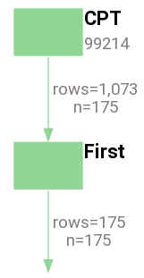

| person_id | criterion_id | criterion_domain | start_date | end_date | source_value |
| --------- | ------------ | ---------------- | ---------- | -------- | ------------ |
| 2 | 58127 | procedure_occurrence | 2009-07-03 | 2009-07-03 | 99214 |
| 5 | 38313 | procedure_occurrence | 2008-12-14 | 2008-12-14 | 99214 |
| 6 | 48992 | procedure_occurrence | 2009-09-12 | 2009-09-12 | 99214 |
| 7 | 63797 | procedure_occurrence | 2008-08-13 | 2008-08-13 | 99214 |
| 8 | 55871 | procedure_occurrence | 2008-02-27 | 2008-02-27 | 99214 |
| 9 | 45498 | procedure_occurrence | 2009-09-11 | 2009-09-11 | 99214 |
| 10 | 48752 | procedure_occurrence | 2009-05-09 | 2009-05-09 | 99214 |
| 11 | 73107 | procedure_occurrence | 2008-06-17 | 2008-06-17 | 99214 |
| 12 | 71635 | procedure_occurrence | 2008-02-11 | 2008-02-11 | 99214 |
| 13 | 74458 | procedure_occurrence | 2008-01-24 | 2008-01-24 | 99214 |

---

The diagram above reads "get all procedures that match the CPT 99214 (Office Visit) and then filter them down to the first occurrence (by date) for each person".  More succinctly, "get the first office visit for each patient".  The diagram is much more terse than that and to accurately read the diagram, you need a lot of implicit knowledge about how each operator operates.  Fortunately, this document will impart that knowledge to you.

Please note that all of the diagrams end with an arrow pointing at nothing.  We'll explain why soon.

### Think of Results as a Stream

ConceptQL diagrams have the "leaf" operators at the top and "trunk" operators at the bottom.  You can think of the results of a ConceptQL statement as a flowing stream of data.  The leaf operators, or operators that gather results out of the database, act like tributaries.  The results flow downwards and either join with other results, or filter out other results until the streams emerge at the bottom of the diagram.  Think of each arrow as a stream of results, flowing down through one operator to the next.

The trailing arrow in the diagrams serves as a reminder that every ConceptQL statement yields a stream of results.

### Streams Have Types

You might have noticed that the operators and edges in the diagrams often have a color.  That color represents what "type" of stream the operator or edge represents.  There are several types in ConceptQL, and you'll notice they are somewhat correlated with the tables found in [OMOP's CDM v4.0](https://github.com/OHDSI/CommonDataModel/releases/tag/v4):

- condition_occurrence
    - red
- death
    - brown
- drug_exposure
    - purple
- person
    - blue
- procedure_occurrence
    - green

Each stream has a vocabulary of origin (essentially, the vocabulary used to pull results from the GDM database).  Based on that origin, each stream will have a particular type.  The stream carries this type information as it moves through each operator.  When certain operators, particularly set and temporal operators, need to perform filtering, they can use this type information to determine how to best filter a stream.  There will be much more discussion about types woven throughout this document.  For now, it is sufficient to know that each stream has a type.

You'll also notice that the trailing arrow(s) at the end of the diagrams indicate which types of streams are ultimately passed on at the end of a ConceptQL statement.

### Why Types?

At its inception, ConceptQL was developed to query [OMOP's CDM v4.0](https://github.com/OHDSI/CommonDataModel/releases/tag/v4) and its associated tables.  Each table represented a certain "type" of data (e.g. condition_occurrence, procedure_occurrence, visit_occurrence, etc) and ConceptQL was designed to treat each type of data as distinct from the other types.

Now that ConceptQL runs against the [GDM](https://github.com/outcomesinsights/generalized_data_model), types are far less important, but are still maintained to help users distinguish between the kinds of data a ConceptQL statement is querying.

### What *are* Streams Really?

Though thinking in "streams" is helpful, on a few occasions we need to know what's going on under the hood.

Every table in the GDM structure has a surrogate key column (an ID column).  When we execute a ConceptQL statement, the "streams" that are generated by the statement are just sets of these IDs for rows that matched the ConceptQL criteria.  So each stream is just a set of IDs that point back to some rows in one of the GDM tables.  When a stream has a "type" it is really just that the stream contains results associated with its vocabulary of origin.

So when we execute this ConceptQL statement, the resulting "stream" is all IDs from the `patients` table where the patient is male:

---

**Example 4 - All Male Patients**

```JSON

["gender","Male"]

```

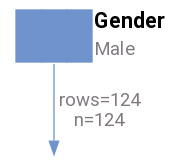

| person_id | criterion_id | criterion_domain | start_date | end_date | source_value |
| --------- | ------------ | ---------------- | ---------- | -------- | ------------ |
| 1 | 1 | person | 1923-05-01 | 1923-05-01 | 00013D2EFD8E45D1 |
| 2 | 2 | person | 1943-01-01 | 1943-01-01 | 00016F745862898F |
| 4 | 4 | person | 1941-06-01 | 1941-06-01 | 00021CA6FF03E670 |
| 5 | 5 | person | 1936-08-01 | 1936-08-01 | 00024B3D2352D2D0 |
| 6 | 6 | person | 1943-10-01 | 1943-10-01 | 0002DAE1C81CC70D |
| 7 | 7 | person | 1922-07-01 | 1922-07-01 | 0002F28CE057345B |
| 8 | 8 | person | 1935-09-01 | 1935-09-01 | 000308435E3E5B76 |
| 12 | 12 | person | 1929-06-01 | 1929-06-01 | 00048EF1F4791C68 |
| 14 | 14 | person | 1934-05-01 | 1934-05-01 | 00052705243EA128 |
| 16 | 16 | person | 1934-01-01 | 1934-01-01 | 0007E57CC13CE880 |

---

When we execute this ConceptQL statement, the resulting "stream" is all `clinical_codes` IDs that match ICD-9CM 250.01:

---

**Example 5 - All Condition Occurrences that match ICD-9CM 250.01**

```JSON

["icd9","250.01"]

```


| person_id | criterion_id | criterion_domain | start_date | end_date | source_value |
| --------- | ------------ | ---------------- | ---------- | -------- | ------------ |
| 136 | 15609 | condition_occurrence | 2009-04-06 | 2009-04-06 | 25001 |
| 131 | 17030 | condition_occurrence | 2010-10-05 | 2010-10-05 | 25001 |
| 131 | 18099 | condition_occurrence | 2010-02-05 | 2010-02-05 | 25001 |
| 82 | 22080 | condition_occurrence | 2008-02-13 | 2008-02-13 | 25001 |
| 137 | 23953 | condition_occurrence | 2008-10-02 | 2008-10-02 | 25001 |
| 249 | 25525 | condition_occurrence | 2009-05-27 | 2009-05-27 | 25001 |
| 83 | 27582 | condition_occurrence | 2009-04-29 | 2009-04-29 | 25001 |
| 14 | 28741 | condition_occurrence | 2009-06-27 | 2009-06-27 | 25001 |
| 17 | 30214 | condition_occurrence | 2010-03-21 | 2010-03-21 | 25001 |
| 187 | 31594 | condition_occurrence | 2009-11-16 | 2009-11-16 | 25001 |

---

Generally, it is helpful to just think of those queries generating a "stream of people" or a "stream of conditions" and not worry about the table of origin or the fact that they are just IDs.

When a ConceptQL statement is executed, it yields a final set of streams that are just all the IDs that passed through all the criteria.  What is done with that set of IDs is up to the user who assembled the ConceptQL statement.  If a user gathers all 250.01 Conditions, they will end up with a set of `clinical_codes` IDs.  They could take those IDs and do all sorts of things like:

- Gather the first and last date of occurrence per person
- Count the number of occurrences per person
- Count number of persons with the condition
- Count the total number of occurrences for the entire population

This kind of aggregation and analysis is beyond the scope of ConceptQL.  ConceptQL will get you the IDs of the rows you're interested in, it's up to other parts of the calling system to determine what you do with them.

## Selection Operators

Selection operators are the parts of a ConceptQL statement that search for specific values within the CDM data, e.g. searching the condition_occurrence table for a diagnosis of an old myocardial infarction (ICD-9CM 412) is a selection.  Selection operators are always leaf operators, meaning no operators "feed" into a selection operator.

There are _many_ selection operators.  A list of currently implemented operators is available in Appendix A.

## All Other Operators i.e. Mutation Operators

Virtually all other operators add, remove, filter, or otherwise alter streams of results.  They are discussed in this section.

## Set Operators

Because streams represent sets of results, it makes sense to include operators that operate on sets

### `Union` Operator

- Takes any number of upstream operators and aggregates their streams
    - Unions together streams with identical types
        - Think of streams with the same type flowing together into a single stream
        - We're really just gathering the union of all IDs for identically-typed streams
    - Streams with the different types flow along together concurrently without interacting
        - It does not make sense to union, say, condition_occurrences with procedure_occurrences, so streams with different types won't mingle together, but will continue to flow downstream in parallel

---

**Example 6 - Two streams of the same type (condition_occurrence) joined into a single stream**

```JSON

["union",["icd9","412"],["icd9","250.01"]]

```


| person_id | criterion_id | criterion_domain | start_date | end_date | source_value |
| --------- | ------------ | ---------------- | ---------- | -------- | ------------ |
| 131 | 172 | condition_occurrence | 2008-03-22 | 2008-03-23 | 412 |
| 177 | 507 | condition_occurrence | 2009-06-13 | 2009-06-16 | 412 |
| 230 | 523 | condition_occurrence | 2008-03-14 | 2008-03-21 | 412 |
| 161 | 963 | condition_occurrence | 2009-10-25 | 2009-10-29 | 412 |
| 60 | 986 | condition_occurrence | 2009-07-19 | 2009-07-22 | 412 |
| 81 | 1405 | condition_occurrence | 2009-01-28 | 2009-01-30 | 412 |
| 88 | 1572 | condition_occurrence | 2009-01-03 | 2009-01-09 | 412 |
| 213 | 15005 | condition_occurrence | 2010-02-07 | 2010-02-07 | 412 |
| 136 | 15609 | condition_occurrence | 2009-04-06 | 2009-04-06 | 25001 |
| 66 | 16171 | condition_occurrence | 2009-07-25 | 2009-07-25 | 412 |

---

---

**Example 7 - Two streams of the same type (condition_occurrence) joined into a single stream, then a different stream (procedure_occurrence) flows concurrently**

```JSON

["union",["union",["icd9","412"],["icd9","250.01"]],["cpt","99214"]]

```

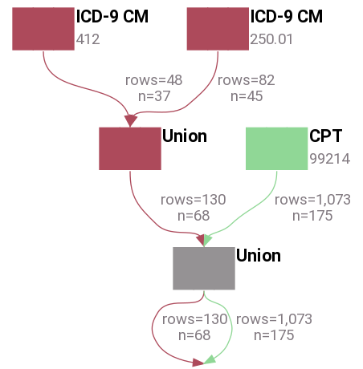

| person_id | criterion_id | criterion_domain | start_date | end_date | source_value |
| --------- | ------------ | ---------------- | ---------- | -------- | ------------ |
| 131 | 172 | condition_occurrence | 2008-03-22 | 2008-03-23 | 412 |
| 177 | 507 | condition_occurrence | 2009-06-13 | 2009-06-16 | 412 |
| 230 | 523 | condition_occurrence | 2008-03-14 | 2008-03-21 | 412 |
| 161 | 963 | condition_occurrence | 2009-10-25 | 2009-10-29 | 412 |
| 60 | 986 | condition_occurrence | 2009-07-19 | 2009-07-22 | 412 |
| 81 | 1405 | condition_occurrence | 2009-01-28 | 2009-01-30 | 412 |
| 88 | 1572 | condition_occurrence | 2009-01-03 | 2009-01-09 | 412 |
| 213 | 15005 | condition_occurrence | 2010-02-07 | 2010-02-07 | 412 |
| 136 | 15609 | condition_occurrence | 2009-04-06 | 2009-04-06 | 25001 |
| 66 | 16171 | condition_occurrence | 2009-07-25 | 2009-07-25 | 412 |

---

---

**Example 8 - Two streams of the same type (condition_occurrence) joined into a single stream, along with a different stream (procedure_occurrence) flows concurrently (same as above example)**

```JSON

["union",["icd9","412"],["icd9","250.01"],["cpt","99214"]]

```

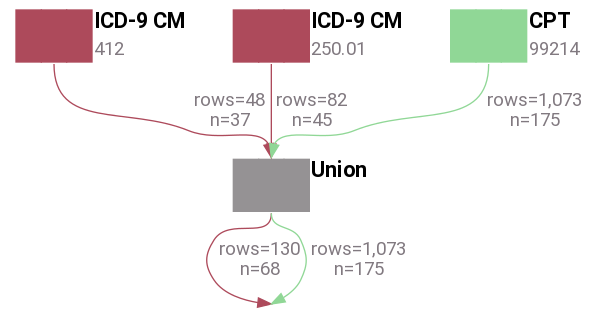

| person_id | criterion_id | criterion_domain | start_date | end_date | source_value |
| --------- | ------------ | ---------------- | ---------- | -------- | ------------ |
| 131 | 172 | condition_occurrence | 2008-03-22 | 2008-03-23 | 412 |
| 177 | 507 | condition_occurrence | 2009-06-13 | 2009-06-16 | 412 |
| 230 | 523 | condition_occurrence | 2008-03-14 | 2008-03-21 | 412 |
| 161 | 963 | condition_occurrence | 2009-10-25 | 2009-10-29 | 412 |
| 60 | 986 | condition_occurrence | 2009-07-19 | 2009-07-22 | 412 |
| 81 | 1405 | condition_occurrence | 2009-01-28 | 2009-01-30 | 412 |
| 88 | 1572 | condition_occurrence | 2009-01-03 | 2009-01-09 | 412 |
| 213 | 15005 | condition_occurrence | 2010-02-07 | 2010-02-07 | 412 |
| 136 | 15609 | condition_occurrence | 2009-04-06 | 2009-04-06 | 25001 |
| 66 | 16171 | condition_occurrence | 2009-07-25 | 2009-07-25 | 412 |

---

### `Intersect` Operator

1. Group incoming streams by type
1. For each group of same-type streams
     a. Intersect all streams, yielding a single stream that contains only those IDs common to those streams
1. A single stream for each incoming type is sent downstream
     a. If only a single stream of a type is upstream, that stream is essentially unaltered as it is passed downstream

---

**Example 9 - Yields a single stream of all patients that are male and white.  This involves two person streams and so results are intersected**

```JSON

["intersect",["gender","male"],["race","white"]]

```


| person_id | criterion_id | criterion_domain | start_date | end_date | source_value |
| --------- | ------------ | ---------------- | ---------- | -------- | ------------ |
| 131 | 131 | person | 1932-03-01 | 1932-03-01 | 00388B34335069C0 |
| 168 | 168 | person | 1931-08-01 | 1931-08-01 | 00534E60E969C69E |
| 70 | 70 | person | 1923-01-01 | 1923-01-01 | 00227C9BE53C38FD |
| 87 | 87 | person | 1943-04-01 | 1943-04-01 | 0028A82FE0CA0802 |
| 116 | 116 | person | 1944-01-01 | 1944-01-01 | 00331E23B76902ED |
| 114 | 114 | person | 1940-07-01 | 1940-07-01 | 0032C178DA63958A |
| 112 | 112 | person | 1936-08-01 | 1936-08-01 | 003282C0D50D34BA |
| 84 | 84 | person | 1939-03-01 | 1939-03-01 | 00258EEA7B4078D1 |
| 93 | 93 | person | 1941-04-01 | 1941-04-01 | 002A425E967ED186 |
| 224 | 224 | person | 1929-06-01 | 1929-06-01 | 0072A5D566AD2FBA |

---

---

**Example 10 - Yields two streams: a stream of all MI Conditions and a stream of all Male patients.  This is essentially the same behavior as Union in this case**

```JSON

["intersect",["icd9","412"],["gender","Male"]]

```


| person_id | criterion_id | criterion_domain | start_date | end_date | source_value |
| --------- | ------------ | ---------------- | ---------- | -------- | ------------ |
| 131 | 172 | condition_occurrence | 2008-03-22 | 2008-03-23 | 412 |
| 177 | 507 | condition_occurrence | 2009-06-13 | 2009-06-16 | 412 |
| 230 | 523 | condition_occurrence | 2008-03-14 | 2008-03-21 | 412 |
| 161 | 963 | condition_occurrence | 2009-10-25 | 2009-10-29 | 412 |
| 60 | 986 | condition_occurrence | 2009-07-19 | 2009-07-22 | 412 |
| 81 | 1405 | condition_occurrence | 2009-01-28 | 2009-01-30 | 412 |
| 88 | 1572 | condition_occurrence | 2009-01-03 | 2009-01-09 | 412 |
| 213 | 15005 | condition_occurrence | 2010-02-07 | 2010-02-07 | 412 |
| 66 | 16171 | condition_occurrence | 2009-07-25 | 2009-07-25 | 412 |
| 220 | 20660 | condition_occurrence | 2009-10-31 | 2009-10-31 | 412 |

---

---

**Example 11 - Yields two streams: a stream of all Conditions where MI was Primary Diagnosis and a stream of all White, Male patients.**

```JSON

["intersect",["icd9","412"],["gender","Male"],["race","White"]]

```


| person_id | criterion_id | criterion_domain | start_date | end_date | source_value |
| --------- | ------------ | ---------------- | ---------- | -------- | ------------ |
| 131 | 172 | condition_occurrence | 2008-03-22 | 2008-03-23 | 412 |
| 177 | 507 | condition_occurrence | 2009-06-13 | 2009-06-16 | 412 |
| 230 | 523 | condition_occurrence | 2008-03-14 | 2008-03-21 | 412 |
| 161 | 963 | condition_occurrence | 2009-10-25 | 2009-10-29 | 412 |
| 60 | 986 | condition_occurrence | 2009-07-19 | 2009-07-22 | 412 |
| 81 | 1405 | condition_occurrence | 2009-01-28 | 2009-01-30 | 412 |
| 88 | 1572 | condition_occurrence | 2009-01-03 | 2009-01-09 | 412 |
| 213 | 15005 | condition_occurrence | 2010-02-07 | 2010-02-07 | 412 |
| 66 | 16171 | condition_occurrence | 2009-07-25 | 2009-07-25 | 412 |
| 220 | 20660 | condition_occurrence | 2009-10-31 | 2009-10-31 | 412 |

---

### `Except` Operator

This operator takes two sets of incoming streams, a left-hand stream and a right-hand stream.  The operator matches like-type streams between the left-hand and right-hand streams. The operator removes any results in the left-hand stream if they appear in the right-hand stream.  The operator passes only results for the left-hand stream downstream.  The operator discards all results in the right-hand stream. For example:

---

**Example 12 - All males who are not white**

```JSON

["except",{"left":["gender","male"],"right":["race","white"]}]

```


| person_id | criterion_id | criterion_domain | start_date | end_date | source_value |
| --------- | ------------ | ---------------- | ---------- | -------- | ------------ |
| 4 | 4 | person | 1941-06-01 | 1941-06-01 | 00021CA6FF03E670 |
| 6 | 6 | person | 1943-10-01 | 1943-10-01 | 0002DAE1C81CC70D |
| 21 | 21 | person | 1932-08-01 | 1932-08-01 | 000C7486B11E7030 |
| 22 | 22 | person | 1942-08-01 | 1942-08-01 | 000D6D88463D8A76 |
| 50 | 50 | person | 1941-08-01 | 1941-08-01 | 001AEDD510C92C87 |
| 68 | 68 | person | 1954-11-01 | 1954-11-01 | 0021D4CDAFC0609F |
| 69 | 69 | person | 1925-05-01 | 1925-05-01 | 00225409819CF5F6 |
| 71 | 71 | person | 1931-01-01 | 1931-01-01 | 0022CC1943D038E2 |
| 72 | 72 | person | 1933-04-01 | 1933-04-01 | 002354398A00234E |
| 75 | 75 | person | 1932-08-01 | 1932-08-01 | 00241223F034F97B |

---

If the left-hand stream has no types that match the right-hand stream, the left-hand stream passes through unaffected:

---

**Example 13 - All Conditions that are MI**

```JSON

["except",{"left":["icd9","412"],"right":["cpt","99214"]}]

```


| person_id | criterion_id | criterion_domain | start_date | end_date | source_value |
| --------- | ------------ | ---------------- | ---------- | -------- | ------------ |
| 131 | 172 | condition_occurrence | 2008-03-22 | 2008-03-23 | 412 |
| 177 | 507 | condition_occurrence | 2009-06-13 | 2009-06-16 | 412 |
| 230 | 523 | condition_occurrence | 2008-03-14 | 2008-03-21 | 412 |
| 161 | 963 | condition_occurrence | 2009-10-25 | 2009-10-29 | 412 |
| 60 | 986 | condition_occurrence | 2009-07-19 | 2009-07-22 | 412 |
| 81 | 1405 | condition_occurrence | 2009-01-28 | 2009-01-30 | 412 |
| 88 | 1572 | condition_occurrence | 2009-01-03 | 2009-01-09 | 412 |
| 213 | 15005 | condition_occurrence | 2010-02-07 | 2010-02-07 | 412 |
| 66 | 16171 | condition_occurrence | 2009-07-25 | 2009-07-25 | 412 |
| 220 | 20660 | condition_occurrence | 2009-10-31 | 2009-10-31 | 412 |

---

And just to show how multiple streams behave:

---

**Example 14 - Passes two streams downstream: a stream of Conditions that are MI (this stream is completely unaffected by the right hand stream) and a stream of People that are Male but not White**

```JSON

["except",{"left":["union",["icd9","412"],["gender","Male"]],"right":["race","White"]}]

```

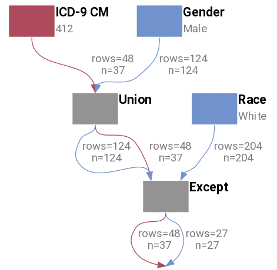

| person_id | criterion_id | criterion_domain | start_date | end_date | source_value |
| --------- | ------------ | ---------------- | ---------- | -------- | ------------ |
| 4 | 4 | person | 1941-06-01 | 1941-06-01 | 00021CA6FF03E670 |
| 6 | 6 | person | 1943-10-01 | 1943-10-01 | 0002DAE1C81CC70D |
| 21 | 21 | person | 1932-08-01 | 1932-08-01 | 000C7486B11E7030 |
| 22 | 22 | person | 1942-08-01 | 1942-08-01 | 000D6D88463D8A76 |
| 50 | 50 | person | 1941-08-01 | 1941-08-01 | 001AEDD510C92C87 |
| 68 | 68 | person | 1954-11-01 | 1954-11-01 | 0021D4CDAFC0609F |
| 69 | 69 | person | 1925-05-01 | 1925-05-01 | 00225409819CF5F6 |
| 71 | 71 | person | 1931-01-01 | 1931-01-01 | 0022CC1943D038E2 |
| 72 | 72 | person | 1933-04-01 | 1933-04-01 | 002354398A00234E |
| 75 | 75 | person | 1932-08-01 | 1932-08-01 | 00241223F034F97B |

---

### Discussion About Set Operators

#### Q. Why should we allow two different types of streams to continue downstream concurrently?

- This feature lets us do interesting things, like find the first occurrence of either an MI or Death as in the example below
    - Throw in a few more criteria and you could find the first occurrence of all censoring events for each patient

---

**Example 15 - First occurrence of either MI or Death for each patient**

```JSON

["first",["union",["icd9","412"],["death"]]]

```

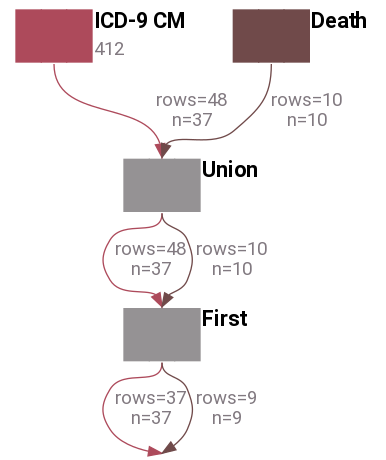

| person_id | criterion_id | criterion_domain | start_date | end_date | source_value |
| --------- | ------------ | ---------------- | ---------- | -------- | ------------ |
| 11 | 82614 | condition_occurrence | 2008-10-29 | 2008-10-29 | 412 |
| 16 | 1 | death | 2010-12-01 | 2010-12-01 |  |
| 17 | 27269 | condition_occurrence | 2008-08-25 | 2008-08-25 | 412 |
| 26 | 2 | death | 2009-07-01 | 2009-07-01 |  |
| 38 | 40556 | condition_occurrence | 2010-02-12 | 2010-02-12 | 412 |
| 54 | 74606 | condition_occurrence | 2008-06-05 | 2008-06-05 | 412 |
| 60 | 986 | condition_occurrence | 2009-07-19 | 2009-07-22 | 412 |
| 65 | 3 | death | 2009-01-01 | 2009-01-01 |  |
| 66 | 16171 | condition_occurrence | 2009-07-25 | 2009-07-25 | 412 |
| 73 | 52843 | condition_occurrence | 2008-11-16 | 2008-11-16 | 412 |

---

#### Q. Why aren't all streams passed forward unaltered?  Why union like-typed streams?

- The way `Intersect` works, if we passed like-typed streams forward without unioning them, Intersect would end up intersecting the two un-unioned like-type streams and that's not what we intended
- Essentially, these two diagrams would be identical:

---

**Example 16 - Two streams: a stream of all Conditions matching either 412 or 250.01 and a stream of Procedures matching 99214**

```JSON

["intersect",["union",["icd9","412"],["icd9","250.01"]],["cpt","99214"]]

```


| person_id | criterion_id | criterion_domain | start_date | end_date | source_value |
| --------- | ------------ | ---------------- | ---------- | -------- | ------------ |
| 131 | 172 | condition_occurrence | 2008-03-22 | 2008-03-23 | 412 |
| 177 | 507 | condition_occurrence | 2009-06-13 | 2009-06-16 | 412 |
| 230 | 523 | condition_occurrence | 2008-03-14 | 2008-03-21 | 412 |
| 161 | 963 | condition_occurrence | 2009-10-25 | 2009-10-29 | 412 |
| 60 | 986 | condition_occurrence | 2009-07-19 | 2009-07-22 | 412 |
| 81 | 1405 | condition_occurrence | 2009-01-28 | 2009-01-30 | 412 |
| 88 | 1572 | condition_occurrence | 2009-01-03 | 2009-01-09 | 412 |
| 213 | 15005 | condition_occurrence | 2010-02-07 | 2010-02-07 | 412 |
| 136 | 15609 | condition_occurrence | 2009-04-06 | 2009-04-06 | 25001 |
| 66 | 16171 | condition_occurrence | 2009-07-25 | 2009-07-25 | 412 |

---

---

**Example 17 - Two streams: a stream of all Conditions matching either 412 AND 250.01 (an empty stream, a condition cannot be both 412 and 250.01 at the same time) and a stream of Procedures matching 99214**

```JSON

["intersect",["intersect",["icd9","412"],["icd9","250.01"]],["cpt","99214"]]

```


| person_id | criterion_id | criterion_domain | start_date | end_date | source_value |
| --------- | ------------ | ---------------- | ---------- | -------- | ------------ |
| 173 | 13767 | procedure_occurrence | 2009-04-01 | 2009-04-01 | 99214 |
| 148 | 13960 | procedure_occurrence | 2010-07-02 | 2010-07-02 | 99214 |
| 188 | 14207 | procedure_occurrence | 2008-02-17 | 2008-02-17 | 99214 |
| 239 | 14245 | procedure_occurrence | 2010-09-01 | 2010-09-01 | 99214 |
| 247 | 14359 | procedure_occurrence | 2008-12-01 | 2008-12-01 | 99214 |
| 27 | 14733 | procedure_occurrence | 2008-09-11 | 2008-09-11 | 99214 |
| 35 | 14776 | procedure_occurrence | 2008-09-24 | 2008-09-24 | 99214 |
| 148 | 15051 | procedure_occurrence | 2008-12-02 | 2008-12-02 | 99214 |
| 127 | 15217 | procedure_occurrence | 2008-05-29 | 2008-05-29 | 99214 |
| 60 | 15332 | procedure_occurrence | 2009-02-13 | 2009-02-13 | 99214 |

---

## Time-oriented Operators

All results in a stream carry a start_date and end_date with them.  All temporal comparisons of streams use these two date columns.  Each result in a stream derives its start and end date from its corresponding row in its table of origin.

If a result comes from a table that only has a single date value, the result derives both its start_date and end_date from that single date, e.g. a death result derives both its start_date and end_date from its corresponding row's observation_date.

The person stream is a special case.  Person results use the person's date of birth as the start_date and end_date.  This may sound strange, but we will explain below why this can be useful.

### Relative Temporal Operators

When looking at a set of results for a person, perhaps we want to select just the chronologically first or last result.  Or maybe we want to select the 2nd result or 2nd to last result.  Relative temporal operators provide this type of filtering.  Relative temporal operators use a result's start_date to determine chronological order.

#### `Nth Occurrence` Operator

- Takes a two arguments: the stream to select from and an integer argument
- For the integer argument
    - Positive numbers mean 1st, 2nd, 3rd occurrence in chronological order
        - e.g. 1 => first
        - e.g. 4 => fourth
    - Negative numbers mean 1st, 2nd, 3rd occurrence in reverse chronological order
        - e.g. -1 => last
        - e.g. -4 => fourth from last
    - 0 is undefined?
- Has an optional parameter: `unique`
    - Setting the `unique` parameter to `true` will de-duplicate all upstream records by `patient_id`, `domain`, and `source_code`, creating a set of unique codes per patient.  Then it will find the Nth occurrence from that set of unique codes.

---

**Example 18 - For each patient, select the Condition that represents the second occurrence of an MI**

```JSON

["occurrence",2,["icd9","412"]]

```


| person_id | criterion_id | criterion_domain | start_date | end_date | source_value |
| --------- | ------------ | ---------------- | ---------- | -------- | ------------ |
| 17 | 46165 | condition_occurrence | 2009-04-30 | 2009-04-30 | 412 |
| 88 | 73803 | condition_occurrence | 2009-05-30 | 2009-05-30 | 412 |
| 152 | 84298 | condition_occurrence | 2010-11-22 | 2010-11-22 | 412 |
| 177 | 507 | condition_occurrence | 2009-06-13 | 2009-06-16 | 412 |
| 187 | 87583 | condition_occurrence | 2010-12-26 | 2010-12-26 | 412 |
| 212 | 34052 | condition_occurrence | 2009-10-07 | 2009-10-07 | 412 |
| 213 | 15005 | condition_occurrence | 2010-02-07 | 2010-02-07 | 412 |
| 214 | 83257 | condition_occurrence | 2009-11-12 | 2009-11-12 | 412 |
| 220 | 20660 | condition_occurrence | 2009-10-31 | 2009-10-31 | 412 |
| 223 | 39893 | condition_occurrence | 2008-10-31 | 2008-10-31 | 412 |

---

In the example shown below, the `unique` parameter under the `Nth Occurrence` operator in the algorithm will de-duplicate all upstream records and create a new set of records limited to the first `410.00`, the first `410.01`, the first `250.00`, and the first `250.01` ICD-9 codes for a patient.  The `occurrence` parameter will find the nth of those unique codes.  In the example below, the algorithm will find the second of three unique codes for each patient.  This algorithm ensures that this patient has at least two of the ICD-9 codes listed in the ICD-9 operator.  As a reminder, the `First`, `Last`, and `Nth Occurrence` operators return only one record per patient.  If there are multiple records with the same date that meet the requirements of the `First`, `Last`, and `Nth Occurrence`, an arbitrary row is returned.

---

**Example 19**

```JSON

["occurrence",2,["icd9","410.00","410.01","250.00","250.01"],{"unique":true}]

```

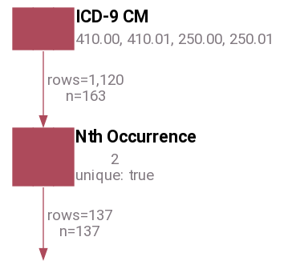

| person_id | criterion_id | criterion_domain | start_date | end_date | source_value |
| --------- | ------------ | ---------------- | ---------- | -------- | ------------ |
| 2 | 57897 | condition_occurrence | 2009-05-16 | 2009-05-16 | 25000 |
| 7 | 69706 | condition_occurrence | 2008-05-12 | 2008-05-12 | 25000 |
| 8 | 90541 | condition_occurrence | 2009-03-01 | 2009-03-03 | 25000 |
| 9 | 84726 | condition_occurrence | 2010-09-12 | 2010-09-12 | 25000 |
| 11 | 35227 | condition_occurrence | 2008-12-08 | 2008-12-08 | 25000 |
| 12 | 43800 | condition_occurrence | 2009-05-21 | 2009-05-21 | 25000 |
| 13 | 57738 | condition_occurrence | 2008-11-22 | 2008-11-22 | 25000 |
| 14 | 28741 | condition_occurrence | 2009-06-27 | 2009-06-27 | 25001 |
| 15 | 68873 | condition_occurrence | 2010-11-18 | 2010-11-18 | 25000 |
| 17 | 73012 | condition_occurrence | 2008-04-26 | 2008-04-26 | 25000 |

---

#### `First` Operator

- [Nth Occurrence Operator](#nth-occurrence-operator) that is shorthand for writing ``[ "occurrence", 1 ]``

---

**Example 20 - For each patient, select the Condition that represents the first occurrence of an MI**

```JSON

["first",["icd9","412"]]

```

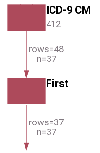

| person_id | criterion_id | criterion_domain | start_date | end_date | source_value |
| --------- | ------------ | ---------------- | ---------- | -------- | ------------ |
| 11 | 82614 | condition_occurrence | 2008-10-29 | 2008-10-29 | 412 |
| 17 | 27269 | condition_occurrence | 2008-08-25 | 2008-08-25 | 412 |
| 38 | 40556 | condition_occurrence | 2010-02-12 | 2010-02-12 | 412 |
| 54 | 74606 | condition_occurrence | 2008-06-05 | 2008-06-05 | 412 |
| 60 | 986 | condition_occurrence | 2009-07-19 | 2009-07-22 | 412 |
| 66 | 16171 | condition_occurrence | 2009-07-25 | 2009-07-25 | 412 |
| 73 | 52843 | condition_occurrence | 2008-11-16 | 2008-11-16 | 412 |
| 77 | 58165 | condition_occurrence | 2010-10-06 | 2010-10-06 | 412 |
| 81 | 1405 | condition_occurrence | 2009-01-28 | 2009-01-30 | 412 |
| 88 | 1572 | condition_occurrence | 2009-01-03 | 2009-01-09 | 412 |

---

#### `Last` Operator

- [Nth Occurrence Operator](#nth-occurrence-operator) that is shorthand for writing ``[ "occurrence", -1 ]``

---

**Example 21 - For each patient, select the Condition that represents the last occurrence of an MI**

```JSON

["last",["icd9","412"]]

```

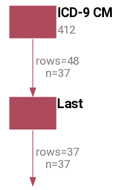

| person_id | criterion_id | criterion_domain | start_date | end_date | source_value |
| --------- | ------------ | ---------------- | ---------- | -------- | ------------ |
| 11 | 82614 | condition_occurrence | 2008-10-29 | 2008-10-29 | 412 |
| 17 | 46165 | condition_occurrence | 2009-04-30 | 2009-04-30 | 412 |
| 38 | 40556 | condition_occurrence | 2010-02-12 | 2010-02-12 | 412 |
| 54 | 74606 | condition_occurrence | 2008-06-05 | 2008-06-05 | 412 |
| 60 | 986 | condition_occurrence | 2009-07-19 | 2009-07-22 | 412 |
| 66 | 16171 | condition_occurrence | 2009-07-25 | 2009-07-25 | 412 |
| 73 | 52843 | condition_occurrence | 2008-11-16 | 2008-11-16 | 412 |
| 77 | 58165 | condition_occurrence | 2010-10-06 | 2010-10-06 | 412 |
| 81 | 1405 | condition_occurrence | 2009-01-28 | 2009-01-30 | 412 |
| 88 | 73803 | condition_occurrence | 2009-05-30 | 2009-05-30 | 412 |

---

### Date Literals

For situations where we need to represent pre-defined date ranges, we can use "date literal" operators.

#### `Date Range` Operator

- Takes a hash with two elements: { start: \<date-format\>, end: \<date-format\> }
- Creates an inclusive, continuous range of dates defined by a start and end date

#### day

- Takes a single argument: \<date-format\>
- Represents a single day
- Shorthand for creating a date range that starts and ends on the same date
- *Not yet implemented*

#### What is <date-format\>?

Dates follow these formats:

- "YYYY-MM-DD"
    - Four-digit year, two-digit month with leading 0s, two-digit day with leading 0s
- "START"
    - Represents the first date of information available from the data source
- "END"
    - Represents the last date of information available from the data source.

### Temporal Comparison Operators

As described above, each result carries a start and end date, defining its own date range.  It is through these date ranges that we are able to do temporal filtering of streams via temporal operators.

Temporal operators work by comparing a left-hand stream (L) against a right-hand stream (R).  R can be either a set of streams or a pre-defined date range.  Each temporal operator has a comparison operator which defines how it compares dates between L and R.  A temporal operator passes results only from L downstream.  A temporal operator discards all results in the R stream after it makes all comparisons.

---

**Example 22 - All MIs for the year 2010**

```JSON

["during",{"left":["icd9","412"],"right":["date_range",{"start":"2010-01-01","end":"2010-12-31"}]}]

```


| person_id | criterion_id | criterion_domain | start_date | end_date | source_value |
| --------- | ------------ | ---------------- | ---------- | -------- | ------------ |
| 213 | 15005 | condition_occurrence | 2010-02-07 | 2010-02-07 | 412 |
| 90 | 33940 | condition_occurrence | 2010-05-26 | 2010-05-26 | 412 |
| 38 | 40556 | condition_occurrence | 2010-02-12 | 2010-02-12 | 412 |
| 239 | 49718 | condition_occurrence | 2010-02-12 | 2010-02-12 | 412 |
| 217 | 56467 | condition_occurrence | 2010-06-22 | 2010-06-23 | 412 |
| 77 | 58165 | condition_occurrence | 2010-10-06 | 2010-10-06 | 412 |
| 110 | 62592 | condition_occurrence | 2010-06-27 | 2010-06-27 | 412 |
| 152 | 84298 | condition_occurrence | 2010-11-22 | 2010-11-22 | 412 |
| 187 | 87583 | condition_occurrence | 2010-12-26 | 2010-12-26 | 412 |
| 109 | 89334 | condition_occurrence | 2010-07-06 | 2010-07-06 | 412 |

---

When comparing results in L against a set of results in R, the temporal operator compares results in stream L against results in stream R on a person-by-person basis.

- If a person has results in L or R stream, but not in both, none of their results continue downstream
- On a per person basis, the temporal operator joins all results in the L stream to all results in the R stream
    - Any results in the L stream that meet the temporal comparison against any results in the R stream continue downstream

---

**Example 23 - All MIs While Patients had Part A Medicare**

```JSON

["during",{"left":["icd9","412"],"right":["payer","Part A"]}]

```


```No Results.  Statement is experimental.```

---

#### `Any Overlap` Operator

As a foray into defining less strict relationships, we've created the `Any Overlap` operator, which passes through any results in L that overlap whatsoever with a result in R.  This diagram attempts to demonstrate all L results that would qualify as having "any_overlap" with an R result.


#### Edge Behaviors of Before and After

For 11 of the 13 temporal operators, comparison of results is straight-forward.  However, the `Before`/`After` operators have a slight twist.

Imagine events 1-1-2-1-2-1.  In my mind, three 1's come before a 2 and two 1's come after a 2.  Accordingly:

- When comparing L **before** R, the temporal operator compares L against the **LAST** occurrence of R per person
- When comparing L **after** R, the temporal operator compares L against the **FIRST** occurrence of R per person

If we're looking for events in L that occur before events in R, then any event in L that occurs before the last event in R technically meet the comparison of "before".  The reverse is true for after: all events in L that occur after the first event in R technically occur after R.

---

**Example 24 - All MIs that occurred before a patient's __last__ case of diabetes (250.01)**

```JSON

["before",{"left":["icd9","412"],"right":["icd9","250.01"]}]

```


| person_id | criterion_id | criterion_domain | start_date | end_date | source_value |
| --------- | ------------ | ---------------- | ---------- | -------- | ------------ |
| 131 | 172 | condition_occurrence | 2008-03-22 | 2008-03-23 | 412 |
| 81 | 1405 | condition_occurrence | 2009-01-28 | 2009-01-30 | 412 |
| 66 | 16171 | condition_occurrence | 2009-07-25 | 2009-07-25 | 412 |
| 184 | 24281 | condition_occurrence | 2008-01-07 | 2008-01-07 | 412 |
| 17 | 27269 | condition_occurrence | 2008-08-25 | 2008-08-25 | 412 |
| 17 | 46165 | condition_occurrence | 2009-04-30 | 2009-04-30 | 412 |
| 152 | 82988 | condition_occurrence | 2008-08-16 | 2008-08-16 | 412 |
| 214 | 83257 | condition_occurrence | 2009-11-12 | 2009-11-12 | 412 |
| 109 | 89334 | condition_occurrence | 2010-07-06 | 2010-07-06 | 412 |
| 214 | 89463 | condition_occurrence | 2008-02-17 | 2008-02-17 | 412 |

---

If this is not the behavior you desire, use one of the sequence operators to select which event in R should be the one used to do comparison

---

**Example 25 - All MIs that occurred before a patient's __first__ case of diabetes (250.01)**

```JSON

["before",{"left":["icd9","412"],"right":["first",["icd9","250.01"]]}]

```


| person_id | criterion_id | criterion_domain | start_date | end_date | source_value |
| --------- | ------------ | ---------------- | ---------- | -------- | ------------ |
| 131 | 172 | condition_occurrence | 2008-03-22 | 2008-03-23 | 412 |
| 81 | 1405 | condition_occurrence | 2009-01-28 | 2009-01-30 | 412 |
| 66 | 16171 | condition_occurrence | 2009-07-25 | 2009-07-25 | 412 |
| 184 | 24281 | condition_occurrence | 2008-01-07 | 2008-01-07 | 412 |
| 17 | 27269 | condition_occurrence | 2008-08-25 | 2008-08-25 | 412 |
| 17 | 46165 | condition_occurrence | 2009-04-30 | 2009-04-30 | 412 |
| 152 | 82988 | condition_occurrence | 2008-08-16 | 2008-08-16 | 412 |
| 109 | 89334 | condition_occurrence | 2010-07-06 | 2010-07-06 | 412 |
| 214 | 89463 | condition_occurrence | 2008-02-17 | 2008-02-17 | 412 |
| 187 | 90638 | condition_occurrence | 2009-01-31 | 2009-01-31 | 412 |

---

### Temporal Comparison Improvements

Sometimes it is difficult to reason through `Time Window` (described below) when working with temporal comparison operators.  It would be nice if a more intuitive language could be used to describe some common temporal relationships.

We've added a few parameters, primarily for the `Before` and `After` operators, that will help with temporal comparisons.

#### New Parameters

- `within`
    - Takes same date adjustment format as `time_window`, e.g. 30d or 2m or 1y-3d
    - The start_date and end_date of the RHS are adjusted out in each direction by the amount specified and the event must pass the original temporal comparison and then fall within the window created by the adjustment
- `at_least`
    - Takes same date adjustment format as `time_window`, e.g. 30d or 2m or 1y-3d
- `occurrences`
    - Takes an whole number

Let's see them in action:

**Prescriptions After a Office Visit** - Find all prescriptions of interest occurring within three days after an office visit

---

**Example 26**

```JSON

["after",{"left":["ndc","61392070054","65084025214","65726040125",{"label":"Prescriptions of Interest"}],"right":["cpt","99214",{"label":"Office Visit"}],"within":"3d"}]

```

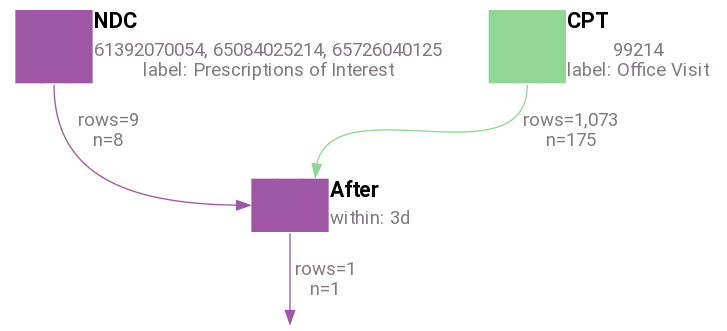

| person_id | criterion_id | criterion_domain | start_date | end_date | source_value |
| --------- | ------------ | ---------------- | ---------- | -------- | ------------ |
| 207 | 11312 | drug_exposure | 2010-08-13 | 2010-08-13 | 61392070054 |

---

Walk through of example above:

- Pull some prescriptions of interest into LHS
- Pull some office visits into RHS
- Compare LHS against RHS, enforcing that the LHS' start_date falls after the RHS' end_date
- Enforce that any remaining LHS' start_date falls within an RHS's (start_date - 3 days) and (end_date + 3 days)

**Find all Heart Attacks Probably Resulting in Death** -- Does anyone die within a year of a heart attack?

---

**Example 27**

```JSON

["before",{"left":["icd9","410.00","410.01","410.10","410.11"],"right":["death"],"within":"1y"}]

```


| person_id | criterion_id | criterion_domain | start_date | end_date | source_value |
| --------- | ------------ | ---------------- | ---------- | -------- | ------------ |
| 191 | 42977 | condition_occurrence | 2009-05-21 | 2009-05-21 | 41010 |

---

Walk through of example above:

- Pull hospitalizations into LHS
- Pull death records into RHS
- Compare LHS against RHS, enforcing that the LHS' end_date falls before the RHS' start_date
- Enforce that any remaining LHS row's end_date falls within an RHS row's (start_date - 1 year) and (end_date + 1 year)


---

**Example 28 - Multiple Myeloma algorithm -- Select all diabetes diagnoses that are preceded by at least 3 other diabetes diagnoses within 90 days of each other.**

```JSON

["after",{"left":["icd9","250.00",{"label":"Diabetes Dx"}],"right":["recall","Diabetes Dx"],"occurrences":3,"within":"90d"}]

```


| person_id | criterion_id | criterion_domain | start_date | end_date | source_value |
| --------- | ------------ | ---------------- | ---------- | -------- | ------------ |
| 68 | 19 | condition_occurrence | 2008-04-19 | 2008-04-23 | 25000 |
| 243 | 205 | condition_occurrence | 2009-08-20 | 2009-08-23 | 25000 |
| 230 | 231 | condition_occurrence | 2008-03-30 | 2008-04-02 | 25000 |
| 168 | 297 | condition_occurrence | 2010-02-14 | 2010-02-18 | 25000 |
| 247 | 337 | condition_occurrence | 2008-03-29 | 2008-03-30 | 25000 |
| 123 | 904 | condition_occurrence | 2008-12-28 | 2008-12-31 | 25000 |
| 17 | 929 | condition_occurrence | 2010-05-22 | 2010-06-12 | 25000 |
| 60 | 983 | condition_occurrence | 2009-07-19 | 2009-07-22 | 25000 |
| 178 | 1158 | condition_occurrence | 2008-11-26 | 2008-11-28 | 25000 |
| 179 | 1324 | condition_occurrence | 2008-09-18 | 2008-09-19 | 25000 |

---

Walk through of example above:

- Pull diabetes diagnoses into LHS
- Pull same set of diagnoses into RHS
- Keep all LHS rows where LHS' start_date falls between RHS' end_date and (end_date + 90 days)
- Use a window function to group LHS by matching RHS row and sort group by date, then number each LHS row
- Keep only LHS rows that have a number greater than 3
- Dedupe LHS rows on output

---

**Example 29 - Find all diagnosis of heart attack at least 1 week after a diagnosis of diabetes**

```JSON

["after",{"left":["icd9","410.00","410.01","410.10","410.11",{"label":"Heart Attack Dx"}],"right":["icd9","250.01",{"label":"Diabetes Dx"}],"at_least":"1w"}]

```

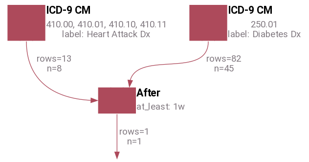

| person_id | criterion_id | criterion_domain | start_date | end_date | source_value |
| --------- | ------------ | ---------------- | ---------- | -------- | ------------ |
| 58 | 79480 | condition_occurrence | 2009-02-24 | 2009-02-24 | 41011 |

---

This example illustrates how `at_least` works.

#### Considerations

Currently, temporal comparisons are done with an inner join between the LHS relation and the RHS relation.  This has some interesting effects:

- If more than one RHS row matches with an LHS row, multiple copies of the LHS row will end up in the downstream results
    - Should we limit the LHS to only unique rows, essentially de-duping the downstream results?
- If the same row appears in both the LHS and RHS relation, it is likely the row will match itself (e.g. a row occurs during itself and contains itself etc.)
    - This is a bit awkward and perhaps we should skip joining rows against each other if they are identical (i.e. have the same `criterion_id` and `criterion_type`)?

### `Time Window` Operator

There are situations when the date columns associated with a result should have their values shifted forward or backward in time to make a comparison with another set of dates.  This is where the `Time Window` operator is used.  It has the following properties:

- Takes 2 arguments
    - First argument is the stream on which to operate
    - Second argument is a hash with two keys: \[:start, :end\] each with a value in the following format:  "(-?\d+\[dmy\])+"
        - Both start and end must be defined, even if you are only adjusting one of the dates
    - Some examples
        - 30d => 30 days
        - 20 => 20 days
        - d => 1 day
        - 1y => 1 year
        - -1m => -1 month
        - 10d3m => 3 months and 10 days
        - -2y10m-3d => -2 years, +10 months, -3 days
    - The start or end value can also be '', '0', or nil
        - This will leave the date unaffected
    - The start or end value can also be the string 'start' or 'end'
        - 'start' represents the start_date for each result
        - 'end' represents the end_date for each result
        - See the example below

---

**Example 30 - All Diagnoses of Diabetes (ICD-9 250.01) within 30 days of an MI**

```JSON

["during",{"left":["icd9","250.01"],"right":["time_window",["icd9","412"],{"start":"-30d","end":"30d"}]}]

```

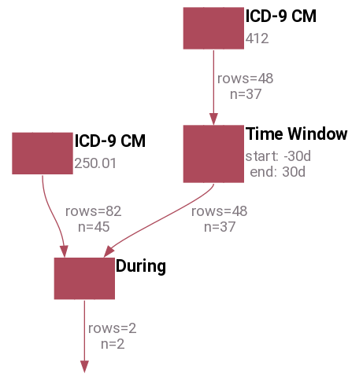

| person_id | criterion_id | criterion_domain | start_date | end_date | source_value |
| --------- | ------------ | ---------------- | ---------- | -------- | ------------ |
| 96 | 46366 | condition_occurrence | 2008-09-13 | 2008-09-13 | 25001 |
| 223 | 81480 | condition_occurrence | 2008-07-03 | 2008-07-03 | 25001 |

---

---

**Example 31 - Shift the window for all MIs back by 200 years**

```JSON

["time_window",["icd9","412"],{"start":"-200y","end":"-200y"}]

```


| person_id | criterion_id | criterion_domain | start_date | end_date | source_value |
| --------- | ------------ | ---------------- | ---------- | -------- | ------------ |
| 131 | 172 | condition_occurrence | 1808-03-22 | 1808-03-23 | 412 |
| 177 | 507 | condition_occurrence | 1809-06-13 | 1809-06-16 | 412 |
| 230 | 523 | condition_occurrence | 1808-03-14 | 1808-03-21 | 412 |
| 161 | 963 | condition_occurrence | 1809-10-25 | 1809-10-29 | 412 |
| 60 | 986 | condition_occurrence | 1809-07-19 | 1809-07-22 | 412 |
| 81 | 1405 | condition_occurrence | 1809-01-28 | 1809-01-30 | 412 |
| 88 | 1572 | condition_occurrence | 1809-01-03 | 1809-01-09 | 412 |
| 213 | 15005 | condition_occurrence | 1810-02-07 | 1810-02-07 | 412 |
| 66 | 16171 | condition_occurrence | 1809-07-25 | 1809-07-25 | 412 |
| 220 | 20660 | condition_occurrence | 1809-10-31 | 1809-10-31 | 412 |

---

---

**Example 32 - Expand the dates for all MIs to a window ranging from 2 months and 2 days prior to 1 year and 3 days after the MI**

```JSON

["time_window",["icd9","412"],{"start":"-2m-2d","end":"3d1y"}]

```


| person_id | criterion_id | criterion_domain | start_date | end_date | source_value |
| --------- | ------------ | ---------------- | ---------- | -------- | ------------ |
| 131 | 172 | condition_occurrence | 2008-01-20 | 2009-03-26 | 412 |
| 177 | 507 | condition_occurrence | 2009-04-11 | 2010-06-19 | 412 |
| 230 | 523 | condition_occurrence | 2008-01-12 | 2009-03-24 | 412 |
| 161 | 963 | condition_occurrence | 2009-08-23 | 2010-11-01 | 412 |
| 60 | 986 | condition_occurrence | 2009-05-17 | 2010-07-25 | 412 |
| 81 | 1405 | condition_occurrence | 2008-11-26 | 2010-02-02 | 412 |
| 88 | 1572 | condition_occurrence | 2008-11-01 | 2010-01-12 | 412 |
| 213 | 15005 | condition_occurrence | 2009-12-05 | 2011-02-10 | 412 |
| 66 | 16171 | condition_occurrence | 2009-05-23 | 2010-07-28 | 412 |
| 220 | 20660 | condition_occurrence | 2009-08-29 | 2010-11-03 | 412 |

---

---

**Example 33 - Collapse all 412 date ranges down to just the date of admission by leaving start_date unaffected and setting end_date to start_date**

```JSON

["time_window",["icd9","412"],{"start":"","end":"start"}]

```


| person_id | criterion_id | criterion_domain | start_date | end_date | source_value |
| --------- | ------------ | ---------------- | ---------- | -------- | ------------ |
| 131 | 172 | condition_occurrence | 2008-03-22 | 2008-03-22 | 412 |
| 177 | 507 | condition_occurrence | 2009-06-13 | 2009-06-13 | 412 |
| 230 | 523 | condition_occurrence | 2008-03-14 | 2008-03-14 | 412 |
| 161 | 963 | condition_occurrence | 2009-10-25 | 2009-10-25 | 412 |
| 60 | 986 | condition_occurrence | 2009-07-19 | 2009-07-19 | 412 |
| 81 | 1405 | condition_occurrence | 2009-01-28 | 2009-01-28 | 412 |
| 88 | 1572 | condition_occurrence | 2009-01-03 | 2009-01-03 | 412 |
| 213 | 15005 | condition_occurrence | 2010-02-07 | 2010-02-07 | 412 |
| 66 | 16171 | condition_occurrence | 2009-07-25 | 2009-07-25 | 412 |
| 220 | 20660 | condition_occurrence | 2009-10-31 | 2009-10-31 | 412 |

---

---

**Example 34 - Nonsensical, but allowed: swap the start_date and end_date for a range**

```JSON

["time_window",["icd9","412"],{"start":"end","end":"start"}]

```


| person_id | criterion_id | criterion_domain | start_date | end_date | source_value |
| --------- | ------------ | ---------------- | ---------- | -------- | ------------ |
| 131 | 172 | condition_occurrence | 2008-03-23 | 2008-03-22 | 412 |
| 177 | 507 | condition_occurrence | 2009-06-16 | 2009-06-13 | 412 |
| 230 | 523 | condition_occurrence | 2008-03-21 | 2008-03-14 | 412 |
| 161 | 963 | condition_occurrence | 2009-10-29 | 2009-10-25 | 412 |
| 60 | 986 | condition_occurrence | 2009-07-22 | 2009-07-19 | 412 |
| 81 | 1405 | condition_occurrence | 2009-01-30 | 2009-01-28 | 412 |
| 88 | 1572 | condition_occurrence | 2009-01-09 | 2009-01-03 | 412 |
| 213 | 15005 | condition_occurrence | 2010-02-07 | 2010-02-07 | 412 |
| 66 | 16171 | condition_occurrence | 2009-07-25 | 2009-07-25 | 412 |
| 220 | 20660 | condition_occurrence | 2009-10-31 | 2009-10-31 | 412 |

---

#### Temporal Operators and Person Streams

Person streams carry a patient's date of birth in their start and end date columns.  This makes them almost useless when they are part of the L stream of a temporal operator.  But person streams are useful as the R stream.  By `Time Window`ing the patient's date of birth, we can filter based on the patient's age like so:

---

**Example 35 - All MIs that occurred after a male patient's 50th birthday**

```JSON

["after",{"left":["icd9","412"],"right":["time_window",["gender","Male"],{"start":"50y","end":"50y"}]}]

```

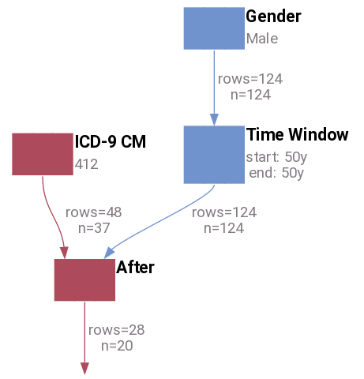

| person_id | criterion_id | criterion_domain | start_date | end_date | source_value |
| --------- | ------------ | ---------------- | ---------- | -------- | ------------ |
| 190 | 61423 | condition_occurrence | 2009-04-09 | 2009-04-09 | 412 |
| 60 | 986 | condition_occurrence | 2009-07-19 | 2009-07-22 | 412 |
| 197 | 21914 | condition_occurrence | 2009-05-07 | 2009-05-07 | 412 |
| 149 | 28518 | condition_occurrence | 2008-04-07 | 2008-04-07 | 412 |
| 239 | 49718 | condition_occurrence | 2010-02-12 | 2010-02-12 | 412 |
| 239 | 47130 | condition_occurrence | 2009-08-04 | 2009-08-04 | 412 |
| 161 | 963 | condition_occurrence | 2009-10-25 | 2009-10-29 | 412 |
| 214 | 89463 | condition_occurrence | 2008-02-17 | 2008-02-17 | 412 |
| 214 | 83257 | condition_occurrence | 2009-11-12 | 2009-11-12 | 412 |
| 187 | 90638 | condition_occurrence | 2009-01-31 | 2009-01-31 | 412 |

---

### `Episode` Operator

There are rare occasions when we'd like to stitch a set of events together into a span of time, such as a set of prescriptions events into a span of time we'd consider a patient to be taking a certain medication.  ConceptQL provides the `Episode` operator for such an occasion.

---

**Example 36**

```JSON

["episode",["icd9","250.00"],{"gap_of":"90"}]

```

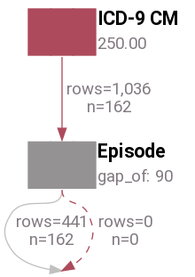

| person_id | criterion_id | criterion_domain | start_date | end_date | source_value |
| --------- | ------------ | ---------------- | ---------- | -------- | ------------ |
| 2 | 0 | episode | 2009-05-11 | 2009-07-31 |  |
| 3 | 0 | episode | 2009-11-17 | 2009-11-17 |  |
| 5 | 0 | episode | 2009-06-28 | 2009-06-28 |  |
| 7 | 0 | episode | 2008-04-23 | 2008-06-09 |  |
| 7 | 0 | episode | 2008-10-02 | 2008-11-30 |  |
| 7 | 0 | episode | 2009-07-12 | 2009-09-13 |  |
| 7 | 0 | episode | 2010-04-22 | 2010-07-18 |  |
| 8 | 0 | episode | 2008-10-17 | 2008-10-17 |  |
| 8 | 0 | episode | 2009-03-01 | 2009-03-03 |  |
| 8 | 0 | episode | 2009-07-16 | 2009-07-16 |  |

---

One side-effect of this operator is that the `criterion_domain` is set to "episode" and each row no longer contains a reference back to a `criterion_id` or `criterion_table` because one or more records are folded into a single row after passing through the episode operator.  Often, the episode operator is best-suited to act as the RHS of a temporal operator.

## Inline-Filter Operators

There are a couple of operators that filter an incoming stream before passing it along.

### `Place of Service Filter` Operator

Often in claims data, an event is reported with a place of service via the CMS place of service codes, such as "inpatient hospital" (21) or "outpatient hospital" (22).  For these kinds of queries, ConceptQL has the `Place of Service Filter`

---

**Example 37**

```JSON

["place_of_service_filter",22,["icd9","250.00"]]

```


```No Results found.```

---

Our sample data for the examples in this document does not contain any place of service information so there are no results after applying this filter.

### `Provenance` Operator

For better or worse, provenance, or rather information about the origin of claims data, is some times an important factor in research algorithms.  Often, paper authors will describe using "inpatient records", by which they mean using claims that come from "the inpatient file" from a set of claims data.  [GDM](https://github.com/outcomesinsights/generalized_data_model#contexts) tracks the provenance of data as part of its ETL process, and ConceptQL includes an operator to select rows that have a particular provenance, aptly called `Provenance`.

---

**Example 38**

```JSON

["provenance","inpatient",["icd9","250.00"]]

```


| person_id | criterion_id | criterion_domain | start_date | end_date | source_value |
| --------- | ------------ | ---------------- | ---------- | -------- | ------------ |
| 68 | 19 | condition_occurrence | 2008-04-19 | 2008-04-23 | 25000 |
| 207 | 106 | condition_occurrence | 2010-04-28 | 2010-05-02 | 25000 |
| 131 | 170 | condition_occurrence | 2008-03-22 | 2008-03-23 | 25000 |
| 243 | 205 | condition_occurrence | 2009-08-20 | 2009-08-23 | 25000 |
| 230 | 231 | condition_occurrence | 2008-03-30 | 2008-04-02 | 25000 |
| 32 | 257 | condition_occurrence | 2010-08-30 | 2010-09-07 | 25000 |
| 79 | 267 | condition_occurrence | 2009-08-09 | 2009-08-24 | 25000 |
| 230 | 284 | condition_occurrence | 2008-03-01 | 2008-03-06 | 25000 |
| 168 | 297 | condition_occurrence | 2010-02-14 | 2010-02-18 | 25000 |
| 37 | 310 | condition_occurrence | 2009-01-19 | 2009-01-20 | 25000 |

---

### `Provider Filter` Operator

There are times when we'd like to captures events only when a particular provider specialty was involved.  ConceptQL provides the `Provider Filter` operator for this.  This operator is a bit bare-bones at the moment in that it requires users to enter in the concept ID of the specialty they are seeking, rather than providing a list of known specialties.

---

**Example 39**

```JSON

["provider_filter",["icd9","250.00"],{"specialties":"12301023"}]

```


```No Results found.```

---

Our sample data for the examples in this document does not contain any provider specialty information so there are no results after applying this filter.

## `One In Two Out` Operator

A very common pattern in algorithms is to consider a condition to be valid if:
- the condition is seen just once in the inpatient file, or
- the condition is present twice in the outpatient file, with
  - a minimum separation, normally of a 30 days, between the two occurrences

We have created an operator that handles this pattern: `One In Two Out`

---

**Example 40 - First of diabetes diagnoses, either found once in the inpatient file, or twice in the outpatient file with a minimum of 30 days between outpatient diagnoses**

```JSON

["one_in_two_out",["icd9","250.00"],{"outpatient_minimum_gap":"30d"}]

```


| person_id | criterion_id | criterion_domain | start_date | end_date | source_value |
| --------- | ------------ | ---------------- | ---------- | -------- | ------------ |
| 2 | 76985 | condition_occurrence | 2009-07-31 | 2009-07-31 | 25000 |
| 7 | 38732 | condition_occurrence | 2008-06-09 | 2008-06-09 | 25000 |
| 8 | 90541 | condition_occurrence | 2009-03-01 | 2009-03-03 | 25000 |
| 9 | 84726 | condition_occurrence | 2010-09-12 | 2010-09-12 | 25000 |
| 11 | 35227 | condition_occurrence | 2008-12-08 | 2008-12-08 | 25000 |
| 12 | 43800 | condition_occurrence | 2009-05-21 | 2009-05-21 | 25000 |
| 13 | 57738 | condition_occurrence | 2008-11-22 | 2008-11-22 | 25000 |
| 14 | 24380 | condition_occurrence | 2009-09-13 | 2009-09-13 | 25000 |
| 15 | 68873 | condition_occurrence | 2010-11-18 | 2010-11-18 | 25000 |
| 17 | 72739 | condition_occurrence | 2008-05-16 | 2008-05-16 | 25000 |

---

The `One In Two Out` operator yields a single row per patient.  The row is the earliest confirmed event from the operator's upstream set of events.

The `One In Two Out` operator uses the file from which a row came from to determine if the row represents an "inpatient" record or an "outpatient" record.  The place of service associated with a record is not taken into account.  Nothing about the associated visit is considered either.

`condition_occurrence` rows with provenance related to of "inpatient" files are considered inpatient records.  All other records are considered outpatient.

Non-`condition_occurrence` rows are removed from the stream.

In order to simplify how sets of inpatient and outpatient records are compared to each other temporally, we collapse each incoming row's date range to a single date.  Users can choose which date to use for both inpatient and outpatient records.

- Inpatient Length of Stay
    - Enforces a minimum length of stay for inpatient records
    - If given a whole number greater than 0, requires that the patient had been hospitalized for at least that many days
    - Optional
    - Default: empty
    - If left empty, length of stay is ignored
    - Length of Stay (LOS) is calculated as:
        - If (end_date - start_date) < 2, then LOS is 1
        - else LOS is (end_date - start_date) + 1
- Inpatient Return Date
    - Determines which date from an inpatient record should be used as the date in which the associated condition "occurred"
    - Options
        - Admit Date
        - Discharge Date
    - Optional
    - Defaults to discharge date (end_date of the given condition_occurrence)
        - The discharge date is preferred over the admit date because only at discharge can we say for certain a patient was diagnosed with a given condition.  We cannot be certain a patient had the condition at the time of admission
- Outpatient Minimum Gap
    - Requires that the second, confirming outpatient diagnosis must occur at least this many days after the initial diagnosis
    - Uses same time adjustment syntax as `time_window`, e.g. 1d3m10y
    - Required
    - Default: 30d
- Outpatient Maximum Gap
    - Requires that the second, confirming outpatient diagnosis must occur at within this many days after the initial diagnosis
    - Uses same time adjustment syntax as `time_window`, e.g. 1d3m10y
    - Optional
    - Default: empty
    - When empty, the confirming diagnosis may occur at any time after the minimum_gap to be considered valid
    - This option is useful when attempting to limit confirming diagnoses for acute diseases, e.g. if attempting to find confirmation of the flu, it would be advisable to set this option in order to limit confirmation to distinct periods when a patient had the flu
- Outpatient Event to Return
    - Determines which event return should two outpatient records meet all criteria
        - In most situations, using the initial outpatient event is desired, particularly when the algorithm is used to record an exposure of interest or outcome
        - However, returning the initial outpatient event when the algorithm is used to determine an index event can introduce immortal time bias.  In these cases, using the confirming event will avoid immortal time bias
    - Options
        - Initial Event
        - Confirming Event
    - Optional
    - Defaults to Initial Event

## `Person Filter` Operator

Often we want to filter out a set of results by people.  For instance, say we wanted to find all MIs for all males.  We'd use the `Person Filter` operator for that.  Like the `Except` operator, it takes a left-hand stream and a right-hand stream.

Unlike the `Except` operator, the `Person Filter` operator will use all types of all streams in the right-hand side to filter out results in all types of all streams on the left hand side.

---

**Example 41 - All MI Conditions for people who are male**

```JSON

["person_filter",{"left":["icd9","412"],"right":["gender","Male"]}]

```


| person_id | criterion_id | criterion_domain | start_date | end_date | source_value |
| --------- | ------------ | ---------------- | ---------- | -------- | ------------ |
| 190 | 61423 | condition_occurrence | 2009-04-09 | 2009-04-09 | 412 |
| 60 | 986 | condition_occurrence | 2009-07-19 | 2009-07-22 | 412 |
| 197 | 21914 | condition_occurrence | 2009-05-07 | 2009-05-07 | 412 |
| 149 | 28518 | condition_occurrence | 2008-04-07 | 2008-04-07 | 412 |
| 239 | 49718 | condition_occurrence | 2010-02-12 | 2010-02-12 | 412 |
| 239 | 47130 | condition_occurrence | 2009-08-04 | 2009-08-04 | 412 |
| 161 | 963 | condition_occurrence | 2009-10-25 | 2009-10-29 | 412 |
| 214 | 89463 | condition_occurrence | 2008-02-17 | 2008-02-17 | 412 |
| 214 | 83257 | condition_occurrence | 2009-11-12 | 2009-11-12 | 412 |
| 187 | 90638 | condition_occurrence | 2009-01-31 | 2009-01-31 | 412 |

---

But we can get crazier.  The right-hand side doesn't have to be a person stream.  If a non-person stream is used in the right-hand side, the person_filter will cast all right-hand streams to person first and use the union of those streams:

---

**Example 42 - All MI Conditions for people who had an office visit at some point in the data**

```JSON

["person_filter",{"left":["icd9","412"],"right":["cpt","99214"]}]

```

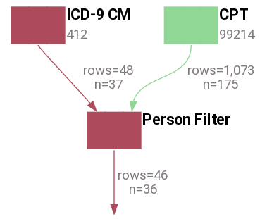

| person_id | criterion_id | criterion_domain | start_date | end_date | source_value |
| --------- | ------------ | ---------------- | ---------- | -------- | ------------ |
| 131 | 172 | condition_occurrence | 2008-03-22 | 2008-03-23 | 412 |
| 177 | 507 | condition_occurrence | 2009-06-13 | 2009-06-16 | 412 |
| 230 | 523 | condition_occurrence | 2008-03-14 | 2008-03-21 | 412 |
| 161 | 963 | condition_occurrence | 2009-10-25 | 2009-10-29 | 412 |
| 60 | 986 | condition_occurrence | 2009-07-19 | 2009-07-22 | 412 |
| 81 | 1405 | condition_occurrence | 2009-01-28 | 2009-01-30 | 412 |
| 88 | 1572 | condition_occurrence | 2009-01-03 | 2009-01-09 | 412 |
| 66 | 16171 | condition_occurrence | 2009-07-25 | 2009-07-25 | 412 |
| 220 | 20660 | condition_occurrence | 2009-10-31 | 2009-10-31 | 412 |
| 96 | 20748 | condition_occurrence | 2008-09-21 | 2008-09-24 | 412 |

---

---

**Example 43 - All MI Conditions for people who had an office visit at some point in the data (an explicit representation of what's happening in the diagram above)**

```JSON

["person_filter",{"left":["icd9","412"],"right":["person",["cpt","99214"]]}]

```


| person_id | criterion_id | criterion_domain | start_date | end_date | source_value |
| --------- | ------------ | ---------------- | ---------- | -------- | ------------ |
| 131 | 172 | condition_occurrence | 2008-03-22 | 2008-03-23 | 412 |
| 177 | 507 | condition_occurrence | 2009-06-13 | 2009-06-16 | 412 |
| 230 | 523 | condition_occurrence | 2008-03-14 | 2008-03-21 | 412 |
| 161 | 963 | condition_occurrence | 2009-10-25 | 2009-10-29 | 412 |
| 60 | 986 | condition_occurrence | 2009-07-19 | 2009-07-22 | 412 |
| 81 | 1405 | condition_occurrence | 2009-01-28 | 2009-01-30 | 412 |
| 88 | 1572 | condition_occurrence | 2009-01-03 | 2009-01-09 | 412 |
| 66 | 16171 | condition_occurrence | 2009-07-25 | 2009-07-25 | 412 |
| 220 | 20660 | condition_occurrence | 2009-10-31 | 2009-10-31 | 412 |
| 96 | 20748 | condition_occurrence | 2008-09-21 | 2008-09-24 | 412 |

---

---

**Example 44 - All MI Conditions for people who are Male OR had an office visit at some point in the data**

```JSON

["person_filter",{"left":["icd9","412"],"right":["union",["cpt","99214"],["gender","Male"]]}]

```


| person_id | criterion_id | criterion_domain | start_date | end_date | source_value |
| --------- | ------------ | ---------------- | ---------- | -------- | ------------ |
| 234 | 22299 | condition_occurrence | 2008-09-01 | 2008-09-01 | 412 |
| 177 | 48526 | condition_occurrence | 2008-09-23 | 2008-09-23 | 412 |
| 177 | 507 | condition_occurrence | 2009-06-13 | 2009-06-16 | 412 |
| 106 | 29318 | condition_occurrence | 2009-02-27 | 2009-02-27 | 412 |
| 110 | 62592 | condition_occurrence | 2010-06-27 | 2010-06-27 | 412 |
| 184 | 24281 | condition_occurrence | 2008-01-07 | 2008-01-07 | 412 |
| 190 | 61423 | condition_occurrence | 2009-04-09 | 2009-04-09 | 412 |
| 60 | 986 | condition_occurrence | 2009-07-19 | 2009-07-22 | 412 |
| 197 | 21914 | condition_occurrence | 2009-05-07 | 2009-05-07 | 412 |
| 149 | 28518 | condition_occurrence | 2008-04-07 | 2008-04-07 | 412 |

---

And don't forget the left-hand side can have multiple types of streams:

---

**Example 45 - Yields two streams: a stream of all MI Conditions for people who are Male and a stream of all office visit Procedures for people who are Male**

```JSON

["person_filter",{"left":["union",["icd9","412"],["cpt","99214"]],"right":["gender","Male"]}]

```

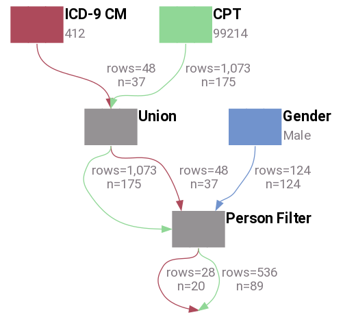

| person_id | criterion_id | criterion_domain | start_date | end_date | source_value |
| --------- | ------------ | ---------------- | ---------- | -------- | ------------ |
| 71 | 31789 | procedure_occurrence | 2009-07-12 | 2009-07-12 | 99214 |
| 68 | 35465 | procedure_occurrence | 2008-11-08 | 2008-11-08 | 99214 |
| 68 | 35191 | procedure_occurrence | 2008-06-30 | 2008-06-30 | 99214 |
| 68 | 35154 | procedure_occurrence | 2009-03-26 | 2009-03-26 | 99214 |
| 68 | 33110 | procedure_occurrence | 2010-08-13 | 2010-08-13 | 99214 |
| 68 | 32826 | procedure_occurrence | 2009-07-22 | 2009-07-22 | 99214 |
| 68 | 49092 | procedure_occurrence | 2008-10-28 | 2008-10-28 | 99214 |
| 68 | 88881 | procedure_occurrence | 2010-03-17 | 2010-03-17 | 99214 |
| 68 | 80436 | procedure_occurrence | 2009-11-13 | 2009-11-13 | 99214 |
| 146 | 37311 | procedure_occurrence | 2009-08-17 | 2009-08-17 | 99214 |

---

## `Co-Reported` Operator

Claims data often reports diagnoses on the same "line" as a procedure.  This is done for billing reasons, essentially the provider is saying "I preformed this procedure due to these conditions present in the patient".  ConceptQL has an operator that specifically targets this kind of relationship: `Co-Reported`

The operator takes two or more streams.  Events in each stream must be reported at the same time in order to be passed through the operator.  In the case of [GDM](https://github.com/outcomesinsights/generalized_data_model) this means that events that share the same [context](https://github.com/outcomesinsights/generalized_data_model#contexts) ID.


---

**Example 46 - Diabetes diagnosis reported as part the reason for an office visit**

```JSON

["co_reported",["icd9","250.00"],["cpt","99214"]]

```

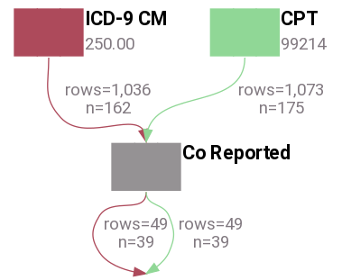

| person_id | criterion_id | criterion_domain | start_date | end_date | source_value |
| --------- | ------------ | ---------------- | ---------- | -------- | ------------ |
| 25 | 93217 | condition_occurrence | 2008-09-18 | 2008-09-18 | 25000 |
| 25 | 93220 | procedure_occurrence | 2008-09-18 | 2008-09-18 | 99214 |
| 31 | 87695 | condition_occurrence | 2008-06-17 | 2008-06-17 | 25000 |
| 31 | 87696 | procedure_occurrence | 2008-06-17 | 2008-06-17 | 99214 |
| 40 | 81973 | condition_occurrence | 2009-05-01 | 2009-05-01 | 25000 |
| 40 | 81993 | procedure_occurrence | 2009-05-01 | 2009-05-01 | 99214 |
| 44 | 44702 | condition_occurrence | 2008-01-10 | 2008-01-10 | 25000 |
| 44 | 44715 | procedure_occurrence | 2008-01-10 | 2008-01-10 | 99214 |
| 58 | 35093 | condition_occurrence | 2009-06-15 | 2009-06-15 | 25000 |
| 58 | 35095 | procedure_occurrence | 2009-06-15 | 2009-06-15 | 99214 |

---

Note that both the diagnosis and procedure are pass on through the operator.

## `label` Option and Its Features

Any ConceptQL operator can be assigned a label.  The label simply provides a way to apply a brief description to an operator, generally, what kind of results the operator is producing.  

Any operator with a `label` inserts its `label` into the set of results.

For instance, here are some diabetes diagnoses with a label applied:

---

**Example 47**

```JSON

["icd9","250.00",{"label":"diabetes"}]

```


| person_id | criterion_id | criterion_table | criterion_domain | start_date | end_date | source_value | source_vocabulary_id | label |
| --------- | ------------ | --------------- | ---------------- | ---------- | -------- | ------------ | -------------------- | ----- |
| 68 | 19 | clinical_codes | condition_occurrence | 2008-04-19 | 2008-04-23 | 25000 | ICD9CM | diabetes |
| 207 | 106 | clinical_codes | condition_occurrence | 2010-04-28 | 2010-05-02 | 25000 | ICD9CM | diabetes |
| 131 | 170 | clinical_codes | condition_occurrence | 2008-03-22 | 2008-03-23 | 25000 | ICD9CM | diabetes |
| 243 | 205 | clinical_codes | condition_occurrence | 2009-08-20 | 2009-08-23 | 25000 | ICD9CM | diabetes |
| 230 | 231 | clinical_codes | condition_occurrence | 2008-03-30 | 2008-04-02 | 25000 | ICD9CM | diabetes |
| 32 | 257 | clinical_codes | condition_occurrence | 2010-08-30 | 2010-09-07 | 25000 | ICD9CM | diabetes |
| 79 | 267 | clinical_codes | condition_occurrence | 2009-08-09 | 2009-08-24 | 25000 | ICD9CM | diabetes |
| 230 | 284 | clinical_codes | condition_occurrence | 2008-03-01 | 2008-03-06 | 25000 | ICD9CM | diabetes |
| 168 | 297 | clinical_codes | condition_occurrence | 2010-02-14 | 2010-02-18 | 25000 | ICD9CM | diabetes |
| 37 | 310 | clinical_codes | condition_occurrence | 2009-01-19 | 2009-01-20 | 25000 | ICD9CM | diabetes |

---

The most recent upstream `label` is the one that is output:

---

**Example 48**

```JSON

["first",["icd9","250.00",{"label":"won't show"}],{"label":"1st diabetes"}]

```


| person_id | criterion_id | criterion_table | criterion_domain | start_date | end_date | source_value | source_vocabulary_id | label |
| --------- | ------------ | --------------- | ---------------- | ---------- | -------- | ------------ | -------------------- | ----- |
| 2 | 89752 | clinical_codes | condition_occurrence | 2009-05-11 | 2009-05-11 | 25000 | ICD9CM | 1st diabetes |
| 3 | 93400 | clinical_codes | condition_occurrence | 2009-11-17 | 2009-11-17 | 25000 | ICD9CM | 1st diabetes |
| 5 | 89717 | clinical_codes | condition_occurrence | 2009-06-28 | 2009-06-28 | 25000 | ICD9CM | 1st diabetes |
| 7 | 15942 | clinical_codes | condition_occurrence | 2008-04-23 | 2008-04-23 | 25000 | ICD9CM | 1st diabetes |
| 8 | 95135 | clinical_codes | condition_occurrence | 2008-10-17 | 2008-10-17 | 25000 | ICD9CM | 1st diabetes |
| 9 | 24929 | clinical_codes | condition_occurrence | 2010-08-01 | 2010-08-01 | 25000 | ICD9CM | 1st diabetes |
| 11 | 73103 | clinical_codes | condition_occurrence | 2008-06-17 | 2008-06-17 | 25000 | ICD9CM | 1st diabetes |
| 12 | 15443 | clinical_codes | condition_occurrence | 2009-04-20 | 2009-04-20 | 25000 | ICD9CM | 1st diabetes |
| 13 | 19968 | clinical_codes | condition_occurrence | 2008-03-05 | 2008-03-05 | 25000 | ICD9CM | 1st diabetes |
| 14 | 77991 | clinical_codes | condition_occurrence | 2009-06-05 | 2009-06-05 | 25000 | ICD9CM | 1st diabetes |

---

The idea behind this is to create hints about what is being output:

---

**Example 49**

```JSON

["first",["union",["icd9","250.00",{"label":"diabetes"}],["icd9","401.9",{"label":"hypertension"}]]]

```


| person_id | criterion_id | criterion_table | criterion_domain | start_date | end_date | source_value | source_vocabulary_id | label |
| --------- | ------------ | --------------- | ---------------- | ---------- | -------- | ------------ | -------------------- | ----- |
| 1 | 1065 | clinical_codes | condition_occurrence | 2010-03-12 | 2010-03-13 | 4019 | ICD9CM | hypertension |
| 2 | 57517 | clinical_codes | condition_occurrence | 2009-03-30 | 2009-03-30 | 4019 | ICD9CM | hypertension |
| 3 | 93400 | clinical_codes | condition_occurrence | 2009-11-17 | 2009-11-17 | 25000 | ICD9CM | diabetes |
| 5 | 38310 | clinical_codes | condition_occurrence | 2008-12-14 | 2008-12-14 | 4019 | ICD9CM | hypertension |
| 6 | 76645 | clinical_codes | condition_occurrence | 2010-02-23 | 2010-02-23 | 4019 | ICD9CM | hypertension |
| 7 | 15942 | clinical_codes | condition_occurrence | 2008-04-23 | 2008-04-23 | 25000 | ICD9CM | diabetes |
| 8 | 55867 | clinical_codes | condition_occurrence | 2008-02-27 | 2008-02-27 | 4019 | ICD9CM | hypertension |
| 9 | 27621 | clinical_codes | condition_occurrence | 2009-10-12 | 2009-10-19 | 4019 | ICD9CM | hypertension |
| 11 | 73103 | clinical_codes | condition_occurrence | 2008-06-17 | 2008-06-17 | 25000 | ICD9CM | diabetes |
| 12 | 34937 | clinical_codes | condition_occurrence | 2008-09-17 | 2008-09-17 | 4019 | ICD9CM | hypertension |

---


### `Recall` Operator

If a algorithm is particularly complex, or has a stream of results that are used more than once, it can be helpful to break the algorithm into a set of sub-algorithms.  This can be done using the `label` options and the `Recall` operator.  Any operator that has a label can be accessed via the `Recall` operator.

- Takes 1 argument
    - The "label" of an operator from which you'd like to pull the exact same set of results

A stream must be have a label applied to it before `Recall` can use it.

---

**Example 50 - Save away a stream of results to build the 1 inpatient, 2 outpatient pattern used in claims data algorithms**

```JSON

[["one_in_two_out",["except",{"left":["union",["icd9","330.0","330.1","330.2","330.3","330.8","330.9","331.0","331.11","331.19","331.2","331.3","331.4","331.5","331.6","331.7","331.81","331.82","331.83","331.89","331.9","332.0","333.4","333.5","333.7","333.71","333.72","333.79","333.85","333.94","334.0","334.1","334.2","334.3","334.4","334.8","334.9","335.0","335.10","335.11","335.19","335.20","335.21","335.22","335.23","335.24","335.29","335.8","335.9","338.0","340","341.0","341.1","341.20","341.21","341.22","341.8","341.9","345.00","345.01","345.10","345.11","345.2","345.3","345.40","345.41","345.50","345.51","345.60","345.61","345.70","345.71","345.80","345.81","345.90","345.91","347.00","347.01","347.10","347.11","649.40","649.41","649.42","649.43","649.44","768.70","768.71","768.72","768.73","780.31","780.32","780.33","780.39","784.3"],["icd10cm","E75.00","E75.01","E75.02","E75.09","E75.10","E75.11","E75.19","E75.23","E75.25","E75.26","E75.29","E75.4","F84.2","G10","G11.0","G11.1","G11.2","G11.3","G11.4","G11.8","G11.9","G12.0","G12.1","G12.20","G12.21","G12.22","G12.23","G12.24","G12.25","G12.29","G12.8","G12.9","G13.2","G13.8","G20","G21.4","G24.01","G24.02","G24.09","G24.2","G24.8","G25.4","G25.5","G25.81","G30.0","G30.1","G30.8","G30.9","G31.01","G31.09","G31.1","G31.2","G31.81","G31.82","G31.83","G31.84","G31.85","G31.89","G31.9","G32.81","G35","G36.1","G36.8","G36.9","G37.0","G37.1","G37.2","G37.3","G37.4","G37.5","G37.8","G37.9","G40.001","G40.009","G40.011","G40.019","G40.101","G40.109","G40.111","G40.119","G40.201","G40.209","G40.211","G40.219","G40.301","G40.309","G40.311","G40.319","G40.401","G40.409","G40.411","G40.419","G40.501","G40.509","G40.801","G40.802","G40.803","G40.804","G40.811","G40.812","G40.813","G40.814","G40.821","G40.822","G40.823","G40.824","G40.89","G40.901","G40.909","G40.911","G40.919","G40.A01","G40.A09","G40.A11","G40.A19","G40.B01","G40.B09","G40.B11","G40.B19","G47.411","G47.419","G47.421","G47.429","G80.3","G89.0","G91.0","G91.1","G91.2","G91.3","G91.4","G91.8","G91.9","G93.7","G93.89","G93.9","G94","O99.350","O99.351","O99.352","O99.353","O99.354","O99.355","P91.60","P91.61","P91.62","P91.63","R41.0","R41.82","R47.01","R56.00","R56.01","R56.1","R56.9"],{"label":"neuro dxs"}],"right":["co_reported",["recall","neuro dxs"],["drg","020","021","022","023","024","025","026","027","028","029","030","031","032","033","034","035","036","037","038","039","040","041","042","052","053","054","055","056","057","058","059","060","061","062","063","064","065","066","067","068","069","070","071","072","073","074","075","076","077","078","079","080","081","082","083","084","085","086","087","088","089","090","091","092","093","094","095","096","097","098","099","100","101","102","103"]]}],{"outpatient_event_to_return":"Confirming Event","outpatient_minimum_gap":"30d","inpatient_return_date":"Discharge Date","outpatient_maximum_gap":"365d"}]]

```

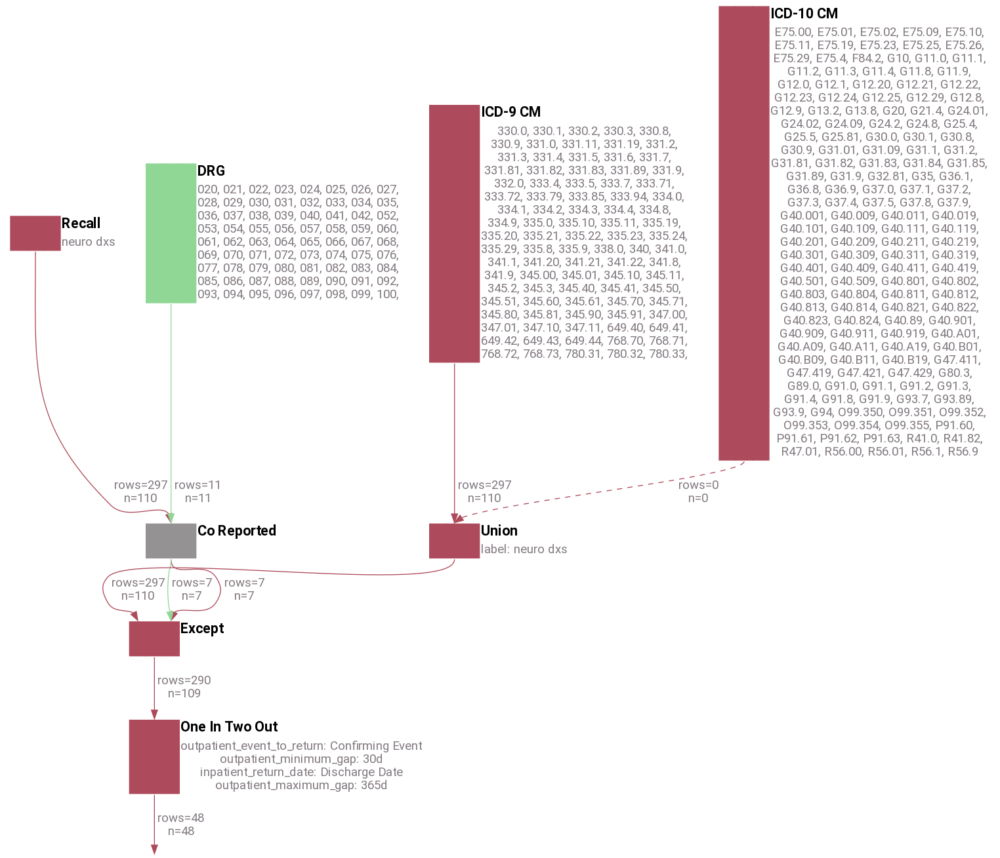

| person_id | criterion_id | criterion_domain | start_date | end_date | source_value |
| --------- | ------------ | ---------------- | ---------- | -------- | ------------ |
| 2 | 397 | condition_occurrence | 2009-04-18 | 2009-04-18 | 7843 |
| 7 | 27644 | condition_occurrence | 2008-09-21 | 2008-09-30 | 3320 |
| 14 | 35530 | condition_occurrence | 2009-07-04 | 2009-07-04 | 3310 |
| 15 | 60361 | condition_occurrence | 2010-09-01 | 2010-09-01 | 78039 |
| 19 | 63713 | condition_occurrence | 2009-01-09 | 2009-01-09 | 3310 |
| 28 | 131 | condition_occurrence | 2008-04-30 | 2008-04-30 | 3310 |
| 35 | 34819 | condition_occurrence | 2009-05-02 | 2009-05-02 | 340 |
| 40 | 33044 | condition_occurrence | 2010-05-31 | 2010-05-31 | 3319 |
| 42 | 72000 | condition_occurrence | 2008-08-28 | 2008-08-28 | 3310 |
| 44 | 39145 | condition_occurrence | 2008-08-31 | 2008-08-31 | 3310 |

---

## Appendix A - Additional Operators

### `Vocabulary` Operator

A `Vocabulary` operator is any selection operator that selects records based on codes from a specific vocabulary.  Below is a list of the most common vocabulary operators available in ConceptQL:

| Operator Name | Stream Type | Arguments | Returns |
| ---- | ---- | --------- | ------- |
| cpt4  | procedure_occurrence | 1 or more CPT codes | All results whose source_value match any of the CPT codes |
| icd9cm | condition_occurrence | 1 or more ICD-9CM codes | All results whose source_value match any of the ICD-9 codes |
| icd9_procedure | procedure_occurrence | 1 or more ICD-9 procedure codes | All results whose source_value match any of the ICD-9 procedure codes |
| icd10cm | condition_occurrence | 1 or more ICD-10 | All results whose source_value match any of the ICD-10 codes |
| hcpcs  | procedure_occurrence | 1 or more HCPCS codes | All results whose source_value match any of the HCPCS codes |
| gender | person | 1 or more gender concept_ids | All results whose gender_concept_id match any of the concept_ids|
| loinc | observation | 1 or more LOINC codes | All results whose source_value match any of the LOINC codes |
| race | person | 1 or more race concept_ids | All results whose race_concept_id match any of the concept_ids|
| rxnorm | drug_exposure | 1 or more RxNorm IDs | All results whose drug_concept_id match any of the RxNorm IDs|
| snomed | condition_occurrence | 1 or more SNOMED codes | All results whose source_value match any of the SNOMED codes |

### More Temporal Operators

#### `During` Operator

The `During` operator is a [Temporal Operator](#temporal-comparison-operators).  For each person, records on the left hand side are compared to records on the right hand side.  It only passes along those left hand records whose date range is fully, and inclusively, contained within a right hand record's date range.

#### `Contains` Operator

The `Contains` operator is a [Temporal Operator](#temporal-comparison-operators).  For each person, records on the left hand side are compared to records on the right hand side.  It only passes along those left hand records whose date range fully, and inclusively, contains a right hand record's date range.

### More Person Operators

Person operators generate person records, or records that are derived from the table containing patient demographics.  The start_date and end_date for a person-based record is the patient's birth date, as explained in more detail [in temporal operators and person streams](#temporal-operators-and-person-streams).

#### `Gender` Operator

This [person operator](#more-person-operators) selects people by gender.  Currently, available genders are Male, Female, or Unknown.

#### `Race` Operator

This [person operator](#more-person-operators) selects people by race.  Available races are defined in the Race vocabulary.

### `Death` Operator

This operator pulls all death records from the death table.

## Appendix B - Algorithm Showcase

Here are some algorithms from [OMOP's Health Outcomes of Interest](http://omop.org/HOI) turned into ConceptQL statements to give more examples.  I truncated some of the sets of codes to help ensure the diagrams didn't get too large.

### Acute Kidney Injury - Narrow Definition and diagnostic procedure

- ICD-9CM of 584
- AND
    - ICD-9 procedure codes of 39.95 or 54.98 within 60 days after diagnosis
- AND NOT
    - A diagnostic code of chronic dialysis any time before initial diagnosis
        - V45.1, V56.0, V56.31, V56.32, V56.8

---

**Example 51**

```JSON

["during",{"left":["except",{"left":["icd9","584"],"right":["after",{"left":["icd9","584"],"right":["icd9","V45.1","V56.0","V56.31","V56.32","V56.8"]}]}],"right":["time_window",["icd9_procedure","39.95","54.98"],{"start":"0","end":"60d"}]}]

```


```No Results found.```

---

### Mortality after Myocardial Infarction #3

- Person Died
- And Occurrence of 410\* prior to death
- And either
    - MI diagnosis within 30 days prior to 410
    - MI therapy within 60 days after 410

---

**Example 52**

```JSON

["during",{"left":["before",{"left":["icd9","410*"],"right":["death"]}],"right":["union",["time_window",["union",["cpt","0146T","75898","82554","92980","93010","93233","93508","93540","93545"],["icd9_procedure","00.24","36.02","89.53","89.57","89.69"],["loinc","10839-9","13969-1","18843-3","2154-3","33204-9","48425-3","49259-5","6597-9","8634-8"]],{"start":"-30d","end":"0"}],["time_window",["union",["cpt","0146T","75898","82554","92980","93010","93233"],["icd9_procedure","00.24","36.02","89.53","89.57","89.69"]],{"start":"","end":"60d"}]]}]

```

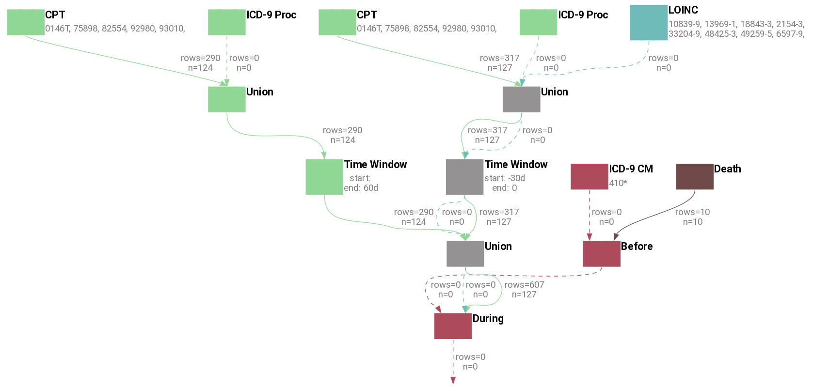

```No Results found.```

---

## Appendix C - History of ConceptQL and Its Evolution

ConceptQL was originally developed to query data from the [OMOP Common Data Model (CDM) v4.0](https://github.com/OHDSI/CommonDataModel/releases/tag/v4).  This meant that ConceptQL was able to take simple statements like `[ "icd9", "412" ]` and determine the proper table to query (in this case `condition_occurrence`) along with the correct source_code and vocabulary_id to search for within that table.

As the OMOP CDM continued to evolve and as its ETL requirements continued to spiral, [Outcomes Insights, Inc](https://outins.com) developed the [GDM](https://github.com/outcomesinsights/generalized_data_model) and ConceptQL was adapted to support querying both data models.  Eventually support for OMOP's CDM was removed from ConceptQL because it was no longer used in any production applications of ConceptQL.  However, this experience has demonstrated that ConceptQL can be adapted to support other data models should the need arise.

ConceptQL was originally implemented to work against PostgreSQL, but was adapted to work against MSSQL, Oracle, and Impala.  We have since refocused ConceptQL to work against PostgreSQL, but we have shown that, with a modest amount of effort, ConceptQL can be made to support most RDBMS systems that support most features found in [SQL:2003](https://en.wikipedia.org/wiki/SQL:2003), such as window functions.  Most SQL generated by ConceptQL is fairly "vanilla" in that it does not rely on special quirks or query hints specific to a particular RDBMS in order to function.
