<!-- START doctoc generated TOC please keep comment here to allow auto update -->
<!-- DON'T EDIT THIS SECTION, INSTEAD RE-RUN doctoc TO UPDATE -->

- [Possibilities](#possibilities)
    - [Algorithms within Algorithms](#algorithms-within-algorithms)
    - [Values](#values)
      - [numeric](#numeric)
      - [Counting](#counting)
      - [Numeric Value Comparison](#numeric-value-comparison)
    - [numeric as selection operator](#numeric-as-selection-operator)
      - [sum](#sum)
    - [Todo List](#todo-list)
    - [Future Work for Define and Recall](#future-work-for-define-and-recall)
    - [Considerations for Values](#considerations-for-values)
    - [Filter Operator](#filter-operator)
    - [AS option for Except](#as-option-for-except)
    - [How to Handle fact_relationship Table from CDMv5](#how-to-handle-fact_relationship-table-from-cdmv5)
    - [Change First/Last to Earliest/Most Recent and change "Nth" to "Nth Earliest" and "Nth Most Recent"](#change-firstlast-to-earliestmost-recent-and-change-nth-to-nth-earliest-and-nth-most-recent)
    - [Dates when building a cohort](#dates-when-building-a-cohort)
    - [During optimization?](#during-optimization)
    - [Casting Operators](#casting-operators)
    - [Drop support for positional arguments?](#drop-support-for-positional-arguments)
    - [Validations](#validations)
      - [General validations](#general-validations)
      - [Upstream validations - Enforce number of upstream operators](#upstream-validations---enforce-number-of-upstream-operators)
      - [Argument validations - Enforce number of positional arguments](#argument-validations---enforce-number-of-positional-arguments)
      - [Option validations](#option-validations)
      - [`recall`-specific validations](#recall-specific-validations)
      - [`algorithm`-specific validations](#algorithm-specific-validations)
      - [Vocabulary validations and warnings](#vocabulary-validations-and-warnings)
    - [Other data models](#other-data-models)
      - [Mutator - in theory, these need no modification to continue working](#mutator---in-theory-these-need-no-modification-to-continue-working)
      - [Selection - These are the operators that will need the most work and might need to be re-thought](#selection---these-are-the-operators-that-will-need-the-most-work-and-might-need-to-be-re-thought)
    - [Multiple sets of things with ordering](#multiple-sets-of-things-with-ordering)
    - [Nth line chemo](#nth-line-chemo)
    - [concurrent with?](#concurrent-with)

<!-- END doctoc generated TOC please keep comment here to allow auto update -->

# Possibilities

This document contains potential features or changes that could be made for ConceptQL.

### Algorithms within Algorithms

One of the main motivations behind keeping ConceptQL so flexible is to allow users to build ConceptQL statements from other ConceptQL statements.  This section loosely describes how this feature will work.  Its actual execution and implementation will differ from what is presented here.

Say a ConceptQL statement gathers all visit_occurrences where a patient had an MI and a Hospital encounter (CPT 99231):

---

**Example 1 - All Visits where a Patient had both an MI and a Hospital Encounter**

```JSON

["intersect",["visit_occurrence",["icd9","412"]],["visit_occurrence",["cpt","99231"]]]

```

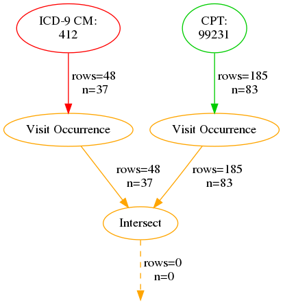

```No Results found.```

---

If we wanted to gather all costs for all procedures for those visits, we could use the "algorithm" operator to represent the algorithm defined above in a new concept:

---

**Example 2 - All Procedure Costs for All Visits as defined above**

```JSON

["procedure_cost",["algorithm","\nAll Visits\nwhere a Patient had\nboth an MI and\na Hospital Encounter"]]

```

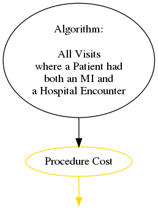

```No Results.  Statement is experimental.```

---

The color and edge coming from the algorithm operator are black to denote that we don't know what types or streams are coming from the concept.  In reality, any program that uses ConceptQL can ask the algorithm represented by the algorithm operator for the concept's types.  The result of nesting one algorithm within another is exactly the same had we taken algorithm operator and replaced it with the ConceptQL statement for the algorithm it represents.

---

**Example 3 - Procedure Costs for All Visits where a Patient had both an MI and a Hospital Encounter (same as above)**

```JSON

["procedure_cost",["intersect",["visit_occurrence",["icd9","412"]],["visit_occurrence",["cpt","99231"]]]]

```

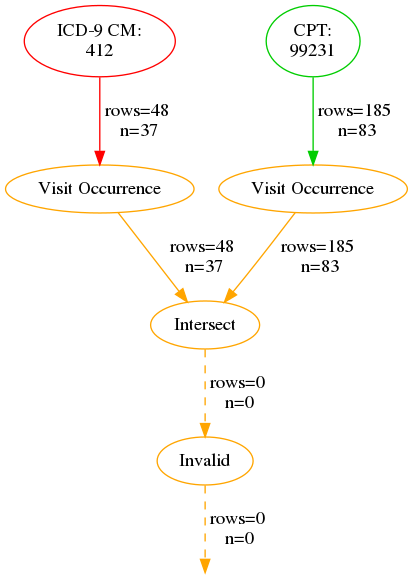

```No Results.  Statement is experimental.```

---

In the actual implementation of the algorithm operator, each ConceptQL statement will have a unique identifier which the algorithm operator will use.  So, assuming that the ID 2031 represents the algorithm we want to gather all procedure costs for, our example should really read:

---

**Example 4**

```JSON

["procedure_cost",["algorithm",2031]]

```

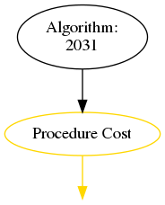

```No Results.  Statement is experimental.```

---

### Values

A result can carry forward three different types of values, modeled after the behavior of the observation table:

- value_as_numeric
    - For values like lab values, counts of occurrence of results, cost information
- value_as_string
    - For value_as_string from observation table, or notes captured in EHR data
- value_as_concept_id
    - For values that are like factors from the observation value_as_concept_id column

By default, all value fields are set to NULL, unless a selection operator is explicitly written to populate one or more of those fields.

There are many operations that can be performed on the value_as\_\* columns and as those operations are implemented, this section will grow.

For now we'll cover some of the general behavior of the value_as_numeric column and it's associated operators.

#### numeric

- Takes 2 arguments
    - A stream
    - And a numeric value or a symbol representing the name of a column in CDM

Passing streams through a `numeric` operator changes the number stored in the value column:

---

**Example 5 - All MIs, setting value_as_numeric to 2**

```JSON

["numeric",2,["icd9","412"]]

```

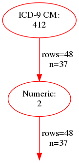

| person_id | criterion_id | criterion_table | criterion_domain | start_date | end_date | source_value | source_vocabulary_id | value_as_number |
| --------- | ------------ | --------------- | ---------------- | ---------- | -------- | ------------ | -------------------- | --------------- |
| 131 | 172 | clinical_codes | condition_occurrence | 2008-03-22 | 2008-03-23 | 412 | ICD9CM | 2.0 |
| 177 | 507 | clinical_codes | condition_occurrence | 2009-06-13 | 2009-06-16 | 412 | ICD9CM | 2.0 |
| 230 | 523 | clinical_codes | condition_occurrence | 2008-03-14 | 2008-03-21 | 412 | ICD9CM | 2.0 |
| 161 | 963 | clinical_codes | condition_occurrence | 2009-10-25 | 2009-10-29 | 412 | ICD9CM | 2.0 |
| 60 | 986 | clinical_codes | condition_occurrence | 2009-07-19 | 2009-07-22 | 412 | ICD9CM | 2.0 |
| 81 | 1405 | clinical_codes | condition_occurrence | 2009-01-28 | 2009-01-30 | 412 | ICD9CM | 2.0 |
| 88 | 1572 | clinical_codes | condition_occurrence | 2009-01-03 | 2009-01-09 | 412 | ICD9CM | 2.0 |
| 213 | 15005 | clinical_codes | condition_occurrence | 2010-02-07 | 2010-02-07 | 412 | ICD9CM | 2.0 |
| 66 | 16171 | clinical_codes | condition_occurrence | 2009-07-25 | 2009-07-25 | 412 | ICD9CM | 2.0 |
| 220 | 20660 | clinical_codes | condition_occurrence | 2009-10-31 | 2009-10-31 | 412 | ICD9CM | 2.0 |

---

`numeric` can also take a column name instead of a number.  It will derive the results row's value from the value stored in the column specified.

---

**Example 6 - All copays for 99214s**

```JSON

["numeric","paid_copay",["procedure_cost",["cpt","99214"]]]

```

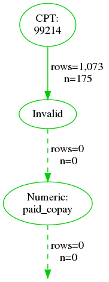

```No Results.  Statement is experimental.```

---

If something nonsensical happens, like the column specified isn't present in the table pointed to by a result row, value_as_numeric in the result row will be unaffected:

---

**Example 7 - Still all MIs with value_as_numeric defaulted to NULL.  condition_occurrence table doesn't have a "paid_copay" column**

```JSON

["value","paid_copay",["icd9","412"]]

```

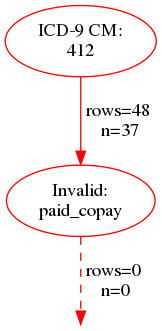

```No Results.  Statement is experimental.```

---

Or if the column specified exists, but refers to a non-numerical column, we'll set the value to 0

---

**Example 8 - All MIs, with value set to 0 since the column specified by value operator is a non-numerical column**

```JSON

["value","stop_reason",["icd9","412"]]

```

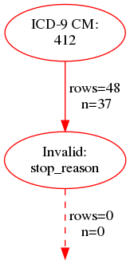

```No Results.  Statement is experimental.```

---

With a `numeric` operator defined, we could introduce a sum operator that will sum by patient and type.  This allows us to implement the Charlson comorbidity algorithm:

---

**Example 9**

```JSON

["sum",["union",["numeric",1,["person",["icd9","412"]]],["numeric",2,["person",["icd9","278.02"]]]]]

```

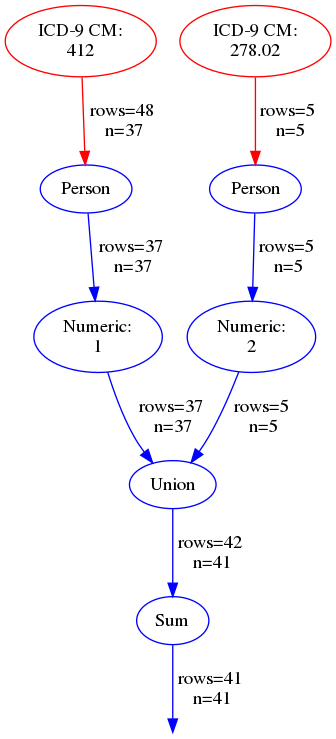

| person_id | criterion_id | criterion_table | criterion_domain | start_date | end_date | source_value | source_vocabulary_id | value_as_number |
| --------- | ------------ | --------------- | ---------------- | ---------- | -------- | ------------ | -------------------- | --------------- |
| 11 | 0 | patients | person | 1934-02-01 | 1934-02-01 | 000489E7EAAD463F |  | 1.0 |
| 17 | 0 | patients | person | 1919-09-01 | 1919-09-01 | 0007F12A492FD25D |  | 3.0 |
| 34 | 0 | patients | person | 1919-10-01 | 1919-10-01 | 00151A878F9A2C0D |  | 2.0 |
| 38 | 0 | patients | person | 1922-12-01 | 1922-12-01 | 001731EB127233DA |  | 1.0 |
| 54 | 0 | patients | person | 1931-02-01 | 1931-02-01 | 001CAFF084B21E14 |  | 1.0 |
| 55 | 0 | patients | person | 1924-12-01 | 1924-12-01 | 001D0E59C94130D3 |  | 2.0 |
| 60 | 0 | patients | person | 1925-07-01 | 1925-07-01 | 001EA2F4DB30F105 |  | 1.0 |
| 66 | 0 | patients | person | 1920-04-01 | 1920-04-01 | 0021B3C854C968C8 |  | 1.0 |
| 73 | 0 | patients | person | 1925-09-01 | 1925-09-01 | 00237322613CFC3C |  | 1.0 |
| 77 | 0 | patients | person | 1929-03-01 | 1929-03-01 | 00244B6D9AB50F9B |  | 1.0 |

---

#### Counting

It might be helpful to count the number of occurrences of a result row in a stream.  A simple "count" operator could group identical rows and store the number of occurrences in the value_as_numeric column.

I need examples of algorithms that could benefit from this operator.  I'm concerned that we'll want to roll up occurrences by person most of the time and that would require us to first cast streams to person before passing the person stream to count.

---

**Example 10 - Count the number of times each person had diabetes**

```JSON

["count",["person",["icd9","250.01"]]]

```

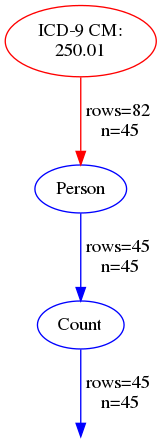

| person_id | criterion_id | criterion_table | criterion_domain | start_date | end_date | source_value | source_vocabulary_id | value_as_number |
| --------- | ------------ | --------------- | ---------------- | ---------- | -------- | ------------ | -------------------- | --------------- |
| 2 | 2 | patients | person | 1943-01-01 | 1943-01-01 | 00016F745862898F |  | 1 |
| 13 | 13 | patients | person | 1936-07-01 | 1936-07-01 | 0004F0ABD505251D |  | 1 |
| 14 | 14 | patients | person | 1934-05-01 | 1934-05-01 | 00052705243EA128 |  | 1 |
| 17 | 17 | patients | person | 1919-09-01 | 1919-09-01 | 0007F12A492FD25D |  | 1 |
| 23 | 23 | patients | person | 1932-07-01 | 1932-07-01 | 000DDD364C46E2C6 |  | 1 |
| 25 | 25 | patients | person | 1965-04-01 | 1965-04-01 | 00108066CA1FACCE |  | 1 |
| 46 | 46 | patients | person | 1931-01-01 | 1931-01-01 | 001A6B93EEA3062E |  | 1 |
| 56 | 56 | patients | person | 1943-10-01 | 1943-10-01 | 001DCB150EB10825 |  | 1 |
| 58 | 58 | patients | person | 1921-09-01 | 1921-09-01 | 001E32373E05BA96 |  | 1 |
| 66 | 66 | patients | person | 1920-04-01 | 1920-04-01 | 0021B3C854C968C8 |  | 1 |

---

We could do dumb things like count the number of times a row shows up in a union:

---

**Example 11 - All rows with a value of 2 would be rows that were both Male and White**

```JSON

["count",["union",["gender","male"],["race","white"]]]

```

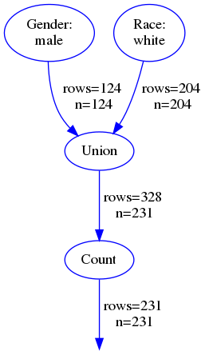

| person_id | criterion_id | criterion_table | criterion_domain | start_date | end_date | source_value | source_vocabulary_id | value_as_number |
| --------- | ------------ | --------------- | ---------------- | ---------- | -------- | ------------ | -------------------- | --------------- |
| 214 | 214 | patients | person | 1914-07-01 | 1914-07-01 | 006D1BD234E5C844 |  | 2 |
| 108 | 108 | patients | person | 1927-04-01 | 1927-04-01 | 0031161707ED8F11 |  | 1 |
| 193 | 193 | patients | person | 1925-01-01 | 1925-01-01 | 00615D59B209C63C |  | 2 |
| 151 | 151 | patients | person | 1928-10-01 | 1928-10-01 | 004802C6917D51BE |  | 1 |
| 69 | 69 | patients | person | 1925-05-01 | 1925-05-01 | 00225409819CF5F6 |  | 1 |
| 209 | 209 | patients | person | 1926-01-01 | 1926-01-01 | 00683B894CEB137A |  | 1 |
| 110 | 110 | patients | person | 1928-03-01 | 1928-03-01 | 0031E4B9F2F11B24 |  | 2 |
| 133 | 133 | patients | person | 1932-03-01 | 1932-03-01 | 0039A9422C87FBEC |  | 2 |
| 64 | 64 | patients | person | 1942-08-01 | 1942-08-01 | 00208E3E5AED8BC2 |  | 2 |
| 229 | 229 | patients | person | 1935-01-01 | 1935-01-01 | 00769CAC5C4C7793 |  | 2 |

---

#### Numeric Value Comparison

Acts like any other binary operator.  L and R streams, joined by person.  Any L that pass comparison go downstream.  R is thrown out.  Comparison based on result row's value column.

- Less than
- Less than or equal
- Equal
- Greater than or equal
- Greater than
- Not equal

### numeric as selection operator

Numeric doesn't have to take a stream.  If it doesn't have a stream as an argument, it acts like a selection operator much like date_range

---

**Example 12 - People with more than 1 MI**

```JSON

["greater_than",{"left":["count",["person",["icd9","412"]]],"right":["numeric",1]}]

```

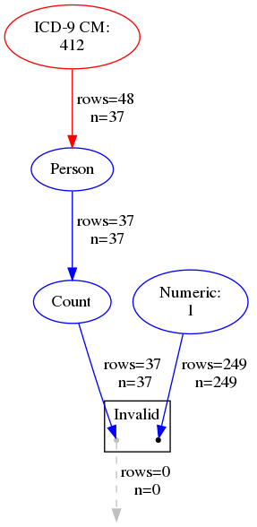

```No Results.  Statement is experimental.```

---

#### sum

- Takes a stream of results and does some wild things
    - Groups all results by person and type
        - Sums the value_as_numeric column within that grouping
        - Sets start_date to the earliest start_date in the group
        - Sets the end_date to the most recent end_date in the group
        - Sets selection_id to 0 since there is no particular single row that the result refers to anymore


ConceptQL is not yet fully specified.  These are modifications/enhancements that are under consideration.  These ideas are most likely not completely refined and might actually represent changes that would fundamentally break ConceptQL.

### Todo List

1. Handle costs
    - How do we aggregate?
1. How do we count?
1. How do we handle missing values in streams?
    - For instance, missing DoB on patient?
1. What does it mean to pass a date range as an L stream?
    - I'm thinking we pass through no results
    - Turns out that, as implemented, a date_range is really a person_stream where the start and end dates represent the range (instead of the date of birth) so we're probably OK
1. How do we want to look up standard vocab concepts?
    - I think Marc’s approach is a bit heavy-handed
    - Turns out, at least in CDMv5 and Vocab V5, we can just list the concept_ids and determine which tables to pull them from because every concept carries a Domain
    - That means we need a single operator, concept_id, to search ALL standard vocabularies

Some statements maybe very useful and it would be handy to reuse the bulk of the statement, but perhaps vary just a few things about it.  ConceptQL supports the idea of using variables to represent sub-expressions.  The variable operator is used as a place holder to say "some criteria set belongs here".  That variable can be defined in another part of the criteria set and will be used in all places the variable operator appears.

### Future Work for Define and Recall

I'd like to make it so if a variable operator is used, but not defined, the algorithm is still valid, but will fail to run until a definition for all missing variables is provided.

But I don't have a good feel for:

- Whether we should have users name the variables, or auto-assign a name?
    - We risk name collisions if a algorithm includes a sub-algorithm with the same variable name
    - Probably need to name space all variables
- How to prompt users to enter values for variables in a concept
    - If we have name-spaced variables and sub-algorithms needing values, how do we show this in a coherent manner to a user?
- We'll need to do a pass through a algorithm to find all variables and prompt a user, then do another pass through the algorithm before attempting to execute it to ensure all variables have values
    - Do we throw an exception if not?
    - Do we require calling programs to invoke a check on the algorithm before generating the query?
- Perhaps slot is a different operator from "define"

### Considerations for Values

I'm considering defaulting each value_as\_\* column to some value.

- numeric => 1
- concept_id => 0
    - Or maybe the concept_id of the main concept_id value from the row?
        - This would be confusing when pulling from the observation table
        - What's the "main" concept_id of a person?
        - Hm.  This feels a bit less like a good idea now
- string
    - source_value?
    - Boy, this one is even harder to default

---

**Example 13 - All MIs, defaulting value_as_numeric to 1, concept_id to concept id for 412, string to condition_source_value**

```JSON

["icd9","412"]

```

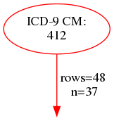

| person_id | criterion_id | criterion_domain | start_date | end_date | source_value |
| --------- | ------------ | ---------------- | ---------- | -------- | ------------ |
| 131 | 172 | condition_occurrence | 2008-03-22 | 2008-03-23 | 412 |
| 177 | 507 | condition_occurrence | 2009-06-13 | 2009-06-16 | 412 |
| 230 | 523 | condition_occurrence | 2008-03-14 | 2008-03-21 | 412 |
| 161 | 963 | condition_occurrence | 2009-10-25 | 2009-10-29 | 412 |
| 60 | 986 | condition_occurrence | 2009-07-19 | 2009-07-22 | 412 |
| 81 | 1405 | condition_occurrence | 2009-01-28 | 2009-01-30 | 412 |
| 88 | 1572 | condition_occurrence | 2009-01-03 | 2009-01-09 | 412 |
| 213 | 15005 | condition_occurrence | 2010-02-07 | 2010-02-07 | 412 |
| 66 | 16171 | condition_occurrence | 2009-07-25 | 2009-07-25 | 412 |
| 220 | 20660 | condition_occurrence | 2009-10-31 | 2009-10-31 | 412 |

---

- Comparison
    - GT
    - GTE
    - E
    - LTE
    - LT
    - NE
    - Range?
- Mutation
    - Add
    - Multiply
    - Divide
    - Subtract
- Relative (for observations)
    - Abnormally high
    - Abnormally low
    - etc.
    - J&J have a good set for this
- Aggregation
    - Sum
    - Average
    - Count
    - Min
    - Max

### Filter Operator

Inspired by person_filter, why not just have a "filter" operator that filters L by R.  Takes L, R, and an "as" option.  `as` option temporarily casts the L and R streams to the type specified by :as and then does person by person comparison, only keeping rows that occur on both sides.  Handy for keeping procedures that coincide with conditions without fully casting the streams:

---

**Example 14 - All 99214's where person was irritable during a visit**

```JSON

["filter",{"left":["cpt","99214"],"right":["icd9","250.01"],"as":"visit_occurrence"}]

```

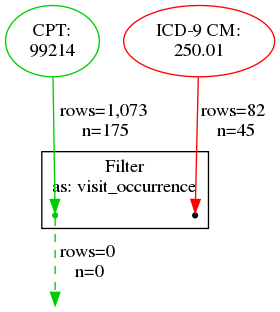

```No Results found.```

---

person_filter then becomes a special case of general filter:

---

**Example 15 - All 99214's where person was irritable at some point in the data**

```JSON

["filter",{"left":["cpt","99214"],"right":["icd9","250.01"],"as":"person"}]

```

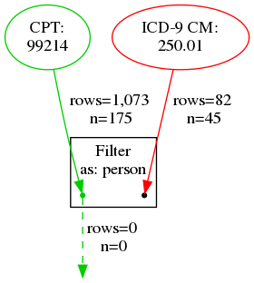

```No Results found.```

---

Filter operator is the opposite of Except.  It only includes L if R matches.

### AS option for Except

Just like Filter has an :as option, add one to Except operator.  This would simplify some of the algorithms I've developed.

### How to Handle fact_relationship Table from CDMv5

Each relationship type could be a binary operator box read as L <relationship\> R. E.g. L 'downstream of' R would take a L stream and only pass on downstreams of rows in R stream.

We could implement a single operator that takes a relationship as an argument (on top of the L and R arguments) or we could create a operator class for each relationship.  I think it would be better to have a single relationship operator class and take the relationship as the argument.

The next question is: how do we actually join the two streams?  I suppose we could translate each "type" into a "domain" and then join where l.domain = domain_concept_id_1 and l.entity_id = fact_id_1 and R.domain = domain_concept_id_2 and R.entity_id = fact_id_2 where the relationship chosen = relationship_concept_id.

Yup, that should work.  Phew!

### Change First/Last to Earliest/Most Recent and change "Nth" to "Nth Earliest" and "Nth Most Recent"

- It's a bit more clear what they do this way
- Though people do normally say "First occurrence of" rather than "Earliest occurrence of", but I'm also not opposed to making people more explicit in their wording

### Dates when building a cohort

- Michelle is using functions like "max" and "min" to find the earliest/latest date in a group of dates
- We have "first" and "last" but those operate on a whole row and so we find the first by start_date and last by end_date but then we carry forward BOTH dates for the matching row.
    - This is not exactly replicating what Michelle is able to do
- Is this something we want to emulate?
- If so, I'm thinking we'll have "min/max_start/end_date" nodes that will group by person, then find min/max of the dates
    - Actually, node needs to be min_max_date with two args: start: (min/max) and end: (min|max)
        - If an aggregation function isn't used on both dates, results of the un-aggregated column will be arbitrary, or perhaps the query itself won't run
    - The result is a person row with start/end date set
    - Why group by person?
        - If we feed in an END_DATA stream, a Death stream, and a Condition Occurrence stream, we can't compare them unless we compare at the person level

### During optimization?

- Is it safe to collapse overlapping start/end date ranges into a larger range?
    - If so, [here's the process for doing that](https://wiki.postgresql.org/wiki/Range_aggregation)
    - Just change "s <  max(le)" to "s <= max(le)"

### Casting Operators

Currently, these operators can act as a way to cast results to a new type, or to serve as a selection operator which pulls out all the rows from a given table.  I don't like this dual-behavior.

We should split the behavior into strict selection operators for each type of data and either:

- A single casting operator that takes the type as an argument
- A set of casting operators, one per type to cast to

### Drop support for positional arguments?

Although lisp-syntax makes it easy to support positional arguments, it might be better to require all arguments to be keyword-based.  HOWEVER, it makes it slightly hard to support arrays of arguments passed to a given keyword argument, e.g. \["icd9", codelist: \["412", "410.00"]] would be read as icd9 with a codelist pointing to operator "412" with an argument of "410.00"

Soooooooo, it would appear that keyword arguments are *only* OK if we have values that aren't arrays and if there needs to be an array of arguments, that set of arguments must be "positional".

It *might* be possible to specify that an option takes multiple arguments and in those cases we won't translate an array, but let's make this happen *if* we need it.

### Validations

I want rails-like validations in ConceptQL.

Metadata reported to the JAM will also include validations for each operator

#### General validations

- Avoid "cyclical statements"
    - An operator's upstream can't come from anywhere downstream of it
    - This is only possible in Ruby and YAML representations
        - Probably should drop support for all but JSON representation
    - Really just a reminder for any UI designers to watch out for and disallow this situation
- There must be at least one operator
- There can only be one root-operator
- Any operator with an unknown name is invalid
    - Or rather, returns the "InvalidOperator" which always carries an error with it and yet can be rendered

#### Upstream validations - Enforce number of upstream operators

- has_one_upstream
    - Casting operators, though see discussion on casting operators
    - Allows 0 or 1 upstreams
    - options
        - required
            - If true, there must be exactly one upstream passed to the operator
- has_many_upstreams
    - union, intersect, set logic operators in general
    - Allows 0 to n upstreams
    - options
        - required
            - If true, there must at least one upstream passed to the operator
- has_no_upstream
    - Ensures no arguments are upstreams

For binary operators, we need to enforce that LHS and RHS both have upstreams

#### Argument validations - Enforce number of positional arguments

Arguments that are nil or empty string are stripped from positional arguments.  I can't think of a scenario where "nil" is an acceptable argument

- has_one_argument
    - Expects 0 or 1 argument
    - options
        - required
            - If true, there must be exactly one argument passed to the operator
- has_many_arguments
    - Expects 0 or more arguments
    - options
        - required
            - If true, there must at least one argument passed to the operator
- has_no_arguments
    - Expects 0 arguments passed to the operator
- argument_type
    - Check to make sure incoming arguments conform to a particular type
        - Enforce type-checking with REGEX?  e.g. "integer" must match "^\d+$"
    - Do we enforce a vocabulary at this point?
        - e.g. Type "ICD-9CM" must match "(\[v\d]\d{2}(|.\d{1,2})|e\d{3}(|.\d))"
        - We could enforce "strict" matching where the code must appear in our vocabulary files
        - I'd like to warn people about any codes that don't appear in vocabulary files

#### Option validations

I'm not certain how I want to represent validations for options.  Each option is specified at the top of the class like so for `time_window`:

```ruby

option :start, type: :string
option :end, type: :string

```

and like so for binary operators:

```ruby

option :left, type: :upstream
option :right, type: :upstream

```

Do I want to embed some, or even all, of the validation into the option declaration?  E.g. for `time_window`:

```ruby

option :start, type: :string, matches: '(\d+[dmy]*)*'
option :end, type: :string, matches: '(\d+[dmy]*)*'

```

and for binary operators:

```ruby

option :left, type: :operator, required: true
option :right, type: :operator, required: true

```

Or do I want to make validations separate from the option declarations and say things like:

```ruby

validate_options :left, :right, required: true
validate_options :start, :end, match: '(\d+[dmy]*)*'
validate_options :hypothetical_icd9_option_here, associated_vocabulary: 'ICD9CM', strict: true

```

#### `recall`-specific validations

`recall` is a unique operator and must check that the argument passed to it is:

- A label that appears in the ConceptQL statement
- A label that is NOT downstream of the Recall operator

#### `algorithm`-specific validations

`algorithm` is a unique operator and must check that the argument passed to it:

- Matches a UUID in our database

#### Vocabulary validations and warnings

Vocabulary validations will start by running each code through a regexp, just to see if the code is even in the right format for that kind vocabulary.  We can have a "strict" option which will also then check to make sure the code exists in the vocabulary database.

Vocabularies might vary between supported data models, so how we enforce "strict" vocabulary validation might need to change between data models.

We can provide a lot of useful feedback to users about the vocabularies they are choosing.

- For certain data models, we might point out that though the vocabulary is primarily for, say, conditions, there are other domains mixed into the codes they provided
    - e.g. V76.8 yields procedure records, though ICD-9 is primarily expected to yield conditions
- Certain codes are added/obsoleted through time
    - It'd be cool to show people what date ranges their codes are valid for
- Display the frequency for each code in a code set
- Perhaps show people when a code they are looking for overlaps with other, related vocabularies?

### Other data models

- We need to support
    - CDMv4
    - CDMv5
    - OI CDM
    - Possibly AmgenCDMv4

#### Mutator - in theory, these need no modification to continue working

- after
- any_overlap
- before
- contains
- count
- during
- equal
- except
- filter
- first
- from
- intersect
- last
- numeric
- occurrence
- one_in_two_out
- overlapped_by
- overlaps
- person_filter
- recall
- started_by
- sum
- time_window
- trim_date_end
- trim_date_start
- union

#### Selection - These are the operators that will need the most work and might need to be re-thought

- Provenance
    - condition_type
- Vocab
    - cpt
    - drug_type_concept
        - Can be replaced with "concept"?
    - gender
    - hcpcs
    - icd10
    - icd9
    - icd9_procedure
    - loinc
    - medcode
    - medcode_procedure
    - ndc
    - observation_by_enttype
    - place_of_service_code
    - prodcode
    - race
    - rxnorm
    - snomed
- Literal
    - date_range
- Type
    - death
    - observation_period
    - person
    - procedure_occurrence
    - visit_occurrence
- Obsolete
    - from_seer_visits
    - to_seer_visits
    - visit

### Multiple sets of things with ordering

- High to medium to low dose of meds and detecting switch from high/med to low or high to med/low etc

### Nth line chemo

- Can do a "poor man's" by grabbing first of each set and then grabbing nth of that

### concurrent with?

- We sometimes need to make sure a patient had x and y at around the same time
- Asymmetrical
    - Options would be start, end like time_window

[^AIA]: J. Allen. Maintaining knowledge about temporal intervals. Communications of the ACM (1983) vol. 26 (11) pp. 832-843